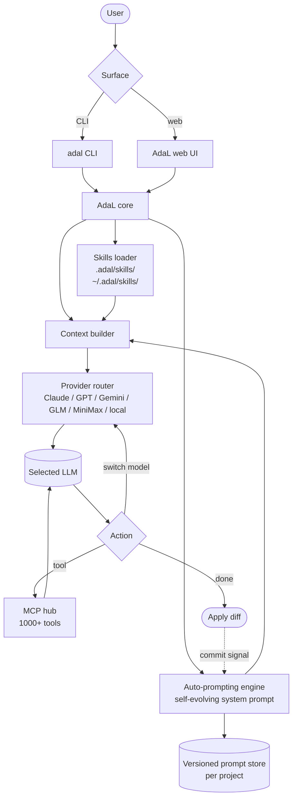

# AdaL

> **Slug**: `adal` · **Surface**: CLI + Web · **Vendor**: SylphAI · **License**: Proprietary (paid SaaS)

A self-evolving AI coding agent named after Ada Lovelace.

## Overview

AdaL is SylphAI's flagship agent. It runs locally as a CLI (`adal`) and offers a web UI as well. Its differentiator is **auto-prompting** — a research technique that learns your codebase patterns and adapts to your team's style with every commit.

The team includes researchers from NVIDIA, Meta AI, Stanford, USC, UT Austin, and MIT.

## Skills support

| Item | Value |
| --- | --- |
| Project path | `.adal/skills/` |
| Global path | `~/.adal/skills/` |
| `--agent` slug | `adal` |
| `allowed-tools` | Yes |
| `context: fork` | No |
| Hooks | No |

## Installation

```bash
npm install -g @sylphai/adal-cli   # requires Node.js 20+

npx skills add vercel-labs/agent-skills -a adal
```

## Notable behavior

- **Self-evolving**: auto-prompting research learns codebase patterns and adapts each commit.
- **Multi-model**: Claude, GPT, Gemini, GLM, MiniMax, plus local models.
- **MCP server integration**: 1000+ tools available.
- **Multi-model collaboration**: switch between models mid-session.
- **Privacy-first**: code stays local, no data leaves your environment.
- Pricing: Pro $20/mo (small codebases), Max $100/mo, Max+ $200/mo, Enterprise custom.

## Internals & Architecture

AdaL's distinguishing primitive is **auto-prompting** — a research technique where the agent observes commits and iteratively rewrites its own system prompt to better match the codebase's idioms. That makes AdaL a **self-evolving** agent: the prompt that runs today is different from the prompt that ran a month ago, shaped by every commit between. Skills layer on top as explicit team conventions; auto-prompting captures the implicit ones.



The auto-prompting loop is the architectural bet: rather than relying on a fixed system prompt, AdaL treats the prompt itself as a learnable artifact. Skills are still useful for *codifying explicit conventions*, but for the long tail of "we just do it this way", auto-prompting takes over. The trade-off is debuggability — when an agent misbehaves, "what's in your prompt today?" becomes a non-trivial question.

## Harness Deep Dive

### Agent loop

- **Shape**: ReAct, but with a **closed feedback loop** — every commit signals the auto-prompting engine, which iterates on the system prompt.
- **Tool-call style**: Native function calling for modern providers via the multi-provider router.
- **Halting**: Standard end-turn / max-turn.
- **Streaming**: Token streaming to CLI and web UI.

### Context & memory

- **Context strategy**: **Auto-prompted system prompt** (versioned per project) plus skills plus workspace. The system prompt itself is memory — Strategy 6 in the harness deep-dive.
- **Persistent files**: `.adal/skills/`, `~/.adal/skills/`, plus a versioned prompt store maintained by the auto-prompting engine.
- **Compaction**: Standard.
- **Sub-context**: None first-party.
- **Cross-session memory**: **Auto-prompting evolves the prompt over time** — the most prominent self-mutating-prompt primitive in the dataset.

### Tool runtime

- **Built-ins**: Standard fs/shell, plus MCP — **1000+ tools** through MCP integration.
- **Parallelism**: Sequential by default.
- **Approval / safety**: Configurable.
- **Sandbox**: None; privacy-first stance keeps code local.
- **MCP**: Heavy first-class use; the dominant extension surface.

### Model integration

- **Provider model**: BYOK across **Claude, GPT, Gemini, GLM, MiniMax, plus local models**. Mid-session swap supported.
- **Caching**: Provider-level.
- **Multi-model**: Per-session and mid-session.

### Innovation summary

**Auto-prompting — the system prompt evolves with your commits.** AdaL is the dataset's most explicit "the agent learns implicit team style without you writing rules" bet. Skills are still valuable for explicit conventions; auto-prompting captures the rest. Trade-off: when an agent misbehaves, debugging "what's in your prompt today?" is non-trivial.

## Documentation

- [AdaL docs](https://docs.sylph.ai/)
- [SylphAI homepage](https://www.sylph.ai/)
- [AdaL CLI on GitHub](https://github.com/SylphAI-Inc/adal-cli)
