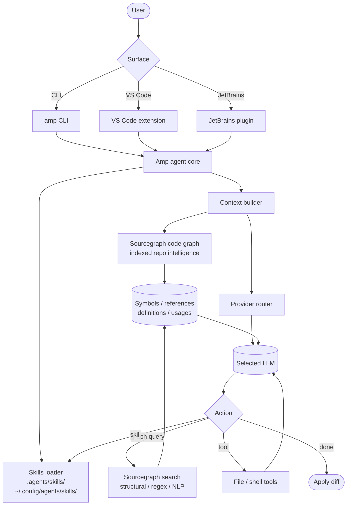

# Amp

> **Slug**: `amp` · **Surface**: CLI + IDE extensions · **Vendor**: Sourcegraph · **License**: Proprietary

Sourcegraph's agentic coding product. A CLI plus first-class IDE extensions, designed to leverage Sourcegraph's code-intelligence backend.

## Overview

Amp (sometimes "Amp Code") is the post-Cody product from Sourcegraph. It re-architected around a CLI-first agent that uses Sourcegraph's code-graph for repository-wide context. Amp shares the `~/.config/agents/skills/` global path with Kimi CLI, Replit, and Universal — confirming its alignment with the "shared agents bucket" convention.

## Skills support

| Item | Value |
| --- | --- |
| Project path | `.agents/skills/` (shared bucket) |
| Global path | `~/.config/agents/skills/` (XDG, shared) |
| `--agent` slug | `amp` |
| `allowed-tools` | Yes |
| `context: fork` | No |
| Hooks | No |

## Installation

```bash
npx skills add vercel-labs/agent-skills -a amp
```

## Notable behavior

- Amp leans heavily on Sourcegraph's code intelligence — skills can reference Sourcegraph search and graph queries via `allowed-tools`.
- Skills load globally from `~/.config/agents/skills/`, meaning a single skill folder is automatically available to Amp, Kimi CLI, Replit, and the Universal slug.
- Amp's IDE extensions (VS Code, JetBrains) inherit the same skills.

## Internals & Architecture

Amp is built on top of **Sourcegraph's code-intelligence backend** — the same graph that powers Sourcegraph search, code navigation, and Cody. The agent treats the code graph as a first-class tool: instead of grepping or asking the model to scan files, Amp queries the graph for symbols, references, and dependencies. Skills live in the shared `.agents/` and XDG-shared `~/.config/agents/skills/` buckets, which is part of Amp's "good citizen of the agents bucket" stance.



The architectural strength is **the code graph as a tool**: Amp can answer "find every function that consumes this struct field" reliably across a multi-repo monorepo because it's reading Sourcegraph's index, not re-parsing files. That makes it especially strong for cross-repository refactors that other agents struggle with. The shared XDG global path means Amp benefits from any skill installed for Kimi CLI, Replit, or Universal at the same `~/.config/agents/skills/` location.

## Harness Deep Dive

### Agent loop

- **Shape**: ReAct, tuned to lean on **Sourcegraph code-graph queries** before falling back to file reads.
- **Tool-call style**: Native function calling on whichever model the user routes to.
- **Halting**: Standard end-turn / max-turn fallback.
- **Streaming**: Token streaming in CLI and IDE extensions.

### Context & memory

- **Context strategy**: Symbolic context first — symbols, references, and dependencies pulled from the Sourcegraph index — then file contents on demand. Drastically reduces "scan the repo to understand the change" overhead.
- **Persistent files**: `AGENTS.md` plus `.agents/skills/` and `~/.config/agents/skills/` (shared bucket / XDG).
- **Compaction**: Standard summarization in long sessions.
- **Sub-context**: None first-party — `allowed-tools` only, no `context: fork`. Long retrievals stay scoped because the graph returns just the symbols, not whole files.
- **Cross-session memory**: `AGENTS.md` + skills.

### Tool runtime

- **Built-ins**: Standard fs/shell set plus **Sourcegraph search and graph queries** as first-class tools (structural / regex / NLP).
- **Parallelism**: Sequential by default.
- **Approval / safety**: Configurable per tool category.
- **Sandbox**: None — runs against the workspace.
- **MCP**: Supported.

### Model integration

- **Provider model**: BYOK across providers; the IDE extensions and CLI share the same provider router.
- **Caching**: Provider-level caching where supported.
- **Multi-model**: Per-session provider/model selection.

### Innovation summary

**The Sourcegraph code graph as a first-class tool.** Amp is the only agent in the dataset that pairs a frontier LLM with a production-grade code-intelligence index, which makes it disproportionately strong at cross-repo refactors and "find every consumer of this symbol" questions that defeat embedding-only retrieval.

## Documentation

- [Amp Skills](https://ampcode.com/manual#agent-skills)
- [Amp manual](https://ampcode.com/manual)
