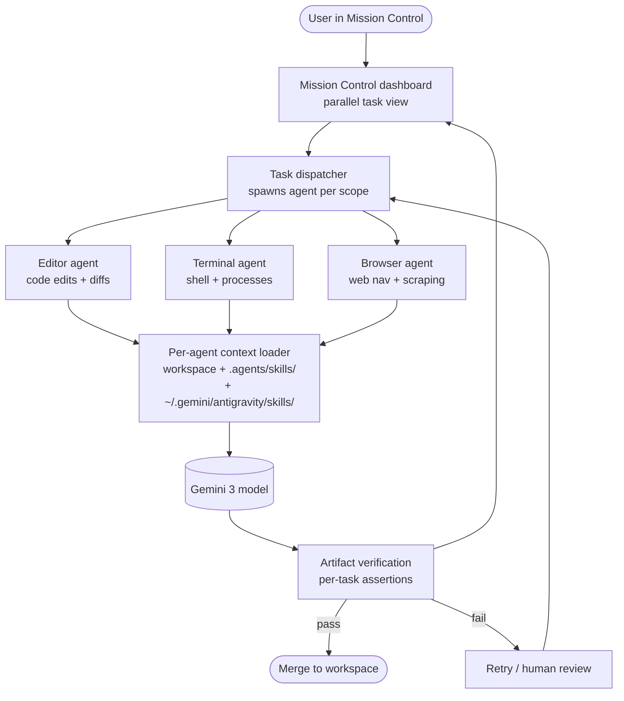

# Antigravity

> **Slug**: `antigravity` · **Surface**: Native AI IDE · **Vendor**: Google · **License**: Proprietary (preview)

Google's agent-first IDE, powered by Gemini 3.

## Overview

Antigravity is Google's "Mission Control" IDE — a development environment designed around managing autonomous agents that operate across editor, terminal, and browser. Currently in preview for personal Gmail accounts on Mac, Windows, and select Linux distros.

The product is built around four explicit tenets: trust, autonomy, feedback, and self-improvement.

## Skills support

| Item | Value |
| --- | --- |
| Project path | `.agents/skills/` (shared bucket) |
| Global path | `~/.gemini/antigravity/skills/` |
| `--agent` slug | `antigravity` |
| `allowed-tools` | Yes |
| `context: fork` | No |
| Hooks | No |

The vendor-nested global path (`~/.gemini/antigravity/`) shows how Google is grouping all Gemini-related products under a single parent directory. Gemini CLI uses `~/.gemini/skills/`; Antigravity uses `~/.gemini/antigravity/skills/`.

## Installation

```bash
npx skills add vercel-labs/agent-skills -a antigravity
```

## Notable behavior

- "Mission Control" UX: a dashboard view of agents working in parallel.
- Task-based monitoring: see artifact verification results at the task level rather than diff level.
- Synchronized control across editor, terminal, and browser.
- Configurable context-aware agents that operate across workspaces.
- Skills give Antigravity teams a way to ride conventions across the parallel agent fleet.

## Internals & Architecture

Antigravity inverts the usual "single agent per editor" model. The IDE shell is a Mission Control dashboard, and the actual coding work is delegated to a **fleet of agents** — each operating in its own scope (editor pane, terminal, browser tab) with task-level coordination. Skills are part of the per-agent context, so a single skill folder configures every agent in the fleet. The whole runtime is wired to Gemini 3 with first-class browser tooling that's rarer in this dataset than in the Antigravity marketing.



The "trust, autonomy, feedback, self-improvement" tenets aren't just marketing — they map to runtime behavior: agents *propose* artifacts, the verifier checks them, and Mission Control surfaces results at the task level rather than as raw diffs. Skills sit underneath this so that policy ("always run lint before merge") survives across whichever agent picks up which sub-task.

## Harness Deep Dive

### Agent loop

- **Shape**: **Fleet** — Mission Control dispatches per-scope agents (editor, terminal, browser) that run in parallel; each runs its own ReAct loop.
- **Tool-call style**: Native function calling on Gemini 3.
- **Halting**: Per-task verification — agents propose artifacts, the verifier checks them; pass merges, fail retries or escalates.
- **Streaming**: Per-agent task event streams render into the dashboard.

### Context & memory

- **Context strategy**: Per-agent context loader (workspace + skills + scope-specific memory). Scopes are isolated so the editor agent doesn't see the browser agent's full context.
- **Persistent files**: `.agents/skills/`, `~/.gemini/antigravity/skills/`.
- **Compaction**: Per-agent — long browser sessions get their own compaction independent from the editor agent.
- **Sub-context**: **The fleet itself is the sub-context primitive.** Each agent is a separate context.
- **Cross-session memory**: Skills + project state.

### Tool runtime

- **Built-ins**: Editor edits, terminal, **browser tooling** (rare in dataset and first-class here), plus standard fs/shell.
- **Parallelism**: First-class — multiple agents run simultaneously, each on its own scope.
- **Approval / safety**: Verification gate per task; user reviews task-level outcomes rather than per-tool calls.
- **Sandbox**: Per-agent process isolation (preview).
- **MCP**: Supported.

### Model integration

- **Provider model**: Gemini 3 (Google).
- **Caching**: Gemini context cache.
- **Multi-model**: Per-scope model selection within the fleet (a fast model for editor edits, stronger for verification, etc.).

### Innovation summary

**Mission Control fleet + per-task verification + first-class browser tooling.** Antigravity is the dataset's clearest "the editor is now an orchestrator, not a chat panel" bet. Per-task verification (rather than per-tool approval) is the distinctive UX — you review *outcomes*, not individual edits.

## Documentation

- [Antigravity Skills](https://antigravity.google/docs/skills)
- [Antigravity Codelab](https://codelabs.developers.google.com/getting-started-with-antigravity-skills)
