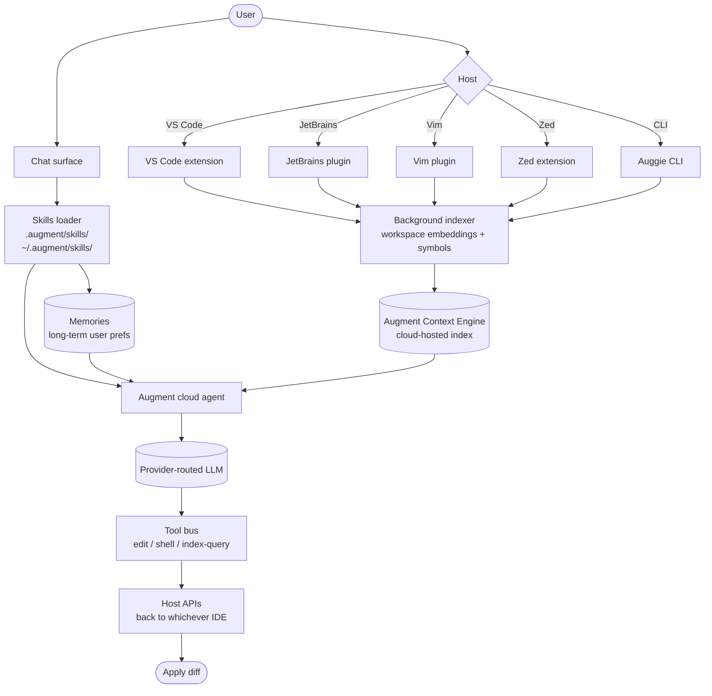

# Augment

> **Slug**: `augment` · **Surface**: IDE extensions · **Vendor**: Augment Code · **License**: Proprietary

A multi-IDE AI coding assistant focused on deep-context code understanding for large codebases.

## Overview

Augment Code is one of the better-funded private companies in the AI coding space. Its core differentiator is a "context engine" designed for very large codebases — the agent can reason about millions of lines without losing thread. Available as extensions for VS Code, JetBrains, Vim, and Zed.

## Skills support

| Item | Value |
| --- | --- |
| Project path | `.augment/skills/` |
| Global path | `~/.augment/skills/` |
| `--agent` slug | `augment` |
| `allowed-tools` | Yes (assumed) |
| `context: fork` | No |
| Hooks | No |

## Installation

```bash
npx skills add vercel-labs/agent-skills -a augment
```

## Notable behavior

- The "Auggie" CLI is a companion CLI surface that shares the same skills.
- Strong context engine for monorepos — skills can reference repo-wide patterns confidently.
- "Memories" (Augment's own long-term memory system) coexists with skills.
- Multi-IDE support (VS Code, JetBrains, Vim, Zed) means skills installed once apply everywhere on that machine.

## Internals & Architecture

Augment is built around its proprietary **Context Engine** — a continuously-indexed embedding + symbol graph of the entire repository, kept fresh by background processes inside whichever IDE host you're using. The IDE extensions are thin: most of the work happens in Augment's cloud, with the IDE responsible only for capturing edits, surfacing diffs, and rendering chat. Skills layer on as portable instructions; "Memories" is Augment's separate long-term store of user-specific preferences.



The standout architectural choice is the **always-fresh Context Engine** — Augment trades disk + bandwidth for the ability to answer "where else does this pattern appear in our 4M-line monorepo?" reliably. Skills give you a way to layer team conventions on top of that engine without having to pre-bake them into the index.

## Harness Deep Dive

### Agent loop

- **Shape**: ReAct, with the **Context Engine** doing heavy lifting before the loop even starts — relevant chunks are pre-staged so the model rarely needs to grep.
- **Tool-call style**: Native function calling on the cloud-side router.
- **Halting**: Standard end-turn / max-turn fallback.
- **Streaming**: Tokens stream into the IDE chat panel.

### Context & memory

- **Context strategy**: **Continuously-indexed embedding + symbol graph** of the entire repo, kept fresh by background processes inside whichever IDE host you're in. Reduces context cost dramatically because retrieval is always pre-warmed.
- **Persistent files**: `.augment/skills/`, `~/.augment/skills/`. Plus **Memories** — Augment's separate long-term store of user-specific preferences (Strategy 6 in the harness deep-dive).
- **Compaction**: Cloud-side; the IDE just sends turns and renders responses.
- **Sub-context**: None first-party.
- **Cross-session memory**: **Memories** auto-evolves user-level preferences over time, in addition to skills.

### Tool runtime

- **Built-ins**: Edit / shell / index-query, plus host-API integrations per IDE.
- **Parallelism**: Sequential by default.
- **Approval / safety**: Configurable; defaults vary by host.
- **Sandbox**: None; runs against the workspace via host APIs.
- **MCP**: Supported.

### Model integration

- **Provider model**: Cloud-routed; users typically don't manage keys.
- **Caching**: Provider-level prompt caching plus the Context Engine acting as a giant retrieval cache.
- **Multi-model**: Per-conversation as the cloud routes.

### Innovation summary

**The always-fresh Context Engine plus Memories.** Augment is the dataset's strongest answer to "what if retrieval were truly always-on?" — and Memories is one of the few first-class long-term *user* memory primitives in the field. The cost (cloud indexing, freshness invalidation) is real, but for million-line monorepos the alternative — re-grepping each turn — doesn't scale.

## Documentation

- [Augment homepage](https://www.augmentcode.com/)
- [Augment docs](https://docs.augmentcode.com/)
