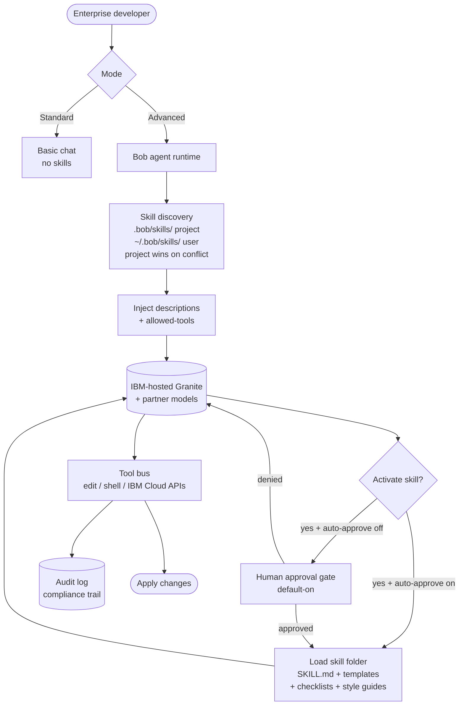

# IBM Bob

> **Slug**: `bob` · **Surface**: Native AI IDE · **Vendor**: IBM · **License**: Proprietary (enterprise)

IBM's AI-powered coding agent and SDLC partner.

## Overview

IBM Bob is the company's flagship AI coding product, positioned as a "personal AI" for enterprise developers. Skills are a first-class feature explicitly framed in the IBM docs as "recipes" — reusable instruction sets for repeatable, consistent work.

## Skills support

| Item | Value |
| --- | --- |
| Project path | `.bob/skills/` |
| Global path | `~/.bob/skills/` |
| `--agent` slug | `bob` |
| `allowed-tools` | Yes |
| `context: fork` | No |
| Hooks | No |

Skill precedence in Bob: project-level (`.bob/skills/`) wins over global (`~/.bob/skills/`) for skills with the same name.

## Installation

```bash
npx skills add vercel-labs/agent-skills -a bob
```

## Notable behavior

- Skills are only available in **Advanced mode** in Bob.
- By default Bob requests approval before activating a skill — a more conservative default than most agents. Configurable under Bob Settings → Auto-Approve → "Always allow skills".
- Bob automatically determines when to activate a skill based on the user's request and the skill's `description` (true progressive-disclosure activation).
- Skill folders can include checklists, templates, reference docs, and style guides — IBM treats the folder as a small filesystem dedicated to one task, not just a single markdown file.
- Strong enterprise governance story.

## Internals & Architecture

Bob is engineered for the enterprise SDLC: every action that mutates the workspace passes through an approval / audit gate by default, and "Skills" are framed in IBM's docs as **recipes** — folders that bundle the prompt, the templates, the checklists, and the reference docs needed to repeatably perform one task. The runtime gates skill activation behind explicit user approval (configurable to auto), which is the most conservative default in the dataset.



The architectural signature is **approval-by-default** plus **rich folder semantics**: a Bob skill is rarely just one markdown file — it's a small documentation package, with the agent expected to use templates, checklists, and reference docs as part of the workflow. That makes Bob the cleanest mapping of "skill" → "SOP" of any harness in the dataset.

## Harness Deep Dive

### Agent loop

- **Shape**: ReAct, but only in **Advanced mode** — Standard mode is basic chat.
- **Tool-call style**: Native function calling against IBM-hosted models.
- **Halting**: Standard end-turn, plus the approval gate which stops every skill activation by default.
- **Streaming**: Tokens stream into the IDE.

### Context & memory

- **Context strategy**: Workspace + skill descriptions + project rules. Skill bodies fetched only after explicit approval (approval-by-default is the dataset's most conservative stance).
- **Persistent files**: `.bob/skills/` (project) and `~/.bob/skills/` (user); project wins on conflict.
- **Compaction**: Standard summarization.
- **Sub-context**: None first-party.
- **Cross-session memory**: Skill files + IBM enterprise audit log.

### Tool runtime

- **Built-ins**: Edit / shell / IBM Cloud APIs.
- **Parallelism**: Sequential.
- **Approval / safety**: **Approval-by-default for skills** (configurable to "Always allow skills"). Every action mutating the workspace passes through approval / audit.
- **Sandbox**: None — runs in IDE process; IBM Cloud APIs handle the cloud side.
- **MCP**: Supported.
- **Audit**: Full audit log feeds the enterprise compliance trail.

### Model integration

- **Provider model**: IBM-hosted **Granite** plus partner models (Anthropic / OpenAI through IBM's gateway).
- **Caching**: Provider-level.
- **Multi-model**: Per-conversation selection within IBM's catalog.

### Innovation summary

**Approval-by-default + rich folder-as-SOP semantics + enterprise audit log.** Bob is the cleanest "skill = standard operating procedure" mapping in the dataset. The conservative defaults trade interactivity for compliance — exactly the trade-off enterprise SDLC teams want.

## Documentation

- [IBM Bob Skills](https://bob.ibm.com/docs/ide/features/skills)
- [IBM Bob homepage](https://bob.ibm.com/)
- [IBM Bob docs](https://bob.ibm.com/docs)
