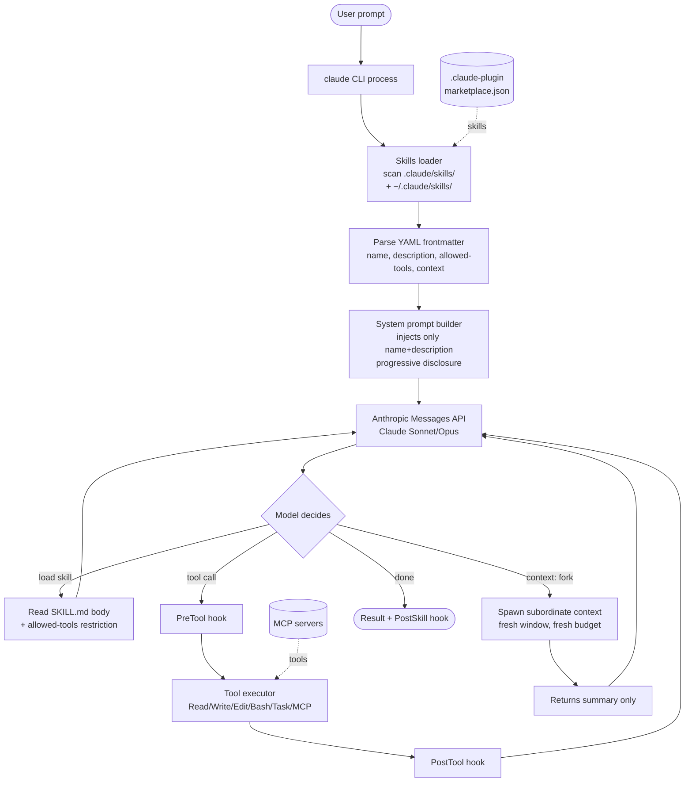

# Claude Code

> **Slug**: `claude-code` · **Surface**: Terminal CLI + VS Code + JetBrains + Desktop app + Web · **Vendor**: Anthropic · **License**: Proprietary

The reference implementation of the Agent Skills spec. The skill format originated as a Claude Code feature and was later promoted into the cross-agent standard.

## Overview

Claude Code is Anthropic's official coding agent. It launched as a developer preview in early 2025 starting with the Terminal CLI and has since expanded to VS Code, JetBrains, a standalone Desktop app, and a hosted Web experience — all backed by the same underlying Claude Code engine, so `CLAUDE.md`, settings, and MCP servers work across every surface. It remains the most-feature-complete implementation of skills — every part of the spec works here, including the parts no other agent ships.

## Skills support

| Item | Value |
| --- | --- |
| Project path | `.claude/skills/` |
| Global path | `~/.claude/skills/` |
| `--agent` slug | `claude-code` |
| `allowed-tools` | Yes |
| `context: fork` | **Yes (only agent)** |
| Hooks | **Yes** |

### `context: fork`

Claude Code's signature feature. Add `context: fork` to your skill frontmatter and the skill runs in a sub-context — a fresh window with a fresh token budget — and returns a summary to the parent. Use it for long, mechanical refactors that would otherwise blow the parent context.

### Hooks

Pre/post-skill, pre/post-tool, and PostFile hooks declared in `~/.claude/settings.json` or per-project. Useful for automated formatting, audit logs, and policy enforcement.

## Installation

Skills install into `.claude/skills/` (project) or `~/.claude/skills/` (global). They are immediately discoverable by the agent on the next session — no restart required.

```bash
npx skills add vercel-labs/agent-skills -a claude-code
```

## Notable behavior

- Anthropic's plugin marketplace (`.claude-plugin/marketplace.json`) is *natively* understood by `npx skills`, so any Claude Code plugin's declared skills become installable into all 45 agents.
- Skill activation is auto + descriptive: the `description` field is what Claude reads to decide whether to load.
- The CLI honors `allowed-tools` strictly — listed tools are made available, others are not.

## Internals & Architecture

Claude Code is a single-process CLI agent. Its design is unusually transparent because Anthropic publishes the engineering logic behind it: the agent loop is a tight read–evaluate–tool cycle on top of the Anthropic Messages API, with a deterministic skills loader injected into the system prompt and a `Task`/`fork` primitive that spawns nested agent processes when a skill or the model requests it. Hooks and MCP are bolted in as orthogonal extension points.



The arrows that matter most: `context: fork` is the only true sub-context primitive in the entire dataset, and the hook sequence (`PreSkill → PreTool → PostTool → PostFile → PostSkill`) is what no other agent reproduces. Together they make Claude Code the spec's reference implementation in *behavior*, not just file format.

## Harness Deep Dive

### Agent loop

- **Shape**: ReAct (think → tool → observe), with `Task`/`fork` as opt-in subagent escape hatch.
- **Tool-call style**: Native function calling on the Anthropic Messages API. No XML/JSON parsing fallbacks — Anthropic-only by design.
- **Halting**: Model emits an end-turn signal, hits the configurable max-turns cap, exhausts the token budget, or a hook returns "stop". Hook-driven halting is unique in the dataset.
- **Streaming**: Tokens stream to the terminal; tool calls execute when the call object completes.

### Context & memory

- **Context strategy**: Aggressive **Anthropic prompt-cache** use on the system prompt + skills + `CLAUDE.md`. The stable prefix is cached across turns so only the delta gets billed.
- **Persistent file**: `CLAUDE.md` per project plus `~/.claude/CLAUDE.md` for the user.
- **Compaction**: Conversation auto-summarizes when the budget gets tight. The summary replaces older turns; recent turns stay verbatim.
- **Sub-context**: **`context: fork`** is the only frontmatter-declarative fork primitive in the entire dataset. Plus a **`Task`** tool that can spawn subordinate contexts on demand. Both return a summary to the parent.
- **Cross-session memory**: None beyond `CLAUDE.md` and skills — sessions don't bleed.

### Tool runtime

- **Built-ins**: Read, Write, Edit, Bash, Glob, Grep, Task, plus Web Fetch and others. The reference set the rest of the field tracks.
- **Parallelism**: Sequential tool calls by default. Subagents via `Task` are the parallelism story.
- **Approval / safety**: `--dangerously-skip-permissions` flips off the per-tool approval gate; otherwise approvals are configurable per tool. **Hooks** layered on top run vendor / org policy regardless of approval state.
- **Sandbox**: None — runs on the host filesystem and host shell.
- **MCP**: First-class. Servers declared in `~/.claude/settings.json` or per-project; tools become available to the agent and `allowed-tools` can reference them.

### Model integration

- **Provider model**: Anthropic-only (Claude Sonnet / Opus). No router, no BYOK, no local-model story.
- **Caching**: Heavy use of Anthropic prompt caching — typically 5–10x cost savings on long sessions.
- **Multi-model**: No mid-session swap. The model is whatever the CLI is configured for at startup.

### Innovation summary

The reference implementation. **`context: fork` + the full hook lifecycle + the plugin marketplace** are the three things no other harness ships at the same depth. Skills as a file format originated here; everything else in this dataset is, in some sense, in conversation with what Anthropic shipped first.

## Documentation

- [Claude Code Skills](https://code.claude.com/docs/en/skills)
- [Plugin marketplaces](https://code.claude.com/docs/en/plugin-marketplaces)
- [Anthropic engineering blog](https://www.anthropic.com/engineering)
