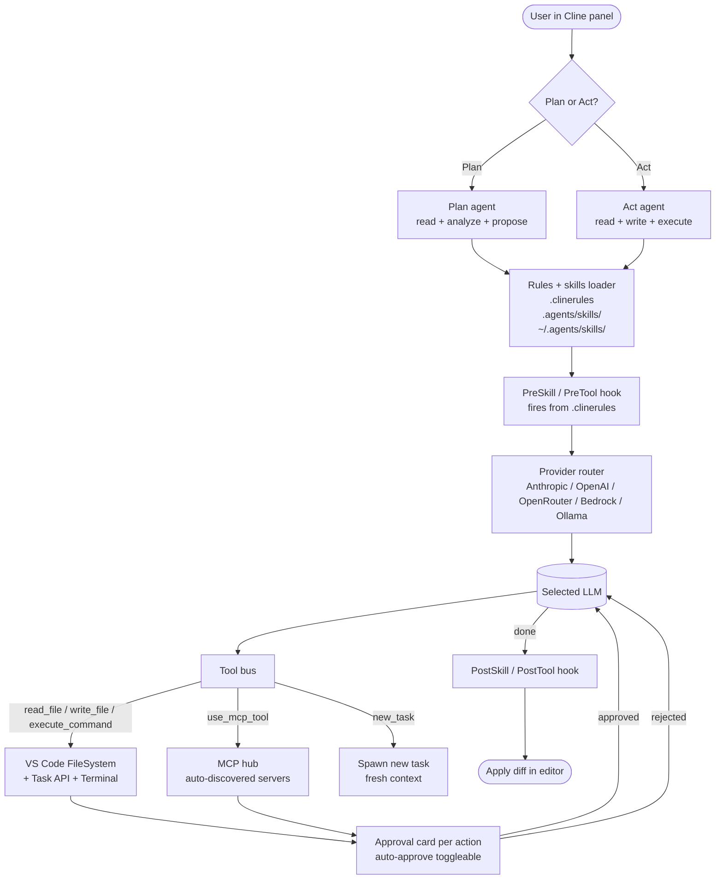

# Cline

> **Slug**: `cline` · **Surface**: VS Code extension · **Vendor**: Cline (community / OSS) · **License**: Apache 2.0

The most-installed open-source autonomous coding agent for VS Code. Implements the second-deepest skills support (after Claude Code).

## Overview

Cline (formerly "Claude Dev") is the open-source autonomous coding agent that broke the "let an AI write code in your IDE for hours autonomously" UX. It runs as a VS Code extension and has been the seed for several forks (most notably Roo Code).

## Skills support

| Item | Value |
| --- | --- |
| Project path | `.agents/skills/` (shared bucket) |
| Global path | `~/.agents/skills/` (shared with Warp) |
| `--agent` slug | `cline` |
| `allowed-tools` | Yes |
| `context: fork` | No |
| **Hooks** | **Yes (one of only two agents to support hooks)** |

Hooks support is rare — only Claude Code and Cline implement skill lifecycle hooks. This is one of the strongest signals that Cline takes the skill spec seriously as a runtime concern, not just a file format.

## Installation

```bash
npx skills add vercel-labs/agent-skills -a cline
```

## Notable behavior

- Plan mode + Act mode: skills can hint at plan-mode usage in their description.
- `.clinerules` is Cline's native rules file and coexists with skills.
- Cline's MCP support is mature; skills can declare `allowed-tools` referencing MCP servers.
- The `~/.agents/skills/` global path is shared with Warp — a single global install reaches both.

## Internals & Architecture

Cline runs as a VS Code extension that hosts a WebView for chat and uses VS Code's Language Server, FileSystem, and Task APIs to do work. It exposes two explicit modes — **Plan** (read-only research + plan production) and **Act** (mutating the workspace) — with each tool call surfaced as an approval card by default. The hooks system (rare in this dataset) lets `.clinerules` and skills attach pre-/post-tool callbacks that run in the extension host process.



The defining choice is the **per-action approval gate**: every file edit, every shell command, every MCP call surfaces a card the user has to click through, and `auto-approve` is a per-tool toggle rather than a global one. Combined with the hooks system, this is what makes Cline the safest "long autonomous run" agent in the IDE-extension category.

## Harness Deep Dive

### Agent loop

- **Shape**: **Mode machine** with two personas — Plan and Act — plus a `new_task` tool to spawn ordered sub-tasks. Each turn is a ReAct cycle inside whichever mode is active.
- **Tool-call style**: Native function calling on modern providers; XML/JSON parsing fallback for older or open-weight models. The XML parser dates from before native function calling existed and is one of the most battle-tested in the dataset.
- **Halting**: Model end-turn, max-turns cap, user reject, **hook returns "stop"**.
- **Streaming**: Tokens stream into the VS Code panel; tool calls render as approval cards.

### Context & memory

- **Context strategy**: Active-tabs + workspace context plus a **per-action approval card** that keeps the user as the deciding turn. Long sessions rely on `.clinerules`, `.clinerules-modes`, and the conversation transcript.
- **Persistent file**: `.clinerules` (project + global) — the convention many other agents now follow.
- **Compaction**: Conversation pruning when context fills; less aggressive than Claude Code because the per-action approval pattern keeps loops shorter.
- **Sub-context**: **`new_task` tool** spawns a sub-task with its own conversation; results return to the parent. Mode switching keeps the same context but changes the persona.
- **Cross-session memory**: `.clinerules` + skills.

### Tool runtime

- **Built-ins**: Read, Write, Edit, Shell, `browser_action` (Playwright-driven), `use_mcp_tool`, `new_task`, plus the standard fs/grep set.
- **Parallelism**: Sequential by default; per-action approval keeps the user in the loop.
- **Approval / safety**: **Per-action approval card** is the default — every file write, every shell command, every browser action shows a diff or command preview. Auto-approve can be toggled per category.
- **Sandbox**: None — runs against the workspace.
- **MCP**: Mature first-class support; one of the earliest agents to ship MCP and **MCPHub** (a marketplace of MCP servers).
- **Hooks**: Skill lifecycle hooks (Pre/Post Skill, Pre/Post Tool) — one of only two agents alongside Claude Code with this depth of hook support.

### Model integration

- **Provider model**: BYOK across many providers — Anthropic, OpenAI, Google, OpenRouter, OpenAI-compatible endpoints, local (Ollama, LM Studio).
- **Caching**: Provider-level where supported.
- **Multi-model**: Per-conversation provider/model picker; can switch mid-session.

### Innovation summary

**Plan/Act modes + per-action approval card + early MCP + hooks.** Cline made approval-by-default the de facto standard for IDE extensions, and `new_task` is one of the most ergonomic sub-context primitives in the dataset because the user can see and steer each spawned task as a card.

## Documentation

- [Cline Skills](https://docs.cline.bot/features/skills)
- [Cline GitHub](https://github.com/cline/cline)
