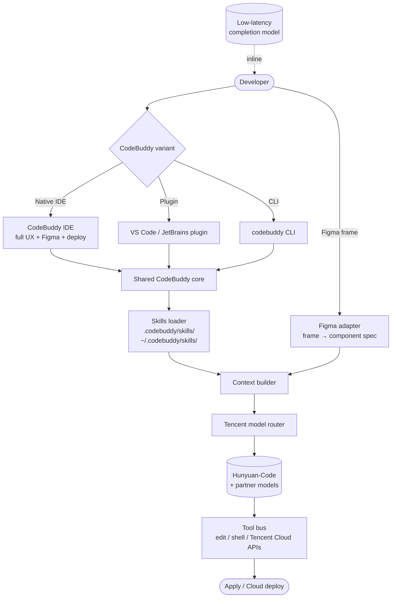

# CodeBuddy

> **Slug**: `codebuddy` · **Surface**: IDE + Plugin + CLI · **Vendor**: Tencent Cloud · **License**: Proprietary

Tencent Cloud's full-stack coding-agent product, available in three forms: a native IDE, an IDE plugin for VS Code/JetBrains, and a CLI.

## Overview

CodeBuddy is Tencent's enterprise-targeted AI coding-assistant tool. The product spans the entire developer surface: a desktop IDE (CodeBuddy IDE), plug-in extensions (CodeBuddy Plugin), and a CLI (CodeBuddy Code). It's primarily aimed at the China market but available internationally via Tencent Cloud's intl portal.

## Skills support

| Item | Value |
| --- | --- |
| Project path | `.codebuddy/skills/` |
| Global path | `~/.codebuddy/skills/` |
| `--agent` slug | `codebuddy` |
| `allowed-tools` | Yes |
| `context: fork` | No |
| Hooks | No |

## Installation

```bash
npx skills add vercel-labs/agent-skills -a codebuddy
```

## Notable behavior

- Three product variants share the same `.codebuddy/skills/` folder, so a single skill works in IDE, plugin, and CLI surfaces.
- Real-time code completion with millisecond-level latency.
- Built-in Figma integration for design-to-code workflows.
- "Conversation as Programming" UX in the full IDE variant.
- One-click deployment to Tencent Cloud is built into the IDE.

## Internals & Architecture

CodeBuddy is unusual in shipping three distinct product surfaces — a native IDE, a VS Code/JetBrains plugin, and a CLI — all reading the same `.codebuddy/skills/` folder. Each surface has its own host-specific extras (Figma integration in the IDE, Cloud-deploy buttons, low-latency completion model) but the agent loop and skill loader are shared, with calls routed to Tencent's hosted Hunyuan-Code and partner models.



The architectural choice that ties the family together: **one skill folder, three surfaces**. A team's coding conventions, deployment scripts, and review checklists all live in one place and follow the developer wherever they go — IDE in the morning, plugin at lunch, CLI in CI overnight. That's a cleaner story than most multi-surface vendors achieve.

## Harness Deep Dive

### Agent loop

- **Shape**: ReAct, with **Figma frame import** as a notable input adapter that other agents lack.
- **Tool-call style**: Native function calling on Tencent-routed models.
- **Halting**: Standard.
- **Streaming**: Token + diff streaming across the three surfaces.

### Context & memory

- **Context strategy**: Workspace + skills + Figma frame specs (in IDE variant). A separate **low-latency completion model** runs alongside the main agent for inline suggestions.
- **Persistent files**: `.codebuddy/skills/`, `~/.codebuddy/skills/` — shared across IDE / plugin / CLI.
- **Compaction**: Standard.
- **Sub-context**: None first-party.
- **Cross-session memory**: Skills + per-surface state.

### Tool runtime

- **Built-ins**: Edit / shell / **Tencent Cloud APIs** (one-click deploy in the IDE), plus **Figma adapter** (frame → component spec).
- **Parallelism**: Sequential.
- **Approval / safety**: Configurable per surface.
- **Sandbox**: None client-side; Tencent Cloud APIs handle cloud-side ops.
- **MCP**: Supported.

### Model integration

- **Provider model**: **Tencent model router** — Hunyuan-Code plus partner models. Cloud-routed.
- **Caching**: Provider-level.
- **Multi-model**: Per-task selection.

### Innovation summary

**One skill folder, three product surfaces.** CodeBuddy is the dataset's cleanest "same conventions follow you across IDE / plugin / CLI" story, plus first-class Figma integration that's rare in the field. The shared `.codebuddy/skills/` folder removes the multi-surface synchronization headache that plagues most cross-product agent vendors.

## Documentation

- [CodeBuddy Skills](https://www.codebuddy.ai/docs/ide/Features/Skills)
- [CodeBuddy product page](https://copilot.tencent.com/)
- [Tencent Cloud overview](https://www.tencentcloud.com/products/acc)
