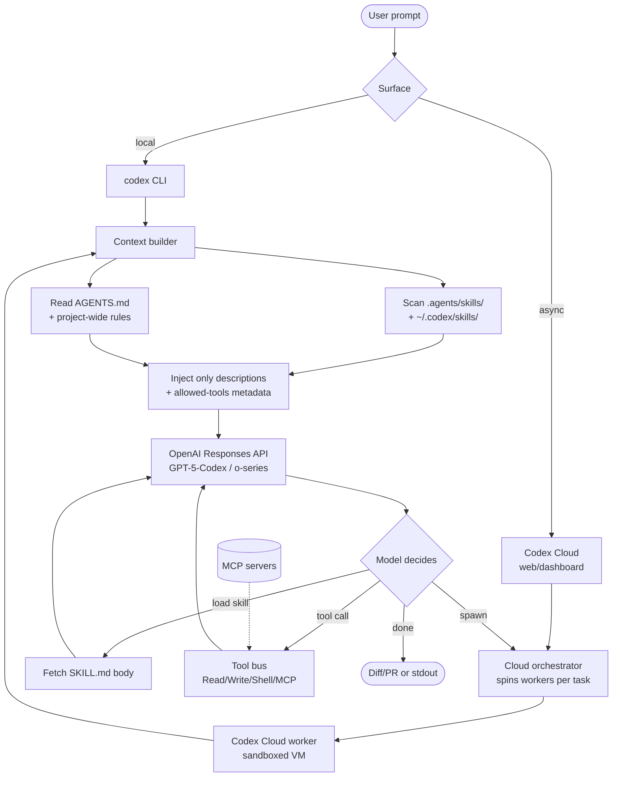

# Codex

> **Slug**: `codex` · **Surface**: CLI + Cloud · **Vendor**: OpenAI · **License**: Proprietary

OpenAI's coding agent. Two products under one name: a local CLI (`codex`) and Codex Cloud, an asynchronous fleet of cloud agents.

## Overview

Codex is OpenAI's flagship coding-agent CLI. It runs locally against the GPT family of models (Codex / GPT-5-Codex variants) and supports skills, MCP, and the cross-agent `AGENTS.md` rules format. Codex Cloud is the same agent surfaced as long-running cloud workers that can be spun up against a repo.

## Skills support

| Item | Value |
| --- | --- |
| Project path | `.agents/skills/` (shared bucket) |
| Global path | `~/.codex/skills/` |
| `--agent` slug | `codex` |
| `allowed-tools` | Yes |
| `context: fork` | No (use Codex Cloud one-shot tasks) |
| Hooks | No |

The shared `.agents/` project bucket means a single team-skills folder serves Codex alongside Cursor, Cline, GitHub Copilot, etc.

## Installation

```bash
npx skills add vercel-labs/agent-skills -a codex
```

Codex's official `codex` CLI also reads `AGENTS.md` at the repo root for project-wide instructions, complementing skills.

## Notable behavior

- OpenAI's docs frame skills as a *progressive disclosure* mechanism — only descriptions go in the system prompt; bodies fetch on demand.
- Codex Cloud parallelizes tasks: a single skill can be invoked across multiple parallel cloud workers.
- The CLI inherits Anthropic-style tool conventions (Read/Write/Shell), so most cross-agent skills work without modification.

## Internals & Architecture

Codex is two products that share a core: a local `codex` CLI binary and Codex Cloud, an asynchronous fleet of remote workers. Both use the same agent loop — system prompt assembly, tool-augmented LLM calls, JSONL transcripts — but Cloud forks a fresh worker per task, which is OpenAI's answer to `context: fork` (no in-process sub-context primitive).



The split surface explains why Codex's project path is the shared `.agents/skills/` bucket: the same skill folder needs to work whether you're running locally or have a cloud worker pull the repo. The "fork" in Codex isn't a frontmatter flag but a process boundary — Cloud workers are the equivalent of `context: fork` at the infrastructure layer.

## Harness Deep Dive

### Agent loop

- **Shape**: ReAct on the local CLI; **fan-out fleet** in Codex Cloud (one worker per task, each running the same loop independently).
- **Tool-call style**: Native function calling on the OpenAI Responses API. JSONL transcripts on disk for replay/debug.
- **Halting**: Model end-turn; per-task quotas in Cloud; per-session limits locally. Long-running Cloud workers can run for many minutes per task.
- **Streaming**: Token + tool-call streaming locally; per-task event streams in Cloud.

### Context & memory

- **Context strategy**: System prompt + `AGENTS.md` + skill descriptions; bodies fetched on demand. Long context handled through OpenAI's prompt cache where applicable.
- **Persistent file**: `AGENTS.md` at the repo root is the canonical project-wide instructions file (Codex was the first big agent to push the AGENTS.md convention).
- **Compaction**: Conversation summarization in long local sessions; Cloud workers don't summarize because each is short-lived.
- **Sub-context**: **Codex Cloud one-shot tasks** are the sub-context primitive. No in-process fork; the boundary is the cloud worker's filesystem and process.
- **Cross-session memory**: `AGENTS.md` + skills. Cloud tasks are stateless across invocations.

### Tool runtime

- **Built-ins**: Read, Write, Shell, plus MCP — the standard set tuned to OpenAI tool conventions.
- **Parallelism**: Sequential tool calls per agent. Cloud parallelism happens at the *task* level (multiple workers), not within a single agent.
- **Approval / safety**: Local CLI defaults to auto-run with configurable confirmation; Cloud tasks run inside sandboxed VMs.
- **Sandbox**: None locally; Cloud workers run in sandboxed VMs (full container isolation).
- **MCP**: First-class.

### Model integration

- **Provider model**: OpenAI-only — Codex / GPT-5-Codex / o-series. Vendor-routed via OpenAI APIs.
- **Caching**: OpenAI prompt cache for stable prefixes.
- **Multi-model**: Pick the model at startup; mid-session swap is uncommon.

### Innovation summary

**One agent loop, two delivery shapes** — local CLI for interactive coding, cloud worker fan-out for async tasks. Codex Cloud is the cleanest example of "the agent loop is decoupled from the surface", because the *exact same* loop runs whether you're in a terminal or fanned out across N parallel cloud VMs each consuming a different issue. **AGENTS.md** as a project-wide rules convention started here and has since been adopted by most of the field.

## Documentation

- [Codex Skills](https://developers.openai.com/codex/skills)
- [OpenAI developer docs](https://developers.openai.com/codex/)
