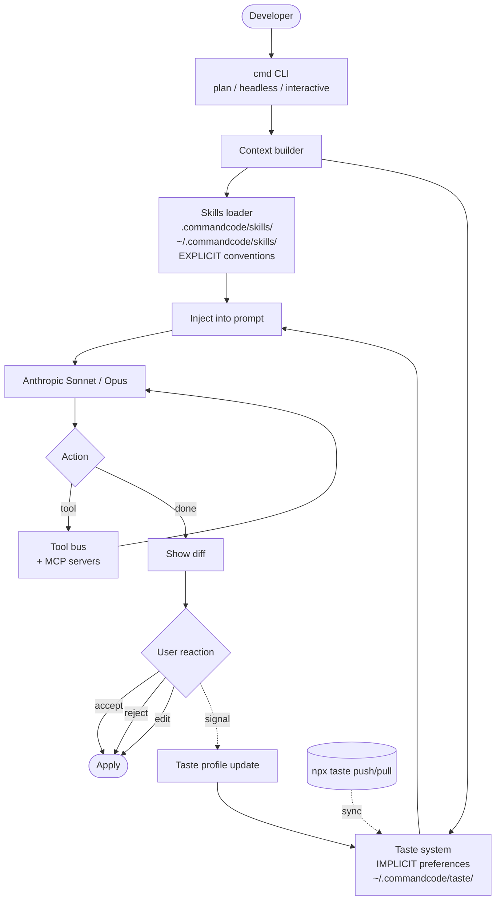

# Command Code

> **Slug**: `command-code` · **Surface**: CLI · **Vendor**: Command Code · **License**: Proprietary

A frontier coding agent that learns your individual coding "taste" and applies it automatically.

## Overview

Command Code (`cmd`) is a CLI-first agent built on the Claude family of models. Its differentiator is the **Taste system** — a neuro-symbolic model that observes every accept/reject/edit and builds a profile of how you (and your team) write code. The taste profile can be pushed and pulled with `npx taste push/pull`, similar to npm packages.

Funded with $5M seed led by Tom Preston-Werner (former GitHub CEO).

## Skills support

| Item | Value |
| --- | --- |
| Project path | `.commandcode/skills/` |
| Global path | `~/.commandcode/skills/` |
| `--agent` slug | `command-code` |
| `allowed-tools` | Yes |
| `context: fork` | No |
| Hooks | No |

## Installation

```bash
npm i -g command-code
cmd

npx skills add vercel-labs/agent-skills -a command-code
```

## Notable behavior

- Skills are layered on top of Command Code's own slash-command / plan-mode framework.
- The Taste system is independent of skills but complements them — skills define explicit conventions, Taste captures implicit preferences.
- MCP integration for connecting external tools.
- Plan mode, headless mode, interactive mode — skills work in all three.

## Internals & Architecture

Command Code's headline is the **Taste system**: a neuro-symbolic profile that observes every accept/reject/edit and learns the user's implicit preferences (variable naming, indentation, library choices, comment style). Taste runs alongside the conventional skills loader — skills capture *explicit* team conventions, Taste captures *implicit* individual preferences — and both feed the same agent loop. Taste profiles are pushed and pulled with `npx taste push/pull`, modelled on npm.



The Taste loop is the architectural innovation: every user reaction (accept, reject, edit) feeds back into Taste, which improves future suggestions without any explicit rule writing. That's a substantively different bet from skills — skills assume you can articulate the rule; Taste assumes you can't, but you'll know it when you see it. Together they cover both halves of "what does this team's code look like?"

## Harness Deep Dive

### Agent loop

- **Shape**: ReAct in plan / headless / interactive modes.
- **Tool-call style**: Native function calling on Anthropic.
- **Halting**: Standard end-turn / max-turn.
- **Streaming**: Token streaming + diff approval.

### Context & memory

- **Context strategy**: Skills (explicit team conventions) plus **Taste profile** (implicit user preferences) injected together into every prompt. Workspace context layered on.
- **Persistent files**: `.commandcode/skills/`, `~/.commandcode/skills/`, plus `~/.commandcode/taste/` (Taste profile, versioned).
- **Compaction**: Standard.
- **Sub-context**: None first-party.
- **Cross-session memory**: **Taste profile auto-evolves** with every accept/reject/edit signal. Pushable/pullable like an npm package via `npx taste push/pull`.

### Tool runtime

- **Built-ins**: Standard fs/shell + slash commands.
- **Parallelism**: Sequential.
- **Approval / safety**: Diff-approval-as-signal (every approval/rejection feeds Taste).
- **Sandbox**: None.
- **MCP**: Supported.

### Model integration

- **Provider model**: Anthropic Sonnet / Opus.
- **Caching**: Anthropic prompt cache.
- **Multi-model**: Pick model per session.

### Innovation summary

**Taste system — a neuro-symbolic profile of implicit preferences, pushable like an npm package.** Command Code is the dataset's cleanest separation of "explicit conventions" (skills) and "implicit preferences" (Taste). Skills assume you can articulate the rule; Taste assumes you can't, but you'll know it when you see it. The pushable profile is the closest thing to "share your code style as a package" that the dataset has.

## Documentation

- [Command Code docs](https://commandcode.ai/docs)
- [Skills](https://commandcode.ai/docs/skills)
- [CLI Reference](https://commandcode.ai/docs/reference/cli)
