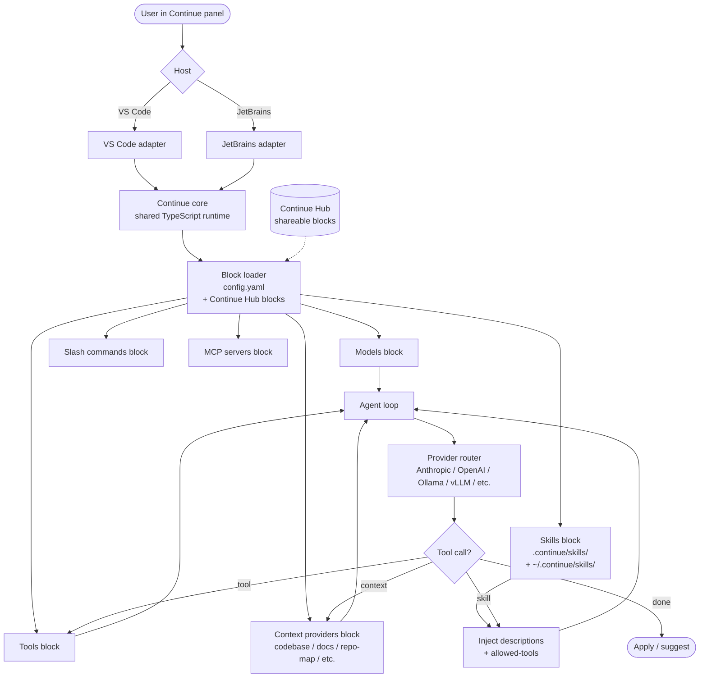

# Continue

> **Slug**: `continue` · **Surface**: IDE extensions (VS Code, JetBrains) · **Vendor**: Continue.dev · **License**: Apache 2.0

The leading open-source AI coding extension. Adopted skills early.

## Overview

Continue is the open-source AI coding extension that pioneered the "bring your own model" experience inside VS Code and JetBrains. It supports any LLM provider (cloud, local, self-hosted) and exposes a customisable assistant surface.

## Skills support

| Item | Value |
| --- | --- |
| Project path | `.continue/skills/` |
| Global path | `~/.continue/skills/` |
| `--agent` slug | `continue` |
| `allowed-tools` | Yes |
| `context: fork` | No |
| Hooks | No |

## Installation

```bash
npx skills add vercel-labs/agent-skills -a continue
```

## Notable behavior

- Continue's `config.yaml` is the primary configuration mechanism; skills layer on top for cross-agent portability.
- Block-based assistant configuration: skills, models, slash commands, and tools are all individually-configurable blocks.
- Strong local-model story (Ollama, llama.cpp, etc.).
- The Continue Hub also lets you publish and discover assistants and skills.

## Internals & Architecture

Continue is the most "Lego-like" of the IDE extensions: **everything is a block** in `config.yaml` — models, slash commands, context providers, tools, skills, MCP servers — and a user composes their assistant by combining blocks. The same TypeScript core ships to VS Code and JetBrains via thin host adapters; the agent loop is provider-agnostic, with Ollama / vLLM / llama.cpp first-class alongside the major cloud providers.



The architectural bet that pays off: **portability through composition**. A user can swap models, swap providers, swap context providers, or pull a new block from the Continue Hub without changing the rest of the assistant. Skills are just one block among many — a knowledge block — and they ride alongside slash-command and prompt blocks rather than displacing them.

## Harness Deep Dive

### Agent loop

- **Shape**: ReAct, with `config.yaml` blocks composing the assistant's tools, models, and context providers.
- **Tool-call style**: Native function calling for modern providers; configurable per-block.
- **Halting**: Standard end-turn / max-turn.
- **Streaming**: Tokens stream into the IDE panel.

### Context & memory

- **Context strategy**: **Context providers** (`@codebase`, `@docs`, `@repo-map`, `@file`, etc.) are pluggable blocks the user explicitly invokes or the model implicitly uses.
- **Persistent files**: `config.yaml`, `.continue/skills/`, `~/.continue/skills/`. Continue Hub blocks can be pulled in.
- **Compaction**: Standard summarization.
- **Sub-context**: None first-party.
- **Cross-session memory**: Skill files + `config.yaml` blocks (everything is a block).

### Tool runtime

- **Built-ins**: Configured per-block (Tools block); MCP-as-block; standard fs/shell.
- **Parallelism**: Sequential.
- **Approval / safety**: Configurable per tool block.
- **Sandbox**: None.
- **MCP**: First-class as `mcpServers:` block in `config.yaml`.

### Model integration

- **Provider model**: Most BYOK-friendly agent in the dataset — Anthropic, OpenAI, Google, Bedrock, Ollama, vLLM, llama.cpp, OpenRouter, OpenAI-compatible. Each model is a block.
- **Caching**: Provider-level.
- **Multi-model**: Per-block / per-conversation; user can assign different models per task.

### Innovation summary

**Lego-block composition — everything is a `config.yaml` block.** Continue is the dataset's strongest "portability through composition" bet: skills, models, slash commands, context providers, tools, and MCP servers are all interchangeable blocks pulled from the Continue Hub or written locally. Swap any block without rewriting the rest.

## Documentation

- [Continue docs](https://docs.continue.dev/)
- [Continue Hub](https://hub.continue.dev/)
