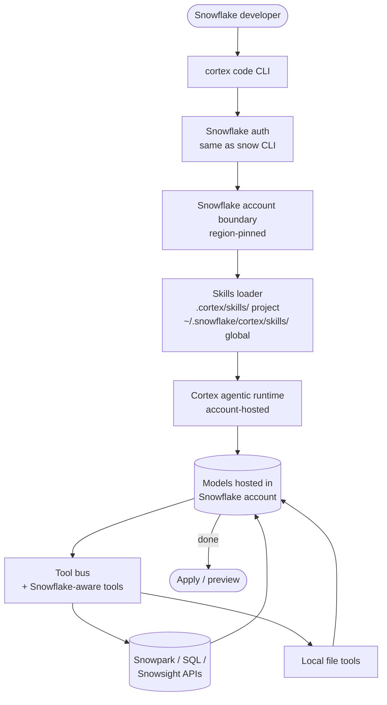

# Cortex Code

> **Slug**: `cortex` · **Surface**: CLI · **Vendor**: Snowflake · **License**: Proprietary

Snowflake's coding-agent surface for Cortex.

## Overview

Cortex Code is a coding agent that lives inside Snowflake's Cortex AI platform. It is intended for developers building on Snowflake (Snowpark, Snowsight, etc.), with skills as a way to ride team conventions and Snowflake-specific best practices into the agent.

## Skills support

| Item | Value |
| --- | --- |
| Project path | `.cortex/skills/` |
| Global path | `~/.snowflake/cortex/skills/` |
| `--agent` slug | `cortex` |
| `allowed-tools` | Yes (assumed) |
| `context: fork` | No |
| Hooks | No |

The vendor-nested global path (`~/.snowflake/cortex/`) is one of only a handful in the dataset — Snowflake namespaces every Cortex artifact under `.snowflake/`.

## Installation

```bash
npx skills add vercel-labs/agent-skills -a cortex
```

## Notable behavior

- The global path follows Snowflake's CLI convention of nesting all configuration under `~/.snowflake/`.
- Skills are particularly useful for codifying Snowflake SQL patterns, Snowpark conventions, and security boilerplate.
- Cortex Code coexists with Snowflake's other agentic features.

## Internals & Architecture

Cortex Code is a thin coding-agent surface on top of **Snowflake Cortex**, the platform's agentic-AI runtime. The agent runs against models hosted *inside* the Snowflake account boundary, which is the security selling point — code never leaves the customer's Snowflake region. Skills inject Snowflake-specific conventions (Snowpark patterns, SQL style, Snowsight integration), and the global path nests under `~/.snowflake/` because Cortex shares config space with the rest of Snowflake's CLI.



The architectural commitment is **stay inside the account boundary**: the agent, the model, the data, and the tooling all execute within the customer's Snowflake region. That makes Cortex Code uniquely well-suited for finance, healthcare, and regulated workloads where shipping code to a third-party model gateway is a non-starter — the trade-off is that Cortex is meaningfully less general-purpose than the cross-platform CLIs.

## Harness Deep Dive

### Agent loop

- **Shape**: ReAct against Snowflake-hosted models — region-pinned execution.
- **Tool-call style**: Native function calling on Cortex's runtime.
- **Halting**: Standard.
- **Streaming**: Token streaming.

### Context & memory

- **Context strategy**: Workspace + skills + Snowflake metadata (objects, schemas, roles).
- **Persistent files**: `.cortex/skills/`, `~/.snowflake/cortex/skills/` (vendor-nested under `~/.snowflake/`).
- **Compaction**: Standard.
- **Sub-context**: None first-party.
- **Cross-session memory**: Skill files + Snowflake account state.

### Tool runtime

- **Built-ins**: Local file tools, **Snowpark / SQL / Snowsight APIs** as first-class tools.
- **Parallelism**: Sequential.
- **Approval / safety**: Snowflake auth + roles enforce permissions; agent inherits user permissions.
- **Sandbox**: **Snowflake account boundary** — code, data, model, and tooling stay in-region.
- **MCP**: Supported.

### Model integration

- **Provider model**: **Models hosted inside the Snowflake account** — region-pinned, never leaves the customer's data perimeter.
- **Caching**: Cortex-managed.
- **Multi-model**: Pick within Cortex's catalog.

### Innovation summary

**Account-boundary execution.** Cortex Code is the dataset's only "code never leaves your data perimeter" agent — agent + model + data + tools stay inside the customer's Snowflake region. Specialty product for finance / healthcare / regulated workloads where shipping code to a third-party gateway is a non-starter.

## Documentation

- [Snowflake Cortex AI](https://docs.snowflake.com/en/guides-overview-ai-features)
