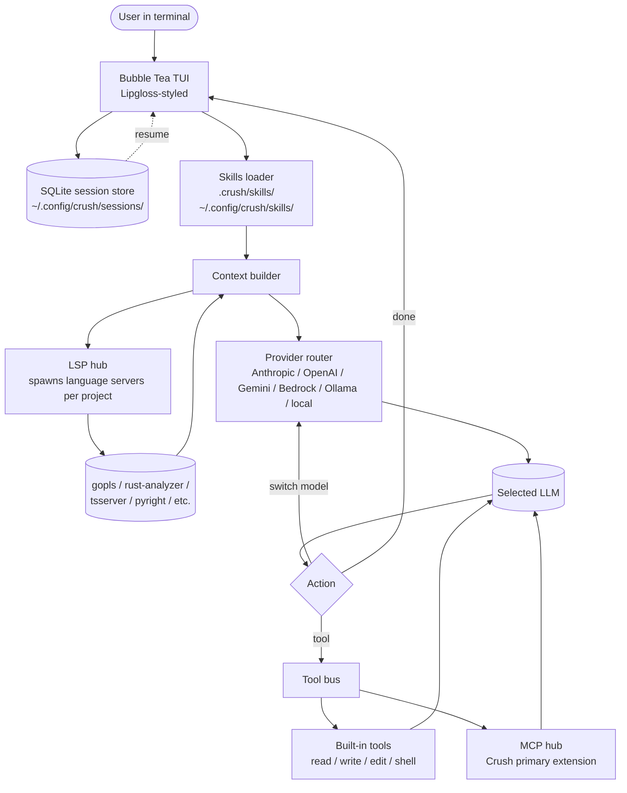

# Crush

> **Slug**: `crush` · **Surface**: TUI / CLI · **Vendor**: Charmbracelet · **License**: MIT

Charmbracelet's polished terminal coding agent, written in Go.

## Overview

Crush is the Charm team's entry into the agentic coding space. They previously built Bubble Tea, Glamour, Lipgloss — the foundation of most polished Go TUIs — so unsurprisingly, Crush has the most refined visual UX of any terminal agent in the matrix.

## Skills support

| Item | Value |
| --- | --- |
| Project path | `.crush/skills/` |
| Global path | `~/.config/crush/skills/` (XDG) |
| `--agent` slug | `crush` |
| `allowed-tools` | Yes |
| `context: fork` | No |
| Hooks | No |

## Installation

```bash
brew install charmbracelet/tap/crush
# or
npm install -g @charmland/crush
# or
go install github.com/charmbracelet/crush@latest

npx skills add vercel-labs/agent-skills -a crush
```

## Notable behavior

- LSP-enhanced: Crush wires Language Server Protocols into the agent's context, so it gets symbol-aware completions and navigation.
- Multi-provider: Anthropic, OpenAI, Gemini, Bedrock, local. Switch mid-session with state preserved.
- Cross-platform: macOS, Linux, Windows, Android, FreeBSD, OpenBSD, NetBSD.
- Sessions are persistent — close the terminal and resume later.
- Skills are layered on top of MCP, which is Crush's primary extension mechanism.

## Internals & Architecture

Crush is a Go binary built on Charmbracelet's Bubble Tea TUI framework. The standout architectural choices: **LSP-augmented context** (the agent talks to the same Language Servers your editor would, getting symbol-aware navigation for free), **provider-agnostic with mid-session switching** (state survives a model swap), and **persistent sessions** stored as SQLite files so closing the terminal doesn't lose the conversation.



The decision to make **MCP the primary extension mechanism** with skills layered on top means Crush behaves like a Unix tool: skills are knowledge, MCP servers are capabilities, and the agent treats them orthogonally. The LSP integration is the differentiator vs. other terminal agents — Crush can answer "what calls this function?" with the same precision as your IDE's Find Usages.

## Harness Deep Dive

### Agent loop

- **Shape**: ReAct in a Bubble Tea TUI. **Mid-session model swap with state preserved** is a notable loop quirk.
- **Tool-call style**: Native function calling for modern providers; legacy fallbacks via the provider router.
- **Halting**: Standard.
- **Streaming**: Token streaming with Lipgloss-styled panels.

### Context & memory

- **Context strategy**: **LSP hub** spawns language servers (gopls, rust-analyzer, tsserver, pyright) per project so the agent gets symbol-aware navigation alongside file content.
- **Persistent files**: `.crush/skills/`, `~/.config/crush/skills/` (XDG). **SQLite session store** under `~/.config/crush/sessions/` — close terminal, resume later.
- **Compaction**: Standard summarization; SQLite history makes long sessions resumable rather than compactable.
- **Sub-context**: None first-party.
- **Cross-session memory**: SQLite session store + skill files.

### Tool runtime

- **Built-ins**: Read / write / edit / shell, plus **LSP-driven navigation tools** that other CLI agents lack.
- **Parallelism**: Sequential by default.
- **Approval / safety**: Configurable per category.
- **Sandbox**: None.
- **MCP**: **MCP is the primary extension mechanism** alongside built-ins.

### Model integration

- **Provider model**: BYOK across Anthropic, OpenAI, Gemini, Bedrock, Ollama, local. **Mid-session swap preserves state** — switch from Sonnet to local Qwen and the conversation survives.
- **Caching**: Provider-level.
- **Multi-model**: Per-conversation, mid-session swap supported.

### Innovation summary

**LSP-augmented context + persistent SQLite sessions in a polished TUI.** Crush is the only terminal agent that wires the same LSP your editor uses into the agent's context — "find usages" is as precise in Crush as in your IDE. SQLite sessions plus mid-session model swap are quiet but high-value engineering wins.

## Documentation

- [Crush GitHub](https://github.com/charmbracelet/crush)
- [Crush AGENTS.md](https://github.com/charmbracelet/crush/blob/main/AGENTS.md)
- [Skills section in README](https://github.com/charmbracelet/crush?tab=readme-ov-file#agent-skills)
