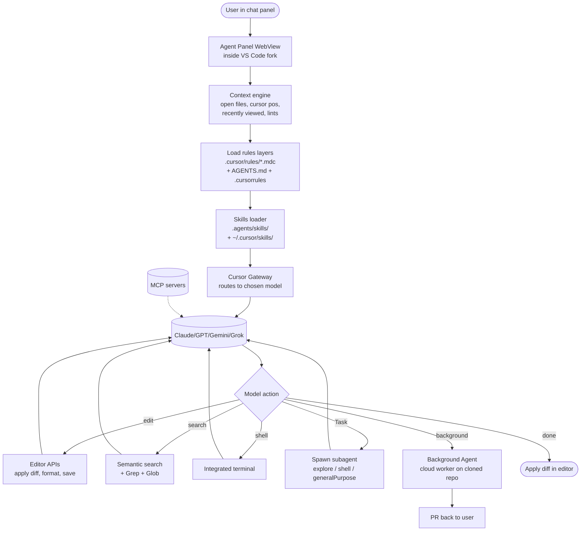

# Cursor

> **Slug**: `cursor` · **Surface**: Native AI IDE · **Vendor**: Anysphere · **License**: Proprietary

The category-defining AI IDE. A VS Code fork with deeply-integrated agent capabilities, background agents, and now skills.

## Overview

Cursor is Anysphere's flagship product: a fork of VS Code that integrates Claude/GPT/Gemini with editor-aware tooling. Skills are one of several rules systems it supports (alongside `.cursor/rules/*.mdc` files), giving teams portable cross-agent instructions.

## Skills support

| Item | Value |
| --- | --- |
| Project path | `.agents/skills/` (shared bucket) |
| Global path | `~/.cursor/skills/` |
| `--agent` slug | `cursor` |
| `allowed-tools` | Yes |
| `context: fork` | No (use Background Agents / Task tool) |
| Hooks | No (Cursor has its own hooks system, separate) |

The hybrid path layout — shared `.agents/skills/` for projects, namespaced `~/.cursor/skills/` for global — is one of the smarter design choices in the dataset. A team can ship one set of skills that work for everyone on the team, regardless of which agent each developer uses.

## Installation

```bash
npx skills add vercel-labs/agent-skills -a cursor
```

Cursor will pick up skills the next time the agent panel is opened. Skills coexist with `.cursor/rules/` and `AGENTS.md`.

## Notable behavior

- Cursor's **Background Agents** are the local equivalent of `context: fork` — a skill can suggest "delegate to a background agent" in plain English and Cursor will offer to do so.
- Cursor's **Task tool** can spawn explore/shell/general-purpose subagents; these are the recommended pattern for long-running work declared in a skill.
- Cursor also reads `AGENTS.md` and `.cursorrules` for legacy compatibility.
- Cursor's **own skills system** is documented at `cursor.com/docs/context/skills` and is fully spec-compatible.

## Internals & Architecture

Cursor is a VS Code fork: the editor runs Electron + a modified extension host, and the agent panel runs as a tightly-integrated WebView with privileged access to editor APIs (selections, language servers, edit history). The agent itself talks to Anthropic / OpenAI / xAI / Google models through Cursor's hosted gateway, with editor-aware tools (Read, Edit, Search) that operate on the open workspace and a `Task` tool that can spawn subagents inside or outside the current process.



Cursor's hybrid skills layout (project-level `.agents/skills/`, global `~/.cursor/skills/`) mirrors its philosophy: be a good citizen of the cross-agent ecosystem at the project level, but own the user-level UX. The `Task` tool plus Background Agents stand in for `context: fork` — anything long enough to need a sub-context gets delegated either to a same-process subagent or a cloud worker, with the answer streamed back into the parent chat.

## Harness Deep Dive

### Agent loop

- **Shape**: ReAct, with **`Task`-tool subagents** (`subagent_type: explore | shell | generalPurpose | best-of-n-runner`) for sub-contexts and **Background Agents** for cloud-side parallel runs.
- **Tool-call style**: Native function calling on whichever model the user picks (Anthropic, OpenAI, xAI, Google).
- **Halting**: Model end-turn signal; max-turns fallback; user-interrupt is one click.
- **Streaming**: Tokens, tool calls, *and* diffs all stream live in the editor — applied edits update before the turn finishes.

### Context & memory

- **Context strategy**: A continuously-running **context engine** in the editor — open files, cursor position, recently viewed files, selection, lints, terminals, recent edits — assembles a per-turn snapshot.
- **Persistent files**: `.cursor/rules/*.mdc` (named or auto-attached rules), `AGENTS.md`, `.cursorrules` (legacy), and `CLAUDE.md` (compatibility).
- **Compaction**: Editor prunes older turns; long sessions rely on workspace re-reads via tools rather than verbatim retention.
- **Sub-context**: `Task` tool with explicit `subagent_type` flags. Background Agents run on a cloned repo in a cloud worker and PR back. No frontmatter-level `context: fork`.
- **Cross-session memory**: Rules layer + project-level skills survive across sessions; no auto-learned long-term store.

### Tool runtime

- **Built-ins**: Read, Edit, Write, Glob, Grep, SemanticSearch, Shell, Task, ReadLints, GenerateImage, EditNotebook, Await, WebSearch, WebFetch — one of the larger out-of-the-box surfaces in the dataset.
- **Parallelism**: Tool calls can fire in parallel within a turn; subagents run truly in parallel via `Task`.
- **Approval / safety**: Auto-run controlled per command class (file edits / shell / MCP). Configurable to require approval per tool or per command pattern.
- **Sandbox**: Local by default; Background Agents run in cloud workers.
- **MCP**: First-class; servers configured per-project in `.cursor/mcp.json`.
- **Hooks**: Cursor has its own hook system (separate from the spec's hooks) for editor and shell events.

### Model integration

- **Provider model**: **Cursor Gateway** — vendor-routed across Anthropic, OpenAI, Google, xAI. The user picks the model; Cursor handles auth and billing.
- **Caching**: Provider-level prompt caching where supported (Anthropic / OpenAI).
- **Multi-model**: Per-conversation model selection; can switch mid-session.

### Innovation summary

**Editor-aware context assembly + the `Task` tool with explicit subagent types + Background Agents.** Cursor is the most complete answer in the dataset to "what if the editor itself were the harness?" — and its hybrid skill paths (cross-agent project bucket, vendor-namespaced global) are a quiet design win that lets it co-exist with the rest of the ecosystem without surrendering its own UX.

## Documentation

- [Cursor Skills](https://cursor.com/docs/context/skills)
- [Cursor Rules](https://cursor.com/docs/context/rules)
- [Background Agents](https://cursor.com/docs/agent/background-agents)
