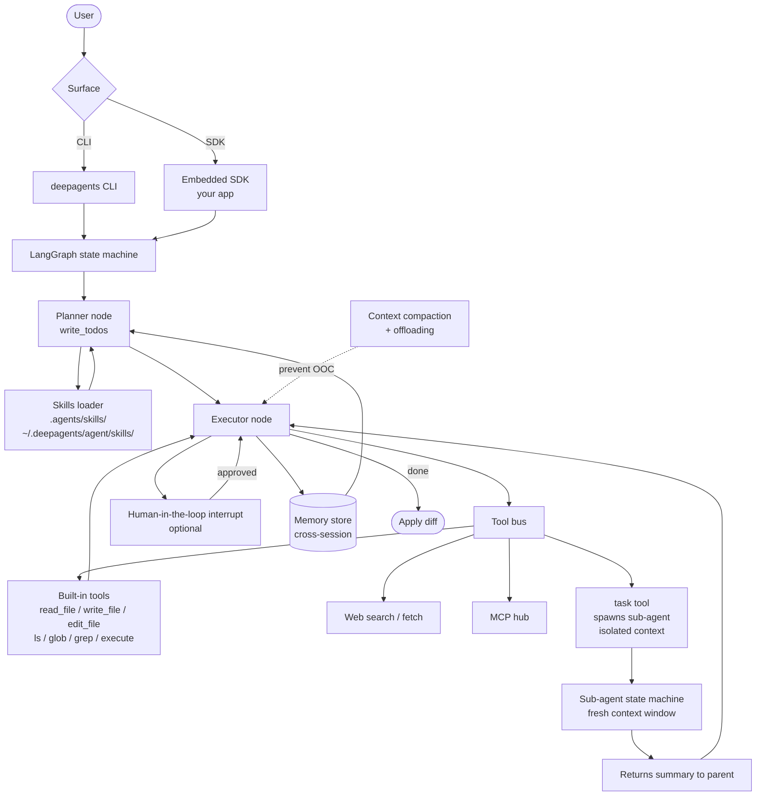

# Deep Agents

> **Slug**: `deepagents` · **Surface**: SDK + CLI · **Vendor**: LangChain · **License**: MIT

LangChain's open-source "batteries-included" agent harness. SDK + CLI for building and running multi-step agentic workflows.

## Overview

Deep Agents is LangChain's opinionated take on a coding/general agent harness, built on top of LangChain and LangGraph. It ships with a CLI for ad-hoc use and an SDK so you can embed the agent runtime in your own products. It treats skills as a first-class extension mechanism, sitting alongside its built-in tools and MCP integration.

## Skills support

| Item | Value |
| --- | --- |
| Project path | `.agents/skills/` (shared bucket) |
| Global path | `~/.deepagents/agent/skills/` |
| `--agent` slug | `deepagents` |
| `allowed-tools` | Yes |
| `context: fork` | No (Deep Agents has the `task` sub-agent tool instead) |
| Hooks | No |

The global path includes an extra `agent/` segment — same convention Pi uses (`~/.pi/agent/skills/`).

## Installation

```bash
npx skills add vercel-labs/agent-skills -a deepagents
```

## Notable behavior

- Built-in tools: `read_file`, `write_file`, `edit_file`, `ls`, `glob`, `grep`, `execute`, `write_todos`, `task`.
- The `task` tool lets the agent spawn sub-agents with isolated context windows — equivalent to `context: fork` but tool-based instead of frontmatter-based.
- Web search and HTTP requests built in.
- Memory storage and retrieval across sessions.
- Context compaction and offloading for long-running tasks.
- Human-in-the-loop approval controls.
- MCP integration for external tools.
- LangChain blog has detailed guidance on using skills with Deep Agents.

## Internals & Architecture

Deep Agents is **LangChain on top of LangGraph**, packaged as a coding-agent harness. The agent is a LangGraph state machine: nodes for planner, executor, and the `task` sub-agent spawner; edges that gate transitions on tool results; and human-in-the-loop interrupts wired into the graph. Skills are just one input to the planner node alongside MCP tools and the built-in tool registry.



The graph-based architecture is the architectural difference: where most agents are a `while True: tool_call()` loop, Deep Agents is **a state machine you can pause, inspect, replay, and graft sub-graphs onto**. That makes it the easiest harness to embed in a larger LangChain application — and the only one in the dataset where "the agent's plan" is a first-class data structure (the todo list) the user can edit between turns.

## Harness Deep Dive

### Agent loop

- **Shape**: **LangGraph state machine** — planner / executor / `task` sub-agent spawner as nodes, edges gate transitions on tool results, **human-in-the-loop interrupts** wired into the graph.
- **Tool-call style**: Native function calling per provider via LangChain.
- **Halting**: Graph-level — `done` node, HITL interrupts, or budget caps.
- **Streaming**: LangGraph events stream per node.

### Context & memory

- **Context strategy**: **Context compaction + offloading** are first-class graph features. **`write_todos`** is a built-in plan structure the user can edit between turns. A separate **memory store** persists across sessions.
- **Persistent files**: `.agents/skills/` (shared bucket), `~/.deepagents/agent/skills/`. Plus the LangGraph memory store.
- **Compaction**: First-class, named primitive.
- **Sub-context**: **`task` tool** spawns a fresh-context sub-agent state machine; returns summary to parent.
- **Cross-session memory**: LangGraph memory store + skill files.

### Tool runtime

- **Built-ins**: `read_file`, `write_file`, `edit_file`, `ls`, `glob`, `grep`, `execute`, `write_todos`, **`task`**, plus web search and HTTP fetch.
- **Parallelism**: Sub-agents via `task` can run concurrently.
- **Approval / safety**: HITL interrupt nodes can block any transition.
- **Sandbox**: None first-party (the host application provides the sandbox if needed).
- **MCP**: First-class via the LangChain MCP integration.

### Model integration

- **Provider model**: Provider-agnostic via LangChain — Anthropic, OpenAI, Google, local, etc.
- **Caching**: Provider-level.
- **Multi-model**: Per-node model assignment in the graph.

### Innovation summary

**LangGraph state machine — pause, inspect, replay, graft sub-graphs.** Deep Agents is the only entry in the dataset where the agent loop is **a graph you can edit between turns** rather than an opaque `while True`. `write_todos` makes the plan a first-class editable data structure. Easiest harness to embed in a larger LangChain application; the SDK-first surface is the differentiator.

## Documentation

- [Deep Agents overview](https://docs.langchain.com/deepagents)
- [Using skills with Deep Agents](https://blog.langchain.dev/using-skills-with-deep-agents)
- [Deep Agents GitHub](https://github.com/langchain-ai/deepagents)
