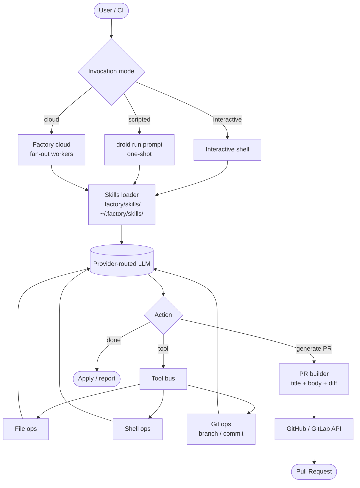

# Droid

> **Slug**: `droid` · **Surface**: CLI · **Vendor**: Factory AI · **License**: Proprietary

Factory AI's coding-agent CLI.

## Overview

Droid is the agent product from Factory AI, a startup that builds tools for autonomous software engineering. The CLI is designed for both interactive use and async/CI workflows.

## Skills support

| Item | Value |
| --- | --- |
| Project path | `.factory/skills/` |
| Global path | `~/.factory/skills/` |
| `--agent` slug | `droid` |
| `allowed-tools` | Yes |
| `context: fork` | No |
| Hooks | No |

Note the slug/folder mismatch: the slug is `droid` (the product), but the folder is `.factory/` (the company).

## Installation

```bash
npx skills add vercel-labs/agent-skills -a droid
```

## Notable behavior

- Async-friendly: Droid's CLI is designed to be invoked from CI pipelines and shell scripts as well as interactively.
- Strong focus on agentic refactors and PR generation as first-class workflows.
- Skills load from `.factory/skills/` regardless of which "Droid" surface (interactive / scripted / cloud) you're using.

## Internals & Architecture

Droid is Factory AI's CLI surface for autonomous-engineering workflows. It runs in three modes — interactive, scripted (one-shot in a shell pipe), and cloud (fleet-style fan-out) — and treats **PR generation as a first-class output** rather than just file edits. Skills install into `.factory/skills/`, and the same skill is consumed by all three modes without modification.



The architecturally-interesting choice is **PR-as-output**: the agent doesn't stop at the diff, it composes the PR title and description, opens it on the host platform, and reports back. That makes Droid uniquely well-suited for *async* workflows — fire it off, get a PR notification later — which is exactly the workflow Factory AI's product design optimizes for.

## Harness Deep Dive

### Agent loop

- **Shape**: ReAct in three invocation modes — **interactive**, **scripted** (`droid run prompt` one-shot), **cloud** (Factory cloud fan-out).
- **Tool-call style**: Native function calling on the routed provider.
- **Halting**: End-turn or PR creation; scripted/cloud modes terminate after PR open.
- **Streaming**: Token streaming interactively; structured output in scripted mode.

### Context & memory

- **Context strategy**: Workspace + skills + git state. PR builder composes title + body + diff.
- **Persistent files**: `.factory/skills/`, `~/.factory/skills/` (note: slug `droid`, folder `.factory/`).
- **Compaction**: Standard summarization in long interactive sessions.
- **Sub-context**: Cloud fleet workers act as sub-contexts.
- **Cross-session memory**: Skill files + git history.

### Tool runtime

- **Built-ins**: File ops, shell, **git ops** (branch, commit), and **PR builder** (GitHub / GitLab API integration).
- **Parallelism**: Sequential per agent; cloud mode parallelizes at the task level.
- **Approval / safety**: Configurable; CI mode runs unattended by design.
- **Sandbox**: None locally; cloud workers run in Factory's sandboxed environments.
- **MCP**: Supported.

### Model integration

- **Provider model**: Provider-routed via Factory.
- **Caching**: Provider-level.
- **Multi-model**: Per-session selection.

### Innovation summary

**PR-as-output — the agent's terminal product is a Pull Request, not a diff.** Droid is built around async / CI workflows where firing the agent off and getting a PR notification later is the win, not interactive back-and-forth. That's a meaningfully different product surface than the chat-first agents in this dataset.

## Documentation

- [Factory AI / Droid Skills](https://docs.factory.ai/cli/configuration/skills)
- [Factory AI homepage](https://factory.ai/)
