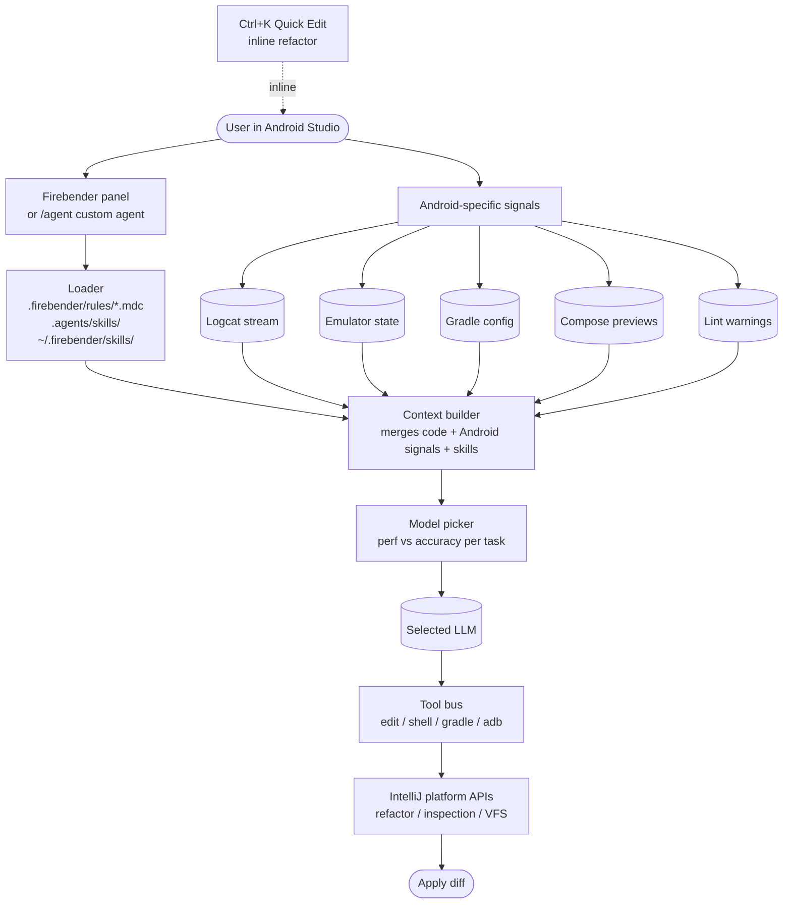

# Firebender

> **Slug**: `firebender` · **Surface**: JetBrains plugin (Android Studio, IntelliJ) · **Vendor**: Firebender (YC W24) · **License**: Proprietary

A YC-backed AI coding assistant built specifically for Android Studio and the JetBrains IDE family.

## Overview

Firebender is a specialist: it lives inside Android Studio (and other JetBrains IDEs) and is tuned for Android-specific contexts — Kotlin, Jetpack Compose, Logcat, emulator data, and modern Android libraries (Room, Retrofit, Hilt). Founded by Aman Gottumukkala and Kevin T. (YC W24).

## Skills support

| Item | Value |
| --- | --- |
| Project path | `.agents/skills/` (shared bucket) |
| Global path | `~/.firebender/skills/` |
| `--agent` slug | `firebender` |
| `allowed-tools` | Yes |
| `context: fork` | No |
| Hooks | No |

The shared `.agents/` project path is interesting given Firebender's specialization — it confirms the team chose to align with the cross-agent convention rather than carve out its own niche directory.

## Installation

```bash
npx skills add vercel-labs/agent-skills -a firebender
```

In-IDE: Settings → Plugins → search "Firebender" → install.

## Notable behavior

- Firebender's own rules format lives in `.firebender/rules/*.mdc` (separate from skills).
- Custom Agents: create specialized agents (e.g., a code-review agent) using the `/agent` command.
- Quick Code Editing (Ctrl+K / Cmd+K) for inline natural-language refactors.
- Multi-model support — choose performance/accuracy trade-offs per task.
- Logcat and emulator integration are unique among the agents in this list.

## Internals & Architecture

Firebender is a JetBrains plugin specialized for Android development: it lives in Android Studio (and other IntelliJ-family IDEs) and wires Android-specific signals — Logcat, emulator state, Gradle config, Compose previews, Lint results — directly into the agent's context. Skills layer on top, with a separate `.firebender/rules/*.mdc` file format inherited from the Cursor rules convention.



The architectural specialty isn't the agent loop — it's the **Android signal pipeline**. Firebender is the only agent in the matrix that reads Logcat live, so a skill like "diagnose this crash" can rely on real runtime data rather than just static analysis. That makes the skills authored for Firebender meaningfully different in shape: they tend to assume runtime context is part of the input.

## Harness Deep Dive

### Agent loop

- **Shape**: ReAct, with **Custom Agents** spawned via `/agent` and **Quick Code Editing** (Ctrl+K / Cmd+K) for inline natural-language refactors.
- **Tool-call style**: Native function calling per chosen model.
- **Halting**: Standard.
- **Streaming**: Tokens stream in the JetBrains panel; Quick Edit applies inline.

### Context & memory

- **Context strategy**: Code + **Android signals** (Logcat, emulator, Gradle, Compose previews, Lint) + skills + rules. Unique in the dataset for the live runtime data.
- **Persistent files**: `.firebender/rules/*.mdc` (Cursor-rules-derived), `.agents/skills/` (shared bucket), `~/.firebender/skills/`.
- **Compaction**: Standard.
- **Sub-context**: Custom Agents (specialized) act as sub-contexts.
- **Cross-session memory**: Rules + skills + JetBrains project state.

### Tool runtime

- **Built-ins**: Edit / shell / **gradle / adb (Logcat)** / IntelliJ platform APIs (refactor, inspection, VFS).
- **Parallelism**: Sequential by default.
- **Approval / safety**: Configurable; defaults are conservative for plugin context.
- **Sandbox**: None — runs in JetBrains plugin host.
- **MCP**: Supported.

### Model integration

- **Provider model**: Multi-model — choose perf vs accuracy per task.
- **Caching**: Provider-level.
- **Multi-model**: Per-task model selection.

### Innovation summary

**Live Logcat as agent context — only Android-aware harness in the dataset.** Firebender is the cleanest example of "specialize the harness around one domain's runtime signals." A "diagnose this crash" skill in Firebender can lean on real Logcat output rather than static analysis, which is an entire dimension of context other agents simply don't have.

## Documentation

- [Firebender Skills](https://docs.firebender.com/multi-agent/skills)
- [Firebender Quickstart](https://docs.firebender.com/get-started/quickstart)
