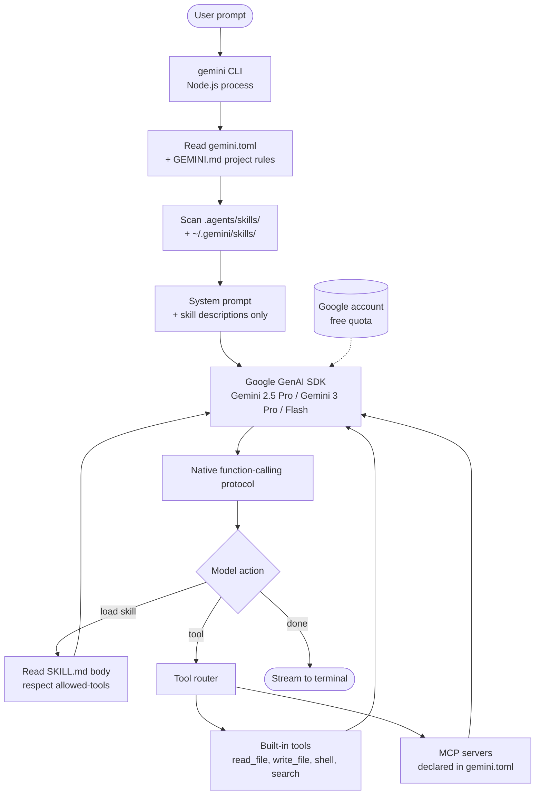

# Gemini CLI

> **Slug**: `gemini-cli` · **Surface**: CLI · **Vendor**: Google · **License**: Open source

Google's free terminal coding agent backed by Gemini. Available with a generous free tier on a personal Google account.

## Overview

Gemini CLI is Google's open-source coding agent that runs in your terminal. It uses the Gemini family of models (Gemini 2.5 Pro / Gemini 3 Pro / Flash) and is one of the better free-tier options for individual developers thanks to Google's API quota allocation.

## Skills support

| Item | Value |
| --- | --- |
| Project path | `.agents/skills/` (shared bucket) |
| Global path | `~/.gemini/skills/` |
| `--agent` slug | `gemini-cli` |
| `allowed-tools` | Yes |
| `context: fork` | No |
| Hooks | No |

## Installation

```bash
npx skills add vercel-labs/agent-skills -a gemini-cli
```

Gemini CLI reads `gemini.toml` for tool config, `GEMINI.md` for project-wide instructions, and now `.agents/skills/` for portable skills.

## Notable behavior

- Gemini CLI shares the `.agents/` project bucket, so a single team-skills checkout works for all the major terminal agents at once.
- Gemini-specific config (model, temperature, etc.) lives in `gemini.toml`, not in skills.
- Skills run inside the same context window as the main agent (no fork).
- The CLI ships with built-in MCP support — skills can declare `allowed-tools` that reference MCP servers.

## Internals & Architecture

Gemini CLI is an OSS Node-based CLI that wraps Google's GenAI SDK. The agent loop is a "ReAct-style" tool-using loop with first-class function calling — Gemini models support native tool calls, so the CLI doesn't need to parse XML or fenced JSON the way Anthropic-era agents did. Skills layer in as system-prompt augmentation, with the body fetched on demand once the model picks a skill name.



The two big architectural choices: **native function-calling** (no JSON-parsing fragility) and **layered config** (`gemini.toml` for tool config, `GEMINI.md` for project rules, `.agents/skills/` for portable skills). Each layer has clear ownership, which is why Gemini-CLI users tend to manage three files instead of one mega-config.

## Harness Deep Dive

### Agent loop

- **Shape**: ReAct with **native Gemini function calling** — no XML/JSON parsing fragility.
- **Tool-call style**: Google GenAI SDK function-calling protocol.
- **Halting**: Standard end-turn / max-turn / quota.
- **Streaming**: Token streaming to terminal.

### Context & memory

- **Context strategy**: System prompt + `GEMINI.md` + skill descriptions; bodies fetched on demand.
- **Persistent files**: `gemini.toml` (tool config), `GEMINI.md` (project rules), `.agents/skills/` (shared bucket), `~/.gemini/skills/` (user).
- **Compaction**: Standard summarization; Gemini's million-token contexts reduce pressure.
- **Sub-context**: None first-party.
- **Cross-session memory**: `GEMINI.md` + skills.

### Tool runtime

- **Built-ins**: `read_file`, `write_file`, `shell`, `search`, plus MCP servers declared in `gemini.toml`.
- **Parallelism**: Sequential by default; Gemini supports parallel function calls so the loop *can* fan out.
- **Approval / safety**: Configurable per tool.
- **Sandbox**: None — runs on the host.
- **MCP**: First-class.

### Model integration

- **Provider model**: Gemini-only (Google) — Gemini 2.5 Pro, Gemini 3 Pro, Flash. Personal Google account gets a **generous free quota**.
- **Caching**: Gemini context cache.
- **Multi-model**: Pick model per session.

### Innovation summary

**Native function calling on a free Google quota with layered config.** Gemini CLI is the cleanest "personal-developer-friendly" CLI agent in the dataset because the free tier lowers the cost barrier, and the layered config (`gemini.toml` + `GEMINI.md` + `.agents/skills/`) gives each concern its own file rather than one mega-config.

## Documentation

- [Gemini CLI Skills](https://geminicli.com/docs/cli/skills/)
- [Gemini CLI repository](https://github.com/google-gemini/gemini-cli)
