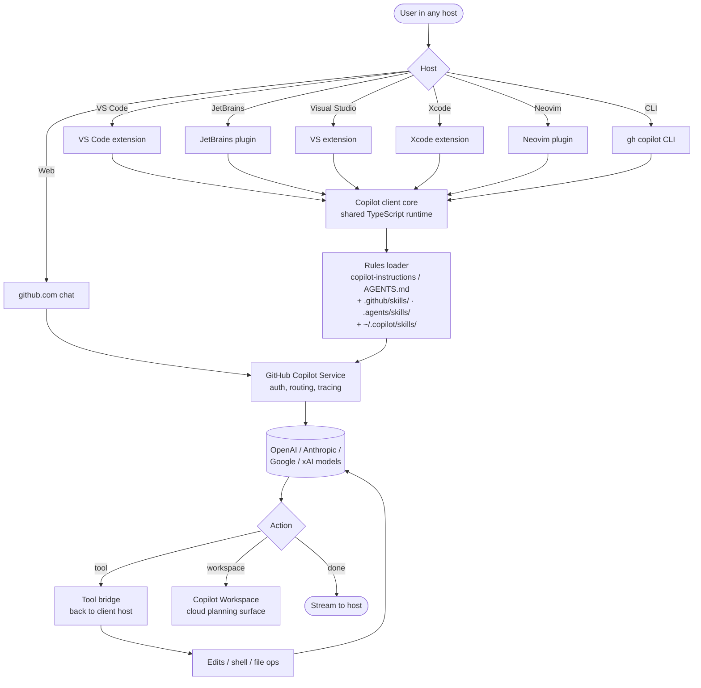

# GitHub Copilot

> **Slug**: `github-copilot` · **Surface**: IDE extensions + CLI · **Vendor**: GitHub / Microsoft · **License**: Proprietary

The original AI coding assistant. Copilot is now a multi-surface product spanning VS Code, JetBrains, Visual Studio, Xcode, Neovim, the GitHub web UI, and a CLI.

## Overview

Copilot has evolved well beyond its original "ghost-text completion" UX into a full agent surface — Copilot Workspace, Copilot CLI, Copilot Agents, and the Copilot panel inside every supported IDE. Skills are the portable workflow layer; Copilot also loads **custom instructions** from `.github/copilot-instructions.md`, path-scoped rules under `.github/instructions/*.instructions.md`, and (where enabled) `AGENTS.md` alongside other agent-instruction filenames — see GitHub's [customization cheat sheet](https://docs.github.com/en/copilot/reference/customization-cheat-sheet).

## Skills support

| Item | Value |
| --- | --- |
| Project paths | `.github/skills/` (Copilot-native layout), `.claude/skills/`, or `.agents/skills/` (shared bucket used by `npx skills` and many agents) |
| Global paths | `~/.copilot/skills/`, `~/.claude/skills/`, or `~/.agents/skills/` |
| `--agent` slug | `github-copilot` |
| `allowed-tools` | Yes |
| `context: fork` | No |
| Hooks (in `SKILL.md` / spec sense) | No — only Claude Code and Cline implement Agent Skills lifecycle hooks today |

The `~/.copilot/` directory name is not `~/.github-copilot/` — a historical inconsistency from when the Copilot CLI established its config layout.

**Copilot agent hooks (separate feature):** GitHub documents [workflow hooks](https://docs.github.com/en/copilot/concepts/agents/cloud-agent/about-hooks) in `.github/hooks/*.json` for the **Copilot cloud agent** and **Copilot CLI** (VS Code is preview as of the [feature matrix](https://docs.github.com/en/copilot/reference/customization-cheat-sheet)). Those are not the same as the optional hooks named in the Agent Skills specification matrix in `docs/feature-compatibility.md`.

## Installation

```bash
npx skills add vercel-labs/agent-skills -a github-copilot
```

## Notable behavior

- Copilot **agent mode** (VS Code), **Copilot CLI**, and the **Copilot cloud agent** load agent skills from the project paths above; see [About agent skills](https://docs.github.com/en/copilot/concepts/agents/about-agent-skills).
- Repository instructions: `.github/copilot-instructions.md` plus optional `AGENTS.md` / `CLAUDE.md` / `GEMINI.md` agent-instruction files (support varies by surface — see [custom instructions support](https://docs.github.com/en/copilot/reference/custom-instructions-support)).
- **MCP** is configured per host (for VS Code, typically `.vscode/mcp.json`; Copilot CLI uses `~/.copilot/mcp-config.json` per GitHub's MCP docs).
- Multi-IDE support exists, but the [customization cheat sheet](https://docs.github.com/en/copilot/reference/customization-cheat-sheet) feature matrix shows preview or partial support for prompts, custom agents, and agent skills on several non–VS Code hosts — verify for your editor.

## Internals & Architecture

GitHub Copilot is a federation: an extension shipped to seven IDE families, a CLI, the GitHub web UI, and Copilot Workspace, all backed by the GitHub Copilot service that proxies to OpenAI, Anthropic, and other models with subscription auth. Skills and instruction files are resolved in the workspace (repo + user config); the agent loop still centers on the Copilot service assembling prompts and tools — the host streams results and runs approved local tool bridges.



Two architectural details worth knowing: (1) conversation state is often **service-backed**, so continuity can outlive a single IDE window (especially for Workspace / cloud surfaces); (2) GitHub documents **both** a first-party tree (`.github/skills/`) and the cross-agent `.agents/skills/` and `.claude/skills/` locations so the same skill folders can ship with repos shared across tools.

## Harness Deep Dive

### Agent loop

- **Shape**: ReAct (Copilot Chat / Agent Mode), with **Copilot Workspace** as a separate plan-driven surface for larger tasks.
- **Tool-call style**: Native function calling on whichever model the Copilot Service routes to.
- **Halting**: Service-side end-turn / max-turn / quota.
- **Streaming**: Tokens stream into whichever host (IDE, web, CLI).

### Context & memory

- **Context strategy**: Active editor context, repo metadata, issues/PRs (when authorized), plus rules / skills. Service-side prompt assembly.
- **Persistent files**: `.github/copilot-instructions.md`, `.github/instructions/*.instructions.md`, agent instruction files (`AGENTS.md` etc. where supported), project skills under `.github/skills/`, `.agents/skills/`, or `.claude/skills/`, and user skills under `~/.copilot/skills/`, `~/.agents/skills/`, or `~/.claude/skills/`. **Custom Instructions** + [Copilot Memory](https://docs.github.com/en/copilot/concepts/agents/copilot-memory) (repository learning) where enabled.
- **Compaction**: Service-managed.
- **Sub-context**: Copilot Workspace is the closest thing — a separate surface where plans/sub-tasks live; chat can hand off.
- **Cross-session memory**: Session continuity is service-side — closing the IDE doesn't kill the conversation; Copilot Workspace can resume.

### Tool runtime

- **Built-ins**: Edit / shell / file ops bridged back to the host IDE; web tools and Copilot-Workspace planning on the cloud side.
- **Parallelism**: Sequential within a chat; Copilot Workspace and Copilot Agents (PR-style background runs) provide parallelism at the task level.
- **Approval / safety**: Configurable per host; defaults are conservative for an enterprise audience.
- **Sandbox**: None client-side; cloud Copilot Agents run in sandboxed runners.
- **MCP**: Supported; configuration file location depends on the host (see [MCP for Copilot](https://docs.github.com/en/copilot/concepts/context/mcp)).

### Model integration

- **Provider model**: **Copilot Service** — vendor-routed across OpenAI, Anthropic, Google, xAI, with subscription auth.
- **Caching**: Service-managed prompt caching.
- **Multi-model**: Per-conversation model picker.

### Innovation summary

**Federation across seven IDE families backed by one cloud service.** First-party skills live under `.github/skills/`; the same Agent Skills folders also work from `.agents/skills/` for teams standardizing on the [open spec](https://agentskills.io). Copilot Workspace, cloud agent, and Copilot CLI extend the surface from "completion + chat" to "plan, sub-task, PR".

## Documentation

- [GitHub Copilot Agent Skills](https://docs.github.com/en/copilot/concepts/agents/about-agent-skills)
- [Copilot customization cheat sheet](https://docs.github.com/en/copilot/reference/customization-cheat-sheet)
- [Copilot docs](https://docs.github.com/en/copilot)
- Community guide (April 2026 branch): [Customize your repo with GitHub Copilot](https://github.com/microsoftnorman/customize-your-repo-with-github-copilot/tree/April-2026) — aligns with official docs on primitives; always prefer GitHub and VS Code documentation when they diverge.
