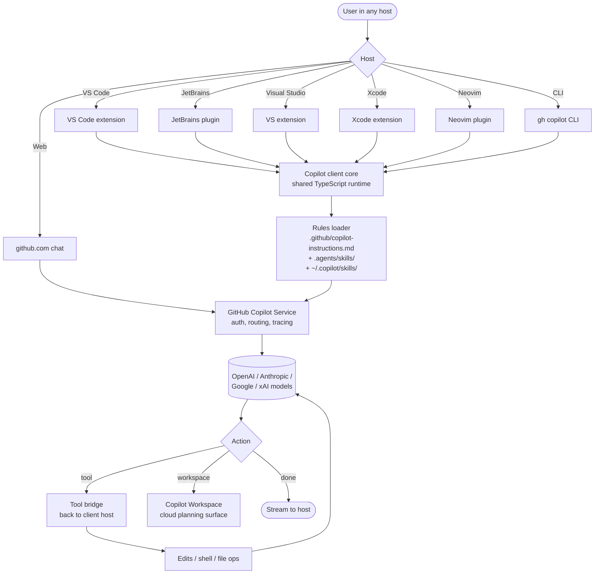

# GitHub Copilot

> **Slug**: `github-copilot` · **Surface**: IDE extensions + CLI · **Vendor**: GitHub / Microsoft · **License**: Proprietary

The original AI coding assistant. Copilot is now a multi-surface product spanning VS Code, JetBrains, Visual Studio, Xcode, Neovim, the GitHub web UI, and a CLI.

## Overview

Copilot has evolved well beyond its original "ghost-text completion" UX into a full agent surface — Copilot Workspace, Copilot CLI, Copilot Agents, and the Copilot panel inside every supported IDE. Skills are the cross-agent rules layer; Copilot also reads `.github/copilot-instructions.md` for project-wide instructions.

## Skills support

| Item | Value |
| --- | --- |
| Project path | `.agents/skills/` (shared bucket) |
| Global path | `~/.copilot/skills/` (note: not `~/.github-copilot/`) |
| `--agent` slug | `github-copilot` |
| `allowed-tools` | Yes |
| `context: fork` | No |
| Hooks | No |

The global path is `~/.copilot/`, not the longer `~/.github-copilot/` — a historical inconsistency from when Copilot's CLI established its config directory.

## Installation

```bash
npx skills add vercel-labs/agent-skills -a github-copilot
```

## Notable behavior

- Copilot's "Agent" mode (in Copilot Chat) reads skills.
- Copilot's older `.github/copilot-instructions.md` continues to work as a project-wide rule file.
- Copilot Workspace reads skills committed to the repo.
- Multi-IDE support means skills work the same in JetBrains, Visual Studio, Xcode, etc.

## Internals & Architecture

GitHub Copilot is a federation: an extension shipped to seven IDE families, a CLI, the GitHub web UI, and Copilot Workspace, all backed by the GitHub Copilot service that proxies to OpenAI, Anthropic, and other models with subscription auth. Skills load on the *client* side (the IDE extension or CLI walks the repo and `.copilot/`), but the agent loop runs server-side — the IDE just sends "this is the prompt + context + tools" and renders the streamed response.



Two architectural details worth knowing: (1) the agent state lives **in the service**, so closing the IDE doesn't necessarily kill the conversation — Copilot Workspace can pick up where chat left off; (2) the project path was retrofitted to `.agents/skills/` rather than `.copilot/`, signalling that GitHub treats the cross-agent bucket as a feature rather than a competitor.

## Harness Deep Dive

### Agent loop

- **Shape**: ReAct (Copilot Chat / Agent Mode), with **Copilot Workspace** as a separate plan-driven surface for larger tasks.
- **Tool-call style**: Native function calling on whichever model the Copilot Service routes to.
- **Halting**: Service-side end-turn / max-turn / quota.
- **Streaming**: Tokens stream into whichever host (IDE, web, CLI).

### Context & memory

- **Context strategy**: Active editor context, repo metadata, issues/PRs (when authorized), plus rules / skills. Service-side prompt assembly.
- **Persistent files**: `.github/copilot-instructions.md` (legacy, still honored), `.agents/skills/` (project), `~/.copilot/skills/` (user). **Custom Instructions** + auto-learned per-user style.
- **Compaction**: Service-managed.
- **Sub-context**: Copilot Workspace is the closest thing — a separate surface where plans/sub-tasks live; chat can hand off.
- **Cross-session memory**: Session continuity is service-side — closing the IDE doesn't kill the conversation; Copilot Workspace can resume.

### Tool runtime

- **Built-ins**: Edit / shell / file ops bridged back to the host IDE; web tools and Copilot-Workspace planning on the cloud side.
- **Parallelism**: Sequential within a chat; Copilot Workspace and Copilot Agents (PR-style background runs) provide parallelism at the task level.
- **Approval / safety**: Configurable per host; defaults are conservative for an enterprise audience.
- **Sandbox**: None client-side; cloud Copilot Agents run in sandboxed runners.
- **MCP**: Supported (recently added).

### Model integration

- **Provider model**: **Copilot Service** — vendor-routed across OpenAI, Anthropic, Google, xAI, with subscription auth.
- **Caching**: Service-managed prompt caching.
- **Multi-model**: Per-conversation model picker.

### Innovation summary

**Federation across seven IDE families backed by one cloud service.** The retrofitted `.agents/skills/` path is a quiet endorsement of cross-agent skill portability from the largest AI-coding installed base in the industry. Copilot Workspace and Copilot Agents extend the surface from "completion + chat" to "plan, sub-task, PR".

## Documentation

- [GitHub Copilot Agent Skills](https://docs.github.com/en/copilot/concepts/agents/about-agent-skills)
- [Copilot docs](https://docs.github.com/en/copilot)
