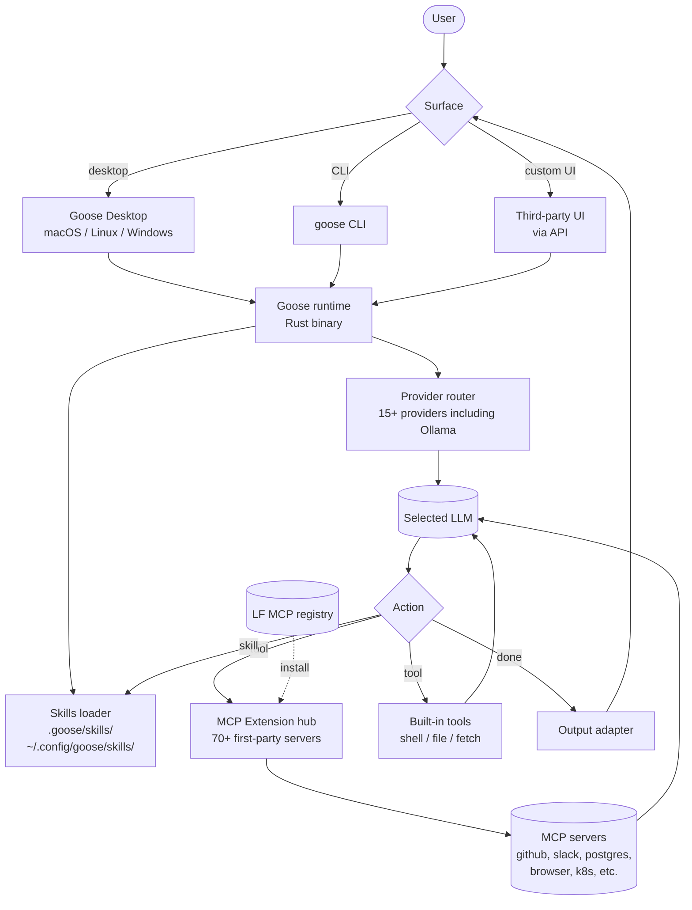

# Goose

> **Slug**: `goose` · **Surface**: Desktop + CLI · **Vendor**: AAIF (Agentic AI Foundation, Linux Foundation) · **License**: MIT

An open-source AI agent framework with a desktop app, CLI, and API. Originally launched by Block (Square / Cash App), now a Linux Foundation project.

## Overview

Goose was launched by Block in early 2025 as "codename goose" and has since moved to the Agentic AI Foundation under the Linux Foundation. It is general-purpose (not coding-specific) but coding is its strongest use case. As of 2026 it has 42,000+ GitHub stars and supports 70+ MCP extensions and 15+ LLM providers.

## Skills support

| Item | Value |
| --- | --- |
| Project path | `.goose/skills/` |
| Global path | `~/.config/goose/skills/` (XDG) |
| `--agent` slug | `goose` |
| `allowed-tools` | Yes (assumed) |
| `context: fork` | No |
| Hooks | No |

## Installation

```bash
# Install Goose
curl -fsSL https://github.com/aaif-goose/goose/releases/download/stable/download_cli.sh | bash

# Install skills
npx skills add vercel-labs/agent-skills -a goose
```

## Notable behavior

- Goose's primary extension mechanism is MCP — it has 70+ MCP extensions in the registry. Skills layer on top.
- Multi-provider: Anthropic, OpenAI, Google, Ollama, plus 12+ others.
- Desktop app (macOS, Linux, Windows) shares the same global skills folder as the CLI.
- Modular by design: build your own UI on top of the agent runtime.

## Internals & Architecture

Goose is built like a **runtime first, surface second**: the agent core is a Rust binary that exposes a stable API, with the desktop app, the CLI, and any third-party UI consuming it. The primary extension mechanism is **MCP** — Goose has 70+ first-party MCP servers in its registry — and skills layer on top as instruction packages. The Linux Foundation governance means MCP and skills move at LF-pace rather than vendor-pace.



The Linux Foundation move matters more than it sounds: it means the **MCP extension catalog and skills convention are governed at the foundation level**, not by a single vendor. That removes a class of "what if the company pivots?" risk that affects most other agents in the dataset, and it makes Goose unusually attractive for enterprises that need long-term stability assurance.

## Harness Deep Dive

### Agent loop

- **Shape**: ReAct, with **MCP as the primary extension surface**.
- **Tool-call style**: Native function calling for modern providers; provider-router handles the rest.
- **Halting**: Standard end-turn / max-turn / built-in `truncate` action for context overflow.
- **Streaming**: Token streaming in desktop and CLI surfaces alike.

### Context & memory

- **Context strategy**: System prompt + skills + MCP tool descriptions; bodies pulled on demand.
- **Persistent files**: `.goose/skills/`, `~/.config/goose/skills/`.
- **Compaction**: Configurable retention (`truncate` is a built-in action).
- **Sub-context**: None first-party.
- **Cross-session memory**: Skill files + Goose's own session store.

### Tool runtime

- **Built-ins**: Shell, file, fetch, plus the **70+ first-party MCP servers** in the LF registry (github, slack, postgres, browser, k8s, …).
- **Parallelism**: Sequential by default.
- **Approval / safety**: Configurable per category.
- **Sandbox**: None by default; the Rust runtime is the same on host and in containers.
- **MCP**: **MCP is the primary extension mechanism** — Goose is one of the most MCP-forward agents in the dataset.

### Model integration

- **Provider model**: BYOK across **15+ providers** (Anthropic, OpenAI, Google, Ollama, …) via the provider router.
- **Caching**: Provider-level where supported.
- **Multi-model**: Configurable per session.

### Innovation summary

**Linux-Foundation-governed runtime with MCP as a first-class catalog.** Goose's separation of "agent core (Rust binary with stable API)" from "surface (desktop / CLI / custom UI)" makes it the most cleanly *architected* OSS agent in the dataset. The LF governance removes single-vendor risk that affects almost every other agent here.

## Documentation

- [Goose docs](https://block.github.io/goose/)
- [Goose GitHub](https://github.com/aaif-goose/goose)
