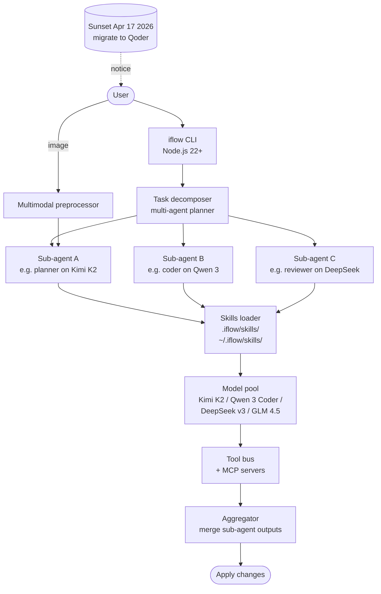

# iFlow CLI

> **Slug**: `iflow-cli` · **Surface**: CLI · **Vendor**: iFlow.cn · **License**: Proprietary

A Chinese terminal-based AI assistant. **Officially shutting down on April 17, 2026**, with users migrating to Qoder.

## Overview

iFlow CLI was a comprehensive terminal AI from iFlow.cn that bundled access to several Chinese open-weight models (Kimi K2, Qwen3 Coder, DeepSeek v3, GLM4.5) for free. Its skills implementation predates the public sunset announcement and remains documented for users in the migration period.

## Skills support

| Item | Value |
| --- | --- |
| Project path | `.iflow/skills/` |
| Global path | `~/.iflow/skills/` |
| `--agent` slug | `iflow-cli` |
| `allowed-tools` | Yes (assumed) |
| `context: fork` | No |
| Hooks | No |

## Installation

```bash
npx skills add vercel-labs/agent-skills -a iflow-cli
```

## Notable behavior

- **Sunset notice**: as of April 17, 2026, the iFlow CLI service is shutting down. Migrate to Qoder.
- Multi-agent collaboration with intelligent task decomposition.
- MCP support and SubAgent configuration baked in.
- Multimodal: image understanding built into the CLI.
- Required Node.js 22+, 4GB+ RAM.

## Internals & Architecture

iFlow CLI bundled access to several Chinese open-weight models (Kimi K2, Qwen 3 Coder, DeepSeek v3, GLM 4.5) under one CLI with multi-agent orchestration baked in. The runtime decomposed tasks into sub-agent invocations — each sub-agent could run a different model — which was conceptually closer to Antigravity's Mission Control than to a single-loop CLI. The shutdown announcement directs users to Qoder, which inherits the spec-compatible skills layout but not the multi-model orchestrator.



The architectural lesson worth recording even after sunset: **multi-model multi-agent orchestration was a feasible pattern in 2025–26**, but not differentiated enough on its own to survive in a market where Qoder, Antigravity, and Zencoder were all converging on similar fleets. The migration to Qoder is the cleanest path because both share the spec-compatible skill folder layout — projects keep their `.iflow/skills/` for archive purposes and add `.qoder/skills/` going forward.

## Harness Deep Dive

### Agent loop

- **Shape**: **Multi-model fleet** — task decomposer fanned out sub-agents, each potentially on a different model.
- **Tool-call style**: Per-model function calling style; orchestrator merged outputs.
- **Halting**: Aggregator merged sub-agent outputs.
- **Streaming**: Per sub-agent.

### Context & memory

- **Context strategy**: Decomposed per sub-agent — each got its own scoped slice. Image input via multimodal preprocessor.
- **Persistent files**: `.iflow/skills/`, `~/.iflow/skills/` (sunset).
- **Compaction**: Per sub-agent.
- **Sub-context**: Sub-agents are first-class — closest analog to Antigravity's fleet.
- **Cross-session memory**: Skill files (frozen as of sunset).

### Tool runtime

- **Built-ins**: Standard fs/shell + MCP servers.
- **Parallelism**: Sub-agents in parallel.
- **Approval / safety**: Configurable.
- **Sandbox**: None.
- **MCP**: First-class.

### Model integration

- **Provider model**: Bundled access to **Kimi K2, Qwen 3 Coder, DeepSeek v3, GLM 4.5** (free during operation). Multimodal pre-processing.
- **Caching**: Provider-level.
- **Multi-model**: Per-sub-agent model selection.

### Innovation summary

**Multi-model multi-agent task decomposition (sunset).** iFlow proved the multi-model fleet pattern was feasible in 2025–26, but couldn't differentiate enough to survive a market where Qoder, Antigravity, and Zencoder were all converging. The architectural lesson — that "different models for different sub-tasks" is a real win — survives in those products even though iFlow itself does not.

## Documentation

- [iFlow CLI Skills](https://platform.iflow.cn/en/cli/examples/skill)
- [iFlow CLI Quickstart](https://platform.iflow.cn/en/cli/quickstart)
- [iFlow CLI on GitHub](https://github.com/iflow-ai/iflow-cli)
