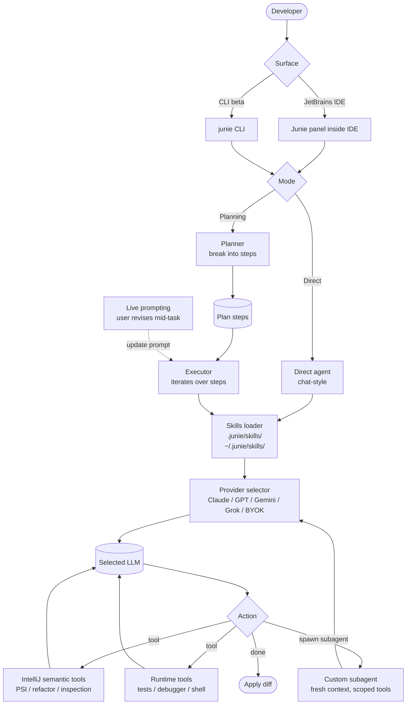

# Junie

> **Slug**: `junie` · **Surface**: JetBrains IDEs + CLI · **Vendor**: JetBrains · **License**: Proprietary

JetBrains' LLM-agnostic AI coding agent. Available across JetBrains IDEs, with a beta CLI for terminal use.

## Overview

Junie is JetBrains' answer to Cursor — an in-IDE agent that can plan, edit, and run code with human-in-the-loop control. It's intentionally **LLM-agnostic**: works with Claude, GPT-5 variants, Gemini 3, and Grok, with BYOK pricing as well as a hosted-credit subscription.

A Junie CLI launched in beta in March 2026.

## Skills support

| Item | Value |
| --- | --- |
| Project path | `.junie/skills/` |
| Global path | `~/.junie/skills/` |
| `--agent` slug | `junie` |
| `allowed-tools` | Yes |
| `context: fork` | No (Junie has its own subagents instead) |
| Hooks | No |

## Installation

```bash
# Install Junie CLI
curl -fsSL https://junie.jetbrains.com/install.sh | bash

npx skills add vercel-labs/agent-skills -a junie
```

## Notable behavior

- Custom subagents — Junie's equivalent of `context: fork`.
- Live prompting: update the running prompt mid-task.
- Planning mode for breaking down complex tasks.
- BYOK pricing alongside JetBrains-hosted credits.
- IDE integration runs syntax and semantic checks, plus tests.
- AI Pro $10/mo · AI Ultimate $30/mo · AI Enterprise $60/mo (coming).

## Internals & Architecture

Junie is JetBrains' attempt at an LLM-agnostic agent that integrates with the IntelliJ platform's deep semantic-analysis APIs (PSI, code inspections, refactoring, debugger). The runtime supports **Custom Subagents** (Junie's equivalent of `context: fork`), a **Planning Mode** that produces a step-by-step plan before execution, and **Live Prompting** so the user can revise the running prompt mid-task. Skills install at `.junie/skills/` and feed both the parent agent and any subagents.



The two architectural strengths: **PSI access** (semantic, not just syntactic, refactoring) and **live prompting** (mid-task user steering). PSI access is what lets Junie do refactors that other agents can only approximate — it's reading the IntelliJ symbol table rather than re-parsing files. Live prompting is what lets long Planning-Mode runs survive scope changes without restarting from zero.

## Harness Deep Dive

### Agent loop

- **Shape**: **Mode machine** — Direct mode (chat-style) and **Planning Mode** (plan-then-execute) coexist; **Custom Subagents** spawn fresh contexts.
- **Tool-call style**: Native function calling on whichever model is selected.
- **Halting**: End-turn / max-turn; **Live Prompting** lets the user revise the running prompt mid-task without restart.
- **Streaming**: Tokens + per-step diffs stream into the JetBrains panel.

### Context & memory

- **Context strategy**: PSI-backed semantic context + workspace files + skills + rules.
- **Persistent files**: `.junie/skills/`, `~/.junie/skills/`.
- **Compaction**: Long Planning Mode runs benefit from Live Prompting (user-driven scope correction) rather than aggressive auto-summarization.
- **Sub-context**: **Custom Subagents** — Junie's equivalent of `context: fork`. Fresh context, scoped tools.
- **Cross-session memory**: Skill files + JetBrains project state.

### Tool runtime

- **Built-ins**: **IntelliJ semantic tools (PSI, refactor, inspections)** — unique in the dataset for this depth — plus runtime tools (tests, debugger, shell).
- **Parallelism**: Subagents in parallel; sequential within each.
- **Approval / safety**: Per-action approval; configurable.
- **Sandbox**: None; runs against the JetBrains workspace.
- **MCP**: Supported.

### Model integration

- **Provider model**: **LLM-agnostic by design** — Claude, GPT, Gemini, Grok, plus BYOK alongside JetBrains-hosted credits.
- **Caching**: Provider-level.
- **Multi-model**: Per-task model selection.

### Innovation summary

**PSI-level semantic refactoring + Live Prompting + Custom Subagents.** Junie is the only agent in the dataset to expose the IntelliJ Program Structure Interface as a tool — refactors are semantic, not regex-based. Live Prompting is the most ergonomic mid-task steering UX in the field.

## Documentation

- [Junie homepage](https://www.jetbrains.com/junie/)
- [Junie CLI announcement](https://blog.jetbrains.com/junie/2026/03/junie-cli-the-llm-agnostic-coding-agent-is-now-in-beta/)
- [Junie docs](https://www.jetbrains.com/help/junie/)
