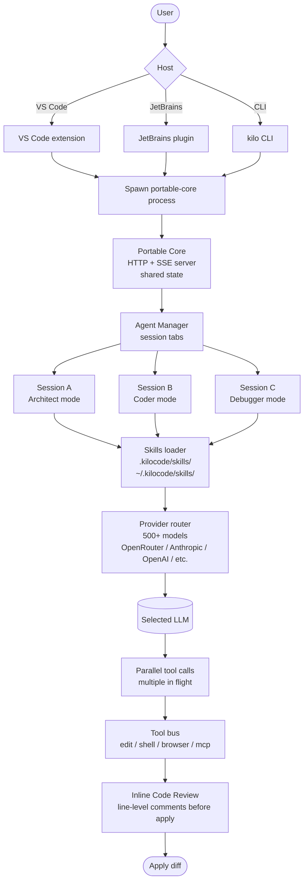

# Kilo Code

> **Slug**: `kilo` · **Surface**: VS Code + JetBrains + CLI · **Vendor**: Kilo Code Inc. · **License**: Open source

A free, open-source AI coding agent with 973k+ VS Code installs and a portable core that runs across VS Code, JetBrains, and a CLI.

## Overview

Kilo Code is one of the most-installed open-source AI coding extensions on the VS Code Marketplace (973k+ installs, 1.5M+ users). In April 2026 it underwent its biggest-ever update — a rebuild on a "Portable Core" that now runs identically across VS Code, JetBrains, and CLI surfaces, with cross-platform session continuity.

## Skills support

| Item | Value |
| --- | --- |
| Project path | `.kilocode/skills/` |
| Global path | `~/.kilocode/skills/` |
| `--agent` slug | `kilo` |
| `allowed-tools` | Yes (assumed) |
| `context: fork` | No (Kilo has its own Agent Manager) |
| Hooks | No |

Note the slug/folder mismatch: slug is `kilo`, folder is `.kilocode/`.

## Installation

```bash
npx skills add vercel-labs/agent-skills -a kilo
```

In-VS-Code: install "Kilo Code" from the Marketplace.

## Notable behavior

- 500+ AI models supported.
- Multi-mode: Architect (planning), Coder (coding), Debugger (debugging), plus custom modes.
- **Agent Manager**: run multiple agents side-by-side with session tabs (Kilo's equivalent of subagents).
- **Inline Code Review**: review changes with line-level comments before applying.
- **Parallel Execution**: parallel tool calls and subagents.
- **Browser Automation**: built-in.
- The VS Code extension bundles its own CLI binary that spawns a background process for HTTP+SSE communication — interesting architectural choice that lets the same engine power IDE and CLI.

## Internals & Architecture

Kilo Code's April 2026 rebuild moved the agent runtime into a **Portable Core** binary that the VS Code extension, JetBrains plugin, and CLI all spawn as a background process and talk to over HTTP + Server-Sent Events. That means session state survives across surfaces — start work in VS Code, continue from the CLI on a remote machine. The **Agent Manager** runs multiple isolated agent sessions in parallel as tabs, each with its own context and tools.



Two architectural moves that pay off: (1) the **Portable Core HTTP server** lets a long task started in the IDE be inspected or driven from the CLI without losing state — rare in this dataset; (2) **inline code review** before apply is the kind of human-in-the-loop UX that makes Kilo trustable on multi-file refactors that would otherwise be reviewed only after the fact.

## Harness Deep Dive

### Agent loop

- **Shape**: **Mode machine** (Architect / Coder / Debugger / Custom) plus **Agent Manager fleet** — multiple sessions in parallel as tabs.
- **Tool-call style**: Native function calling; **parallel tool calls** in flight at once.
- **Halting**: Standard end-turn / approval gate / inline review.
- **Streaming**: Token streaming + parallel tool execution events.

### Context & memory

- **Context strategy**: Per-session context (each Agent Manager tab is independent). Mode-specific system prompts overlay.
- **Persistent files**: `.kilocode/skills/`, `~/.kilocode/skills/` (note: slug `kilo`, folder `.kilocode/`).
- **Compaction**: Standard summarization per session.
- **Sub-context**: **Agent Manager session tabs** are the sub-context primitive — each tab is a fresh process boundary.
- **Cross-session memory**: Skill files + Portable Core state (which survives across surfaces).

### Tool runtime

- **Built-ins**: Edit / shell / **browser automation** / MCP, plus **parallel tool calls**.
- **Parallelism**: First-class — multiple tool calls per turn, multiple agent sessions in parallel.
- **Approval / safety**: **Inline Code Review** with line-level comments before applying — a more granular gate than per-action approval.
- **Sandbox**: Process isolation per Agent Manager tab.
- **MCP**: Supported.

### Model integration

- **Provider model**: BYOK across **500+ models** via OpenRouter, Anthropic, OpenAI, etc.
- **Caching**: Provider-level.
- **Multi-model**: Per-session selection.

### Innovation summary

**Portable Core HTTP server + Agent Manager parallel sessions + Inline Code Review.** Kilo Code is one of the few open-source agents that runs identically across VS Code, JetBrains, and CLI by sharing a single background process. The Agent Manager's session tabs are the most ergonomic "many parallel agents" UX in the dataset, and inline review with line-level comments is a tighter human-in-the-loop than per-action approval.

## Documentation

- [Kilo Code homepage](https://kilocode.ai/)
- [What's New (April 2026)](https://kilo.ai/docs/code-with-ai/platforms/vscode/whats-new)
- [VS Code extension page](https://marketplace.visualstudio.com/items?itemName=kilocode.Kilo-Code)
