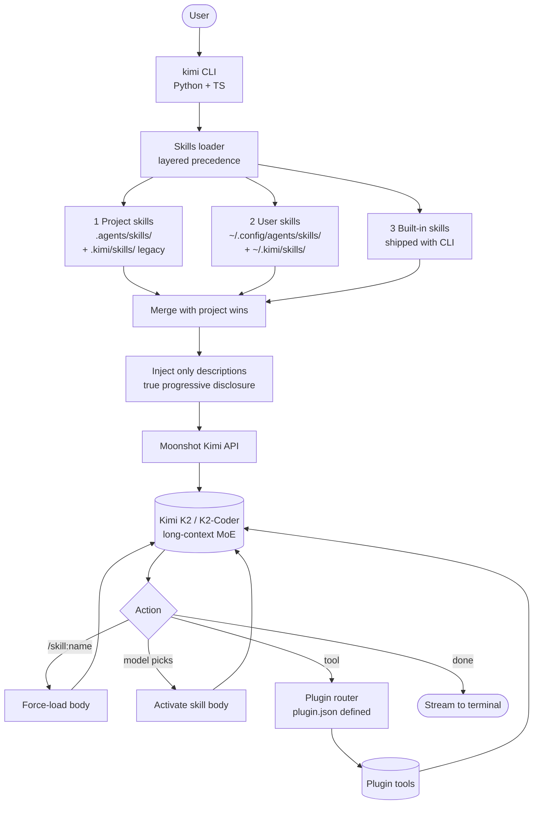

# Kimi Code CLI

> **Slug**: `kimi-cli` · **Surface**: CLI · **Vendor**: Moonshot AI · **License**: Open source

Moonshot's terminal coding agent, built around the Kimi K2 model.

## Overview

Kimi Code CLI is the official terminal agent from Moonshot, the Chinese lab behind the Kimi family of models (especially Kimi K2 — a strong open-weight Mixture-of-Experts model). The CLI is written in Python (75%) with TypeScript components, and it ships with skills as a first-class concept.

## Skills support

| Item | Value |
| --- | --- |
| Project path | `.agents/skills/` (shared bucket) |
| Global path | `~/.config/agents/skills/` (XDG, shared) |
| `--agent` slug | `kimi-cli` |
| `allowed-tools` | Yes |
| `context: fork` | No |
| Hooks | No |

Kimi CLI also reads its native paths (`~/.kimi/skills/`, `.kimi/skills/`) for backward compatibility with its older convention.

## Installation

```bash
npx skills add vercel-labs/agent-skills -a kimi-cli
```

In-product, you can load a specific skill with `/skill:<name>`.

## Notable behavior

- Kimi CLI ships its own built-in skills (e.g. style guides) that load with priority lower than user/project skills.
- The model decides whether to fetch the body of a skill based on the description — true progressive disclosure.
- Strong fit with Kimi K2's long-context strengths; skills with long bodies still load efficiently.
- Distinguishes "skills" (knowledge) from "plugins" (executable tools declared via `plugin.json`).

## Internals & Architecture

Kimi Code CLI is a Python CLI (with TypeScript components) tuned for the Kimi K2 model family. Two architectural splits make it interesting: (1) it **separates skills (knowledge) from plugins (executable tools)** more rigidly than other harnesses, with `plugin.json` defining tool metadata that's distinct from `SKILL.md`, and (2) it ships **built-in skills** at lowest precedence so the agent has sane defaults even with no project skills installed.



The skill/plugin split is the clearest architectural decision in the dataset: skills are *what to know*, plugins are *what to do*. That maps nicely to Kimi K2's strengths — it's a long-context MoE model that can absorb a whole skill body fluently, but it benefits from clean tool boundaries because tool-use is where MoE models historically lagged frontier.

## Harness Deep Dive

### Agent loop

- **Shape**: ReAct, with `/skill:name` user override (force-load).
- **Tool-call style**: Native function calling on the Moonshot Kimi API.
- **Halting**: Standard.
- **Streaming**: Token streaming.

### Context & memory

- **Context strategy**: **Layered skill precedence** — project > user > built-in. Only descriptions injected up front; bodies pulled on activation. Kimi K2's long context (256k+ tokens) reduces compaction pressure.
- **Persistent files**: `.agents/skills/` (shared bucket), `~/.config/agents/skills/` (XDG, shared with Amp / Replit / Universal), plus legacy `.kimi/skills/` and `~/.kimi/skills/`.
- **Compaction**: Long-context model means less aggressive summarization needed.
- **Sub-context**: None first-party.
- **Cross-session memory**: Skill files (incl. built-ins).

### Tool runtime

- **Built-ins**: Standard fs/shell, plus **plugin router** for `plugin.json`-defined tools.
- **Parallelism**: Sequential.
- **Approval / safety**: Configurable.
- **Sandbox**: None — host filesystem.
- **MCP**: Supported.
- **Skill vs plugin split**: **Skills = knowledge, plugins = executable tools** — the cleanest separation in the dataset.

### Model integration

- **Provider model**: Moonshot Kimi-only — Kimi K2, K2-Coder (long-context MoE).
- **Caching**: Moonshot caching where supported.
- **Multi-model**: Within Moonshot's family.

### Innovation summary

**Hard skill/plugin split + built-in skills as defaults.** Kimi CLI is the cleanest "skills are knowledge, plugins are tools" implementation in the dataset. The built-in skills shipping at lowest precedence means the agent has sane defaults out of the box, and the long-context Kimi K2 model means whole skill bodies absorb fluently without compaction games.

## Documentation

- [Kimi Code CLI Skills](https://moonshotai.github.io/kimi-cli/en/customization/skills.html)
- [Kimi CLI repository](https://github.com/MoonshotAI/kimi-cli)
