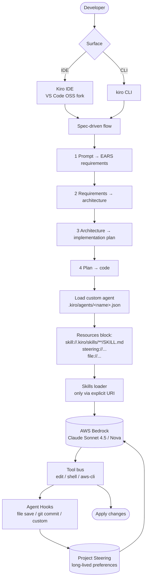

# Kiro CLI

> **Slug**: `kiro-cli` · **Surface**: Native AI IDE + CLI · **Vendor**: Amazon Web Services · **License**: Proprietary (free tier)

AWS's agentic AI development platform. Kiro is both a desktop IDE (a fork of VS Code OSS) and a CLI, both backed by Amazon Bedrock.

## Overview

Kiro is AWS's entrant into the AI IDE space, focused on **spec-driven development**: it transforms natural-language prompts into structured requirements (using EARS notation), architectural designs, and implementation plans. The agent runs against Claude Sonnet 4.5 and other Bedrock-backed models.

## Skills support

| Item | Value |
| --- | --- |
| Project path | `.kiro/skills/` |
| Global path | `~/.kiro/skills/` |
| `--agent` slug | `kiro-cli` |
| `allowed-tools` | **No** |
| `context: fork` | No |
| Hooks | No |

**Important**: After installing skills, Kiro requires manual JSON configuration to wire them into a custom agent:

```json
// .kiro/agents/<agent>.json
{
  "resources": ["skill://.kiro/skills/**/SKILL.md"]
}
```

This is unique to Kiro — most agents auto-discover from the install path.

## Installation

```bash
npx skills add vercel-labs/agent-skills -a kiro-cli
# Then manually wire the skills into ./kiro/agents/<your-agent>.json
```

## Notable behavior

- Free tier: 50 free actions/month + GitHub's free API quota.
- Spec-driven workflow is opt-in but heavily promoted in the docs.
- Agent Hooks: Kiro's own automation primitive (file save, git commit, etc.) — separate from skills.
- Project Steering: a longer-lived memory of project preferences and standards.
- Built on Bedrock: Claude, Nova, and other AWS-hosted models.

## Internals & Architecture

Kiro is structured around a **spec-driven** workflow: a natural-language prompt becomes a structured EARS spec, then an architectural design, then an implementation plan, and only then code. Skills attach to **custom agents** (defined as JSON files), and unlike most harnesses, Kiro does not auto-discover skills from the install path — you must reference them via a `skill://` resource URI in the agent's JSON manifest.



The two unusual choices: **manual wiring of skills via JSON** — most agents auto-discover, Kiro forces an explicit reference — and the **separate Agent Hooks system**, which is Kiro's own automation primitive distinct from skills (skills are knowledge; hooks are triggers). The spec-driven workflow funnels work through requirements → design → plan before any code is written, which makes Kiro feel slower but produces unusually-clean implementations on green-field tasks.

## Harness Deep Dive

### Agent loop

- **Shape**: **Spec-driven** — prompt → EARS requirements → architecture → implementation plan → code.
- **Tool-call style**: Native function calling on Bedrock-hosted models.
- **Halting**: Per-phase review gates; final apply on plan completion.
- **Streaming**: Per-phase artifact streaming.

### Context & memory

- **Context strategy**: **Project Steering** is a longer-lived store of project preferences and standards (separate from skills). Custom agents are JSON manifests with explicit `resources:` lists.
- **Persistent files**: `.kiro/skills/`, `~/.kiro/skills/`, `.kiro/agents/<name>.json` (custom agents), Project Steering store.
- **Compaction**: Per-phase artifacts replace older context.
- **Sub-context**: Custom agents act as sub-contexts (separate JSON manifests).
- **Cross-session memory**: Project Steering plus skill files.

### Tool runtime

- **Built-ins**: Edit / shell / **aws-cli** / Bedrock APIs.
- **Parallelism**: Sequential per phase.
- **Approval / safety**: Per-phase approval gates (spec-driven flow forces review).
- **Sandbox**: None client-side.
- **MCP**: Supported.
- **Skill discovery**: **Manual wiring required** — `skill://` URI in custom agent JSON. No auto-discovery. **`allowed-tools` not respected.**
- **Agent Hooks**: Kiro's own automation primitive (file save / git commit / custom triggers) — separate from spec hooks.

### Model integration

- **Provider model**: **AWS Bedrock** — Claude Sonnet 4.5, Nova, plus other Bedrock-hosted models.
- **Caching**: Bedrock-managed.
- **Multi-model**: Per-task selection within Bedrock.

### Innovation summary

**Spec-driven flow (EARS → design → plan → code) plus manual skill wiring.** Kiro is the dataset's most opinionated "structure-before-code" agent. Slow on quick fixes; unusually clean on green-field work. The manual skill wiring is friction users put up with because the spec-driven discipline pays off for the kind of work Kiro targets (enterprise AWS-native green-field projects).

## Documentation

- [Kiro CLI Skills](https://kiro.dev/docs/cli/custom-agents/configuration-reference/#skill-resources)
- [Kiro homepage](https://www.kiro.dev/)
