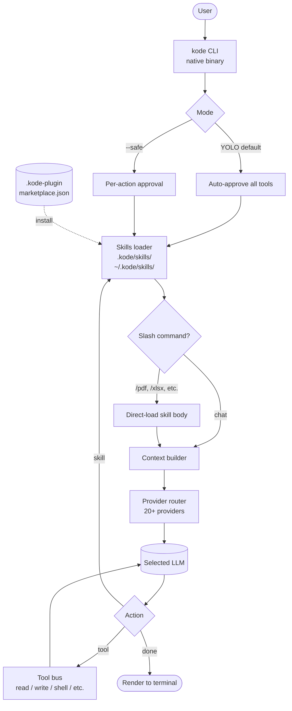

# Kode

> **Slug**: `kode` · **Surface**: CLI · **Vendor**: shareAI-lab · **License**: Apache 2.0

An AI-powered terminal coding agent that natively understands `AGENTS.md` and the skills format.

## Overview

Kode is a TypeScript-based CLI agent from shareAI-lab. It's targeted at developers who want a power-user terminal agent with first-class support for the AGENTS.md convention used across 60k+ open-source projects. Has 4,875+ GitHub stars.

## Skills support

| Item | Value |
| --- | --- |
| Project path | `.kode/skills/` |
| Global path | `~/.kode/skills/` |
| `--agent` slug | `kode` |
| `allowed-tools` | Yes |
| `context: fork` | No |
| Hooks | No |

Kode supports its own **Plugin Marketplace** via `.kode-plugin/marketplace.json` — analogous to Claude Code's plugin marketplace.

## Installation

```bash
npx skills add vercel-labs/agent-skills -a kode
```

In-product:
```bash
kode add-skill <repo>
```

## Notable behavior

- Skills can be invoked as slash commands inside Kode (e.g. `/pdf`, `/xlsx`).
- 20+ AI model providers supported.
- Cross-platform native binaries (Windows + others).
- "YOLO mode" by default — bypasses permission prompts. Use `kode --safe` for sensitive projects.
- Custom skills go in `.kode/skills/<skill-name>/SKILL.md`.

## Internals & Architecture

Kode is a TypeScript-compiled-to-native CLI with a **plugin marketplace** pattern modelled on Claude Code's: any repo can declare itself a plugin via `.kode-plugin/marketplace.json` and ship skills + tools that other Kode users install with one command. The runtime defaults to **YOLO mode** (auto-approve), which makes it fast but unsafe for sensitive work — `kode --safe` flips per-action approvals back on.



The architectural choice that defines Kode's vibe: **slash-commands-as-skills**. A skill named `pdf` becomes a `/pdf` slash command, which makes Kode feel more like a *toolbox* than a chat agent. Combined with YOLO defaults, that's optimized for power users who want to invoke specific recipes fast — at the cost of safety for newcomers who should remember the `--safe` flag.

## Harness Deep Dive

### Agent loop

- **Shape**: ReAct, with **slash-commands-as-skills** (`/pdf`, `/xlsx`, etc.).
- **Tool-call style**: Native function calling per provider.
- **Halting**: Standard end-turn; default YOLO bypasses approvals.
- **Streaming**: Token streaming.

### Context & memory

- **Context strategy**: System prompt + skills + workspace; slash commands force-load specific skills.
- **Persistent files**: `.kode/skills/`, `~/.kode/skills/`, plus `.kode-plugin/marketplace.json` for the plugin marketplace.
- **Compaction**: Standard.
- **Sub-context**: None first-party.
- **Cross-session memory**: Skill files + marketplace-installed plugins.

### Tool runtime

- **Built-ins**: Read / write / shell, plus marketplace plugins.
- **Parallelism**: Sequential.
- **Approval / safety**: **YOLO mode is the default** (auto-approve everything); `kode --safe` flips per-action approvals back on.
- **Sandbox**: None.
- **MCP**: Supported.
- **Plugin marketplace**: `.kode-plugin/marketplace.json` modelled on Claude Code's marketplace.

### Model integration

- **Provider model**: BYOK across **20+ providers** — Anthropic, OpenAI, Google, OpenRouter, local, etc.
- **Caching**: Provider-level.
- **Multi-model**: Per-session selection.

### Innovation summary

**YOLO-by-default + slash-commands-as-skills + plugin marketplace.** Kode is the dataset's most opinionated "power-user toolbox" agent. The slash-command-as-skill convention makes the agent feel like a Unix toolbox; YOLO defaults trade safety for speed (newcomers should remember `--safe`). The plugin marketplace gives the same Claude-Code-style ecosystem distribution.

## Documentation

- [Kode Skills](https://github.com/shareAI-lab/kode/blob/main/docs/skills.md)
- [Kode GitHub](https://github.com/shareAI-lab/kode)
