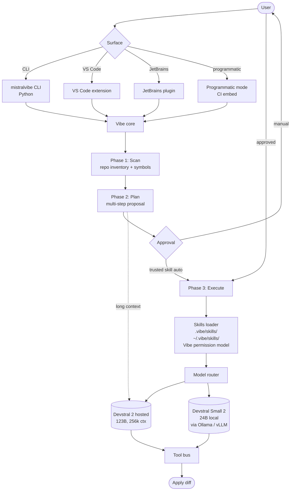

# Mistral Vibe

> **Slug**: `mistral-vibe` · **Surface**: CLI + IDE extensions · **Vendor**: Mistral AI · **License**: Open source CLI

Mistral's enterprise coding agent, powered by Devstral 2 (123B).

## Overview

Mistral Vibe is Mistral AI's official coding-agent product. It's open-source (`pip install mistralvibe`) and pairs with the Devstral family of models — including a smaller Devstral Small 2 (24B) for local/private deployments via Ollama or vLLM. Vibe positions itself as a **multi-file orchestration** tool rather than a single-file assistant: it understands cross-file dependencies and can coordinate changes across an entire repo.

## Skills support

| Item | Value |
| --- | --- |
| Project path | `.vibe/skills/` |
| Global path | `~/.vibe/skills/` |
| `--agent` slug | `mistral-vibe` |
| `allowed-tools` | Yes (via Vibe's permission model) |
| `context: fork` | No |
| Hooks | No |

Note the folder name: `.vibe/`, not `.mistral-vibe/`. The product is "Mistral Vibe" but the folder is short.

## Installation

```bash
pip install mistralvibe

npx skills add vercel-labs/agent-skills -a mistral-vibe
```

## Notable behavior

- **256k token context window** — long enough to load big repos as context.
- **Plan-first workflow**: scan → plan → execute, with optional auto-approve for trusted skills.
- Local/private mode via Ollama or vLLM: Devstral Small 2 (24B) runs on a workstation.
- IDE extensions (VS Code, JetBrains) inherit the same skills.
- Async agents and a programmatic mode for embedding in CI.

## Internals & Architecture

Mistral Vibe is a Python CLI plus matching IDE extensions, all running on the **Devstral 2** model family (123B for hosted, 24B Devstral Small 2 for local via Ollama / vLLM). The defining workflow is **scan → plan → execute**: Vibe inspects the repo, produces a plan, then executes only after approval (or auto-approves for trusted skills). The 256k context window means the plan can hold a large mental model of the repo without offloading.



The two architectural strengths: (1) **plan-first as a hard gate** — Vibe doesn't start mutating until a plan exists, which makes long autonomous runs reviewable up-front rather than after the fact, and (2) **Devstral Small 2 local** — a 24B model that runs on a workstation closes the air-gapped use case that no other vendor in this dataset addresses cleanly.

## Harness Deep Dive

### Agent loop

- **Shape**: **Plan-first as a hard gate** — `scan → plan → execute`. Execute won't start without an approved plan (or a `trusted` skill flag).
- **Tool-call style**: Native function calling on Devstral.
- **Halting**: Plan completion + approval gate; execute phase ends when plan steps complete.
- **Streaming**: Plan streams first, then per-step execution events.

### Context & memory

- **Context strategy**: 256k token context window — large enough to hold a substantial repo's symbol map. Scan phase populates an inventory before planning begins.
- **Persistent files**: `.vibe/skills/`, `~/.vibe/skills/` (note: folder is `.vibe/` not `.mistral-vibe/`).
- **Compaction**: 256k context reduces compaction pressure significantly.
- **Sub-context**: None first-party.
- **Cross-session memory**: Skill files.

### Tool runtime

- **Built-ins**: Standard fs/shell, plus permissions per skill (Vibe's permission model maps `allowed-tools` cleanly).
- **Parallelism**: Sequential per plan step.
- **Approval / safety**: Plan-level approval (or `trusted` skill auto-approve).
- **Sandbox**: None client-side; **Devstral Small 2 local** moves the sensitive workload into the air-gapped sandbox.
- **MCP**: Supported.

### Model integration

- **Provider model**: **Devstral 2 (123B)** hosted via Mistral, **Devstral Small 2 (24B)** locally via Ollama / vLLM.
- **Caching**: Mistral-managed.
- **Multi-model**: Pick hosted vs local per-environment.

### Innovation summary

**Plan-first as a hard gate plus Devstral Small 2 local for air-gapped use.** Mistral Vibe is the cleanest "plan must exist before any mutation" workflow in the dataset, and Devstral Small 2 closes the air-gapped / regulated use case other vendors don't address. The 256k context window lets the scan phase produce a meaningful repo inventory.

## Documentation

- [Mistral Vibe — Agents & Skills](https://docs.mistral.ai/mistral-vibe/agents-skills)
- [Vibe site](https://mistralvibe.net/)
- [Mistral AI products page](https://mistral.ai/products/vibe)
