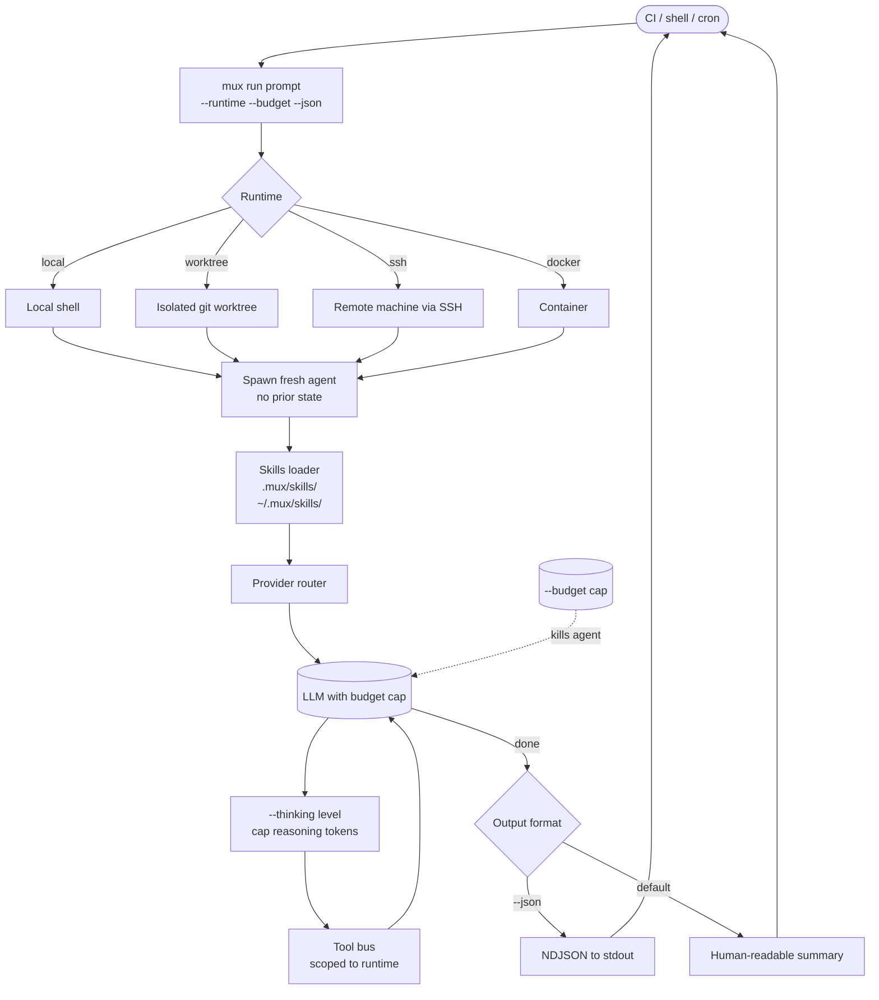

# Mux

> **Slug**: `mux` · **Surface**: CLI · **Vendor**: Coder · **License**: Open source

A headless one-shot coding agent CLI from Coder. Designed for automation, scripting, and CI/CD pipelines.

## Overview

Coder's Mux (`mux run`) is a non-interactive coding-agent CLI: invoke it, hand it a task, get a result. It is designed less for "hang out in the terminal" use and more for "wire it into your CI". Supports multiple runtimes — local, worktree, SSH, Docker — and structured output modes (human / JSON / quiet).

> Note: Don't confuse this with `@mux/cli`, the unrelated Mux Inc. video-streaming CLI. The skills entry refers to Coder's Mux.

## Skills support

| Item | Value |
| --- | --- |
| Project path | `.mux/skills/` |
| Global path | `~/.mux/skills/` |
| `--agent` slug | `mux` |
| `allowed-tools` | Yes (via the runtime's tool model) |
| `context: fork` | No |
| Hooks | No |

## Installation

```bash
npm install -g mux
# or one-shot
npx mux run "Fix the failing tests"

npx skills add vercel-labs/agent-skills -a mux
```

## Notable behavior

- One-shot by default: each `mux run` invocation is a fresh agent.
- Runtime selection: local (current shell), worktree (isolated git worktree), SSH (remote machine), Docker (container).
- `--json` for structured NDJSON output, ideal for scripts.
- `--budget` to cap dollars-per-run.
- `--thinking` levels for extended reasoning.

Skills are useful here as portable instruction sets that can ride along with `mux run` invocations from CI scripts.

## Internals & Architecture

Mux is the **headless one-shot agent**: no chat loop, no TUI, no session persistence by default. Each `mux run` invocation spawns a fresh agent against a chosen runtime (local, worktree, SSH, or Docker), executes the task, emits structured output (text or NDJSON), and exits. Skills ride along as instruction context. Hard limits on budget and thinking depth make Mux predictable in CI.



The two architectural choices that separate Mux from interactive agents: **runtime is a first-class flag** (the same task can run locally for debugging, in a worktree for safety, or in Docker for hermetic CI without changing the prompt), and **budget + thinking are hard caps** so a runaway agent costs an exact bounded amount. That makes Mux the only agent in the dataset designed primarily for *automation*, not interactive use.

## Harness Deep Dive

### Agent loop

- **Shape**: **One-shot** — each `mux run` invocation is a fresh agent. No chat loop, no session persistence by default.
- **Tool-call style**: Native function calling per provider.
- **Halting**: Standard end-turn, plus **`--budget` (dollar cap)** and **`--thinking` level** as hard caps.
- **Streaming**: NDJSON in `--json` mode, human-readable summary otherwise.

### Context & memory

- **Context strategy**: Fresh context per run — fed by the prompt, the runtime's filesystem, and any skills.
- **Persistent files**: `.mux/skills/`, `~/.mux/skills/`.
- **Compaction**: N/A — single-shot runs are short-lived.
- **Sub-context**: None within an invocation; multiple invocations are the parallelism story.
- **Cross-session memory**: Skill files; everything else is intentionally ephemeral.

### Tool runtime

- **Built-ins**: Standard fs/shell, scoped to the chosen runtime.
- **Parallelism**: One agent per invocation; orchestrate parallelism externally.
- **Approval / safety**: Auto-approve in CI mode; runtime choice (worktree / Docker) provides isolation.
- **Sandbox**: **Runtime is a first-class flag** — `local`, `worktree`, `ssh`, `docker`. The same task can run hermetically in CI or live on a workstation.
- **MCP**: Supported.

### Model integration

- **Provider model**: BYOK across providers.
- **Caching**: Provider-level.
- **Multi-model**: Per invocation.

### Innovation summary

**Headless one-shot agent with runtime, budget, and output as first-class flags.** Mux is the only agent in the dataset designed primarily for *automation* rather than interactive use. **`--budget` is the only first-class dollar cap in the dataset** — a runaway agent costs an exact bounded amount. **`--runtime`** lets the same prompt run hermetically (Docker / worktree / SSH) without changing the prompt itself.

## Documentation

- [Mux CLI reference](https://mux.coder.com/reference/cli)
- [Mux CLI overview](https://mux.coder.com/cli)
