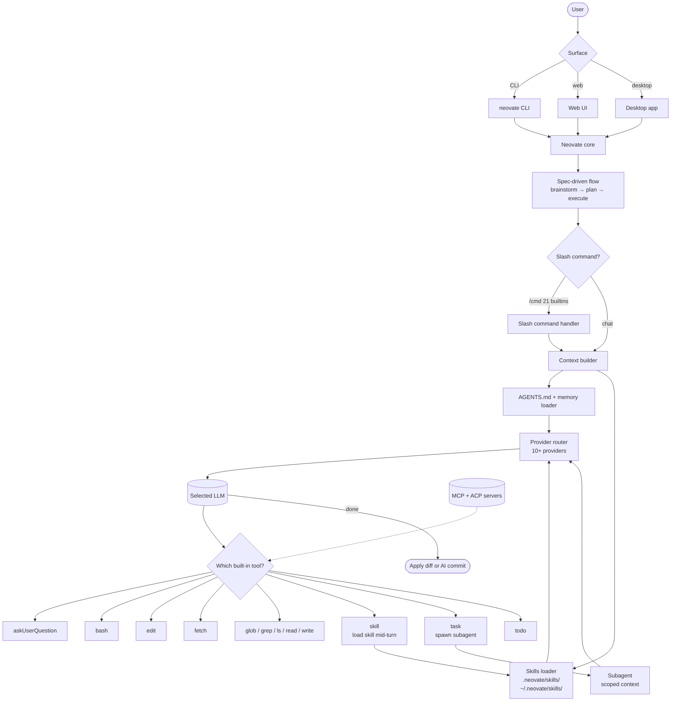

# Neovate

> **Slug**: `neovate` · **Surface**: CLI + Web + Desktop · **Vendor**: Neovate AI · **License**: Open source

A multi-surface AI coding agent with a rich plugin/skills system and a "spec-driven" workflow.

## Overview

Neovate is a polished agent harness with three surfaces (CLI, Web, Desktop) and an unusually generous out-of-the-box tool set: 12 built-in tools including `askUserQuestion`, `bash`, `edit`, `fetch`, `glob`, `grep` (ripgrep), `ls`, `read`, `skill`, `task`, `todo`, and `write`.

## Skills support

| Item | Value |
| --- | --- |
| Project path | `.neovate/skills/` |
| Global path | `~/.neovate/skills/` |
| `--agent` slug | `neovate` |
| `allowed-tools` | Yes |
| `context: fork` | No (Neovate has subagents via the `task` tool) |
| Hooks | No |

## Installation

```bash
npx skills add vercel-labs/agent-skills -a neovate
```

## Notable behavior

- **Skill** is one of the 12 built-in tools — the agent can explicitly request a skill load mid-conversation.
- **Spec-driven development**: brainstorm → plan → execute workflow.
- **Subagents** (`task`) for parallel/delegated work.
- **AGENTS.md** support for project-wide instructions.
- **Slash commands**: 21 built-in commands for reusable prompt templates.
- **Memory mode**: persist information to `AGENTS.md` with `#` prefix.
- **AI Commit** — intelligent git commit message generation.
- **MCP & ACP** (Agent Communication Protocol) support for editor integration.
- Multi-model support across Anthropic, OpenAI, Gemini, DeepSeek, Moonshot, GLM, Groq, XAI, OpenRouter, HuggingFace.

## Internals & Architecture

Neovate is unusually **batteries-included**: 12 built-in tools by default (a superset of what most agents ship), 21 built-in slash commands, three surfaces (CLI / Web / Desktop), and a spec-driven brainstorm → plan → execute workflow that sits over the top. Skills are not just configuration — `skill` is one of the 12 built-in tools, so the model can explicitly request `skill("name")` mid-conversation rather than waiting for the loader to inject one.



The architectural surprise is that **`skill` is a tool, not just a system-prompt augmentation**. That gives the model an explicit lever ("I want this skill, load it now") rather than relying on the loader's heuristic to pre-inject the right description. Combined with `task` for subagents and `todo` for plan tracking, Neovate gives the LLM a richer toolbox of *meta-tools* than most harnesses.

## Harness Deep Dive

### Agent loop

- **Shape**: **Spec-driven** (`brainstorm → plan → execute`), with **`task` tool subagents** and `todo` as a built-in plan tracker.
- **Tool-call style**: Native function calling, with `skill` as one of the 12 built-in tools (the model can request a skill mid-conversation).
- **Halting**: Standard end-turn / max-turn; spec phases gate execution.
- **Streaming**: Token + tool-call streaming across CLI / Web / Desktop.

### Context & memory

- **Context strategy**: `AGENTS.md` + skill descriptions + workspace; bodies fetched on demand or via `skill()` tool call.
- **Persistent files**: `.neovate/skills/`, `~/.neovate/skills/`, `AGENTS.md`. **Memory mode** — `#`-prefix lines auto-append to `AGENTS.md` (Strategy 6 lite).
- **Compaction**: Standard summarization.
- **Sub-context**: **`task` tool** spawns subagents with scoped context.
- **Cross-session memory**: `AGENTS.md` (auto-evolving via memory mode) + skill files.

### Tool runtime

- **Built-ins (12)**: `askUserQuestion`, `bash`, `edit`, `fetch`, `glob`, `grep` (ripgrep), `ls`, `read`, **`skill`**, **`task`**, **`todo`**, `write`. One of the largest out-of-the-box surfaces in the dataset.
- **Parallelism**: `task` subagents run in parallel.
- **Approval / safety**: Configurable.
- **Sandbox**: None.
- **MCP**: Supported.
- **ACP (Agent Communication Protocol)**: Supported for editor integration.
- **Slash commands**: 21 built-in.

### Model integration

- **Provider model**: BYOK across **10+ providers** — Anthropic, OpenAI, Gemini, DeepSeek, Moonshot, GLM, Groq, XAI, OpenRouter, HuggingFace.
- **Caching**: Provider-level.
- **Multi-model**: Per-conversation.

### Innovation summary

**`skill` as a built-in tool the model can call mid-conversation.** Neovate is the only agent in the dataset where skill loading is itself a tool the LLM can invoke explicitly (rather than relying on the loader to pre-inject). Combined with `task` (subagents), `todo` (plan tracking), and `askUserQuestion`, Neovate gives the model a richer set of *meta-tools* than the field. **AI Commit** rounds out the spec-driven workflow with intelligent commit message generation.

## Documentation

- [Neovate Features](https://neovateai.dev/docs/features)
- [Neovate homepage](https://neovateai.dev/)
- [Neovate CLI](https://neovateai.dev/docs/cli)
