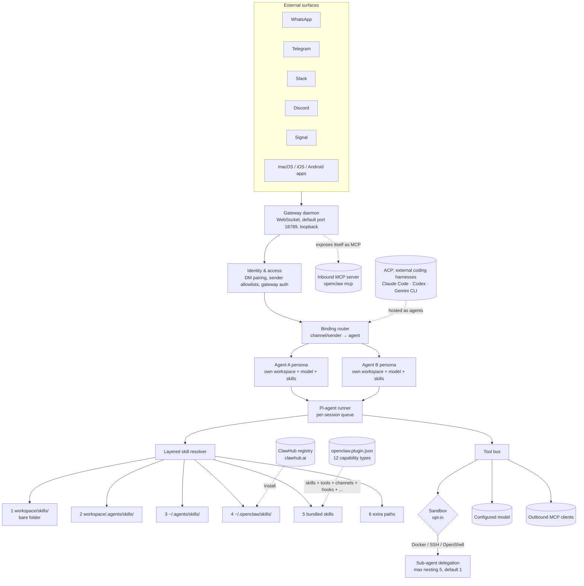

# OpenClaw

> **Slug**: `openclaw` · **Surface**: Local-first WebSocket gateway daemon + macOS / iOS / Android companion apps · **Vendor**: OpenClaw (open source) · **License**: Open source

A persistent, local-first WebSocket gateway that connects ~24 messaging surfaces (WhatsApp, Telegram, Slack, Discord, Signal, etc.) to an embedded **Pi-agent runner**. AgentSkills-compatible. Notable in this dataset both for its bare `skills/` project path (no leading dot — unique in the ecosystem) and because Liu et al. 2026 ([arXiv:2604.14228](../papers/dive-into-claude-code.md)) use it as the structural counterpoint to Claude Code in their design-space analysis.

## Overview

OpenClaw is **not** a coding-IDE in the same sense as the other 44 agents. The paper characterises it as a **persistent control plane for multi-channel personal assistance**: the daemon owns connections to messaging providers, exposes a typed WebSocket protocol on a loopback port (default `18789`) for clients and device nodes, and routes inbound messages to one of many configured agents based on declarative binding rules. The agent loop is a *component within* the gateway dispatch layer, not the system center.

The compositional consequence — flagged in Liu et al. §10.1 — is the most interesting cross-fact for *this* repo: **OpenClaw can host Claude Code, OpenAI Codex, and Gemini CLI as external coding harnesses through its ACP (Agent Client Protocol) integration.** The two systems are stackable, not exclusive. So OpenClaw is one of the few places in this dataset where a "harness of harnesses" pattern is a first-class deployment shape rather than something stitched together by hand.

The gateway-and-skills layout is what makes OpenClaw an Agent-Skills citizen: it loads the cross-agent `.agents/skills/` bucket alongside its own `~/.openclaw/skills/`, and runs its own public registry (ClawHub at `clawhub.ai`).

## Skills support

| Item | Value |
| --- | --- |
| Project path | `skills/` (bare folder, no leading dot — **unique in the ecosystem**, pre-spec relic) |
| Global path | `~/.openclaw/skills/` |
| `--agent` slug | `openclaw` |
| `allowed-tools` | Yes |
| `context: fork` | No |
| Hooks | No |

OpenClaw's skill loading order is layered (highest to lowest precedence):
1. Workspace skills: `<workspace>/skills/`
2. Project agent skills: `<workspace>/.agents/skills/`
3. Personal agent skills: `~/.agents/skills/`
4. Managed/local skills: `~/.openclaw/skills/`
5. Bundled skills (shipped with OpenClaw)
6. Extra skill folders (configurable)

So OpenClaw is one of the few agents that *natively* reads from the shared `.agents/skills/` bucket as well as its own folder.

## Installation

```bash
npx skills add vercel-labs/agent-skills -a openclaw
```

OpenClaw also ships its own native installer:

```bash
openclaw skills install <repo>
```

## Notable behavior

- **Per-agent personas with allowlists**: a single gateway hosts many fully isolated agents, each with its own workspace, model config, authentication profiles, session store, and skill / tool allowlists (`agents.list[].skills`).
- **Built-in MCP both ways**: `openclaw mcp` exposes the gateway as an MCP server *and* registers outbound MCP clients, so plugin-contributed and external MCP tools live in the same address space.
- **Plugin packages** ship via `openclaw.plugin.json` and can contribute across **12 capability types** — text inference, speech, media understanding, image / music / video generation, web search, messaging channels, plus tools / hooks / HTTP routes / CLI commands / services / channels (Liu et al. 2026 §10).
- **Dreaming**: an experimental background consolidation pass scores short-term recall items and promotes qualified ones into long-term `MEMORY.md` (and optionally `DREAMS.md`).
- **ClawHub registry** at `clawhub.ai` for browsing / installing community skills.
- The bare `skills/` project path is the historical artifact most worth knowing about — it can collide with publisher discovery if a repo uses `skills/` for its own published skills.

## Internals & Architecture

OpenClaw treats agents as **personas inside a gateway**: the gateway daemon owns external connections, validates inbound messages, resolves session state, and dispatches to a per-agent **Pi-agent runner** that executes the agentic loop. Per-session queue serialization (with an optional global lane) prevents tool and session races across the multi-channel surface. The skill loader reads from a deliberately layered set of locations (workspace, project agents bucket, personal agents bucket, OpenClaw-managed, bundled, extras) and resolves them in precedence order. ClawHub functions as the package registry.



The layered loader is the hidden differentiator at the *skills* level: most agents have one or two paths, OpenClaw has six, with explicit precedence. That makes it the easiest harness to reason about when you have *both* org-wide skills and a personal collection — there's no "which one wins" guesswork. The bare `skills/` project path is OpenClaw's pre-spec relic; it's listed as the highest-precedence layer for backward compatibility.

The harder differentiator at the *system* level — and the one the Liu et al. paper draws out — is that the gateway is the architectural center, not the agent loop. Every other agent in this dataset (with the partial exception of OpenHands' web shell) puts the loop at the center; OpenClaw embeds the loop inside a gateway that knows about identity, channels, and routing.

## Harness Deep Dive

### Agent loop

- **Shape**: **Persona-driven inside a gateway** — the agent loop (Pi-agent runner) sits inside a gateway RPC dispatch layer that validates parameters, resolves sessions, and returns immediately while the runner streams lifecycle and stream events back through the WebSocket protocol.
- **Tool-call style**: Native function calling per chosen model.
- **Halting**: Standard, plus per-session and global queue serialization to prevent tool and session races across simultaneous channel inputs.
- **Streaming**: Token + tool-call streaming, multiplexed back through the gateway protocol to whichever client (mobile app, desktop app, messaging surface) originated the request.

### Context & memory

- **Workspace bootstrap files**: at session start the gateway injects up to **8** files into the system prompt — `AGENTS.md`, `SOUL.md`, `TOOLS.md`, `IDENTITY.md`, `USER.md` (always when present), plus `BOOTSTRAP.md`, `HEARTBEAT.md`, and `MEMORY.md` (conditionally). Large files are truncated.
- **Memory subsystem** (separate from bootstrap): three file types — `MEMORY.md` for long-term durable facts, date-stamped daily notes (`memory/YYYY-MM-DD.md`), and an optional `DREAMS.md` for dreaming sweep summaries.
- **Memory search**: when an embedding provider is configured, hybrid retrieval (vector similarity + keyword). When not, plain file scan.
- **Auto-compaction**: pluggable providers; reminds the agent to save important notes to memory files *before* compacting, preventing context loss.
- **Dreaming** (experimental): background sweep scores candidates and promotes qualified items from short-term recall into long-term memory.
- **Persistent files**: `skills/` (bare), `.agents/skills/`, `~/.agents/skills/`, `~/.openclaw/skills/`, bundled, plus extras.
- **Sub-context**: Persona switch keeps the conversation; closest analog to mode switching. **Sub-agent delegation** is configurable up to nesting depth 5 (default 1, recommended 2), thread-bound on supported channels, with depth-aware tool policy.
- **Cross-session memory**: skill files at six layers, ClawHub-installed packages, plus the dreaming-promoted `MEMORY.md` — one of the few agents in this dataset with a deliberate experiential-memory tier.

### Tool runtime

- **Built-ins**: per-persona allowlists in `agents.list[]` — each agent persona has its own tool registry.
- **Parallelism**: serial per session by default; optional global lane for cross-session ordering.
- **Approval / safety**: per-persona allowlist is the gate. **Sandboxing is opt-in** with multiple backends (Docker / SSH / OpenShell) and configurable scope (per-agent, per-session, or shared); a `non-main` mode can sandbox all non-main sessions when enabled. The OpenClaw security docs explicitly state hostile multi-tenant isolation on a shared gateway is *not* a supported boundary.
- **MCP**: built-in `openclaw mcp` exposes the gateway *as* an MCP server **and** maintains an outbound MCP client registry — bidirectional MCP is one of the differentiators.
- **Plugin system**: `openclaw.plugin.json` with **12 capability types**: text inference, speech, media understanding, image generation, music generation, video generation, web search, messaging channels, plus tools, hooks, HTTP routes, CLI commands, and services. Plugins register into a central registry the gateway reads at runtime.
- **External harness hosting (ACP)**: Agent Client Protocol integration lets OpenClaw host Claude Code, OpenAI Codex, and Gemini CLI as full-fledged agent personas — uniquely makes "harness of harnesses" a deployment shape.
- **Registry**: ClawHub at `clawhub.ai`.

### Model integration

- **Provider model**: configurable per-persona — different agents on the same gateway can use different providers and models.
- **Caching**: provider-level.
- **Multi-model**: per-persona model selection. Routing rules can also dispatch to different agents (and therefore different models) per channel or sender.

### Trust & security model

OpenClaw's trust boundary lives at the **gateway perimeter**, not at per-action evaluation. This is the sharpest divergence the Liu et al. paper draws between OpenClaw and Claude Code (Claude Code: per-action deny-first + ML classifier; OpenClaw: identity, channel allowlists, gateway auth, opt-in sandbox). Practical consequences:

- DM pairing codes and sender allowlists gate which messaging-surface accounts can talk to the gateway at all.
- Tool policy is configurable allow / deny per agent rather than centralized.
- The default trust assumption is **a single trusted operator per gateway instance** — the threat model is unauthorized inbound, not an untrusted agent operating against a trusted developer's machine.

### Innovation summary

Three things make OpenClaw structurally distinct in the dataset:

1. **Gateway-centric architecture.** The agent loop is a component, not the system center; the gateway owns channels, identity, routing, and session state. That inverts the design choice every other CLI / IDE agent in this dataset makes.
2. **Six-layer skill loader with explicit precedence + per-persona allowlists + ClawHub registry.** The easiest harness to reason about when you have *both* org-wide skills and a personal collection.
3. **Stackable harnesses via ACP.** OpenClaw can host Claude Code, OpenAI Codex, and Gemini CLI as external coding harnesses, making it the one place in this dataset where the "harness of harnesses" pattern is a first-class deployment.

The bare `skills/` folder (highest precedence) is a pre-spec relic that doubles as backward compatibility.

## Documentation

- [OpenClaw Skills](https://docs.openclaw.ai/tools/skills)
- [Creating Skills](https://docs.openclaw.ai/tools/creating-skills)
- [ClawHub](https://clawhub.ai/)
- Liu, Zhao, Shang & Shen, *Dive into Claude Code: The Design Space of Today's and Future AI Agent Systems* — [arXiv:2604.14228](https://arxiv.org/abs/2604.14228) (§10 contrasts OpenClaw with Claude Code across six design dimensions). **In-repo notes**: [`docs/papers/dive-into-claude-code.md`](../papers/dive-into-claude-code.md).
