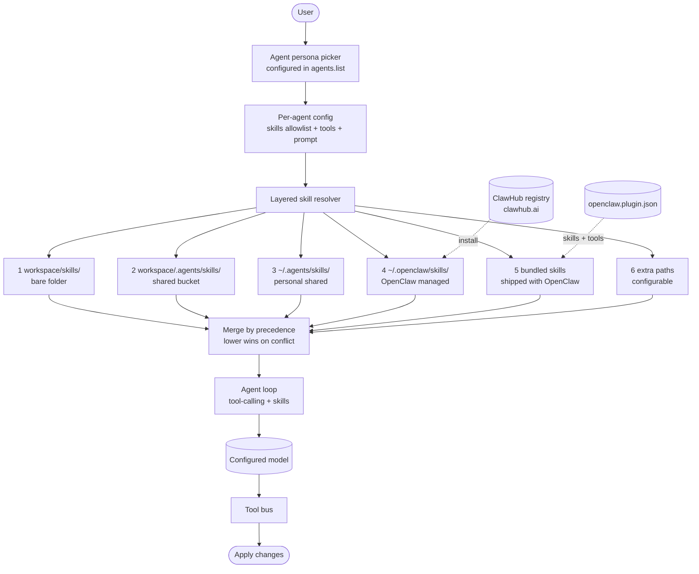

# OpenClaw

> **Slug**: `openclaw` · **Surface**: Native AI IDE · **Vendor**: OpenClaw · **License**: Proprietary (likely with OSS pieces)

An AgentSkills-compatible IDE with its own skills registry (ClawHub). One of the few agents to use a bare `skills/` folder with no leading dot.

## Overview

OpenClaw is an agentic IDE built around the AgentSkills convention. Its install path is unusual — it uses a bare `skills/` directory at the project root, rather than the namespaced dot-folders the other 44 agents use. OpenClaw also runs its own public skills registry (ClawHub) at `clawhub.ai`.

## Skills support

| Item | Value |
| --- | --- |
| Project path | `skills/` (no leading dot — unique in the ecosystem) |
| Global path | `~/.openclaw/skills/` |
| `--agent` slug | `openclaw` |
| `allowed-tools` | Yes |
| `context: fork` | No |
| Hooks | No |

OpenClaw's skill loading order is layered (highest to lowest precedence):
1. Workspace skills: `<workspace>/skills/`
2. Project agent skills: `<workspace>/.agents/skills/`
3. Personal agent skills: `~/.agents/skills/`
4. Managed/local skills: `~/.openclaw/skills/`
5. Bundled skills (shipped with OpenClaw)
6. Extra skill folders (configurable)

So OpenClaw is one of the few agents that *natively* reads from the shared `.agents/skills/` bucket as well as its own folder.

## Installation

```bash
npx skills add vercel-labs/agent-skills -a openclaw
```

OpenClaw also ships its own native installer:

```bash
openclaw skills install <repo>
```

## Notable behavior

- Per-agent skill allowlists: configure which skills a particular agent persona can use via `agents.list[].skills`.
- ClawHub registry at `clawhub.ai` for browsing/installing community skills.
- Plugin system: plugins can ship their own skills via `openclaw.plugin.json`.
- The bare `skills/` project path is the historical artifact most worth knowing about — it can collide with publisher discovery if a repo uses `skills/` for its own published skills.

## Internals & Architecture

OpenClaw treats agents as **personas** rather than monolithic runtimes: the same IDE shell can host many agent configurations, each with its own allowlist of skills, tools, and prompts. The skill loader reads from a deliberately layered set of locations (workspace, project agents bucket, personal agents bucket, OpenClaw-managed, bundled, extras) and resolves them in precedence order. ClawHub functions as the package registry.



The layered loader is the hidden differentiator: most agents have one or two paths, OpenClaw has six, with explicit precedence. That makes it the easiest harness to reason about when you have *both* org-wide skills and a personal collection — there's no "which one wins" guesswork. The bare `skills/` project path is OpenClaw's pre-spec relic; it's listed as the highest-precedence layer for backward compatibility.

## Harness Deep Dive

### Agent loop

- **Shape**: **Persona-driven** — agents are configurations, not monolithic; same IDE shell hosts many agent personas with their own allowlists.
- **Tool-call style**: Native function calling per chosen model.
- **Halting**: Standard.
- **Streaming**: Token + tool-call streaming.

### Context & memory

- **Context strategy**: Per-persona prompt + skills allowlist + tools allowlist. The **layered skill resolver** with explicit 6-level precedence sorts out conflicts deterministically.
- **Persistent files**: `skills/` (bare folder, OpenClaw's pre-spec relic), `.agents/skills/`, `~/.agents/skills/`, `~/.openclaw/skills/`, bundled, plus extras.
- **Compaction**: Standard.
- **Sub-context**: Persona switch keeps the conversation; closest analog to mode switching.
- **Cross-session memory**: Skill files at six layers + ClawHub-installed packages.

### Tool runtime

- **Built-ins**: Per-persona allowlists in `agents.list[]` — each agent persona has its own tool registry.
- **Parallelism**: Sequential by default.
- **Approval / safety**: Per-persona allowlist is the gate.
- **Sandbox**: None first-party.
- **MCP**: Supported.
- **Plugin system**: `openclaw.plugin.json` ships skills + tools as a unit.
- **Registry**: ClawHub at `clawhub.ai`.

### Model integration

- **Provider model**: Configurable per-persona model.
- **Caching**: Provider-level.
- **Multi-model**: Per-persona model selection.

### Innovation summary

**Six-layer skill loader with explicit precedence + per-persona allowlists + ClawHub registry.** OpenClaw is the easiest harness to reason about when you have *both* org-wide skills and a personal collection — six layers, deterministic precedence, no "which one wins" guesswork. The bare `skills/` folder (highest precedence) is a pre-spec relic that doubles as backward compatibility.

## Documentation

- [OpenClaw Skills](https://docs.openclaw.ai/tools/skills)
- [Creating Skills](https://docs.openclaw.ai/tools/creating-skills)
- [ClawHub](https://clawhub.ai/)
