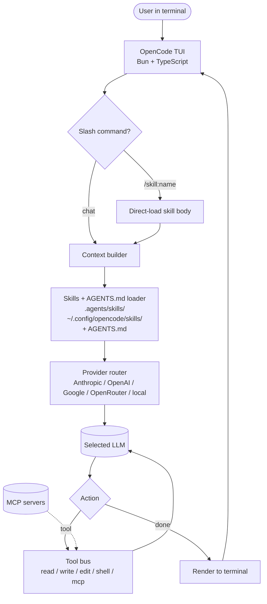

# OpenCode

> **Slug**: `opencode` · **Surface**: CLI · **Vendor**: sst · **License**: Apache 2.0

A polished, provider-agnostic, open-source terminal coding agent. Often described together with Crush as the two leading OSS terminal agents.

## Overview

OpenCode is built by the team behind sst (Serverless Stack). It is provider-agnostic — works with Anthropic, OpenAI, Google, OpenRouter, local models — and follows the AGENTS.md and skills standards by default.

## Skills support

| Item | Value |
| --- | --- |
| Project path | `.agents/skills/` (shared bucket) |
| Global path | `~/.config/opencode/skills/` (XDG) |
| `--agent` slug | `opencode` |
| `allowed-tools` | Yes |
| `context: fork` | No |
| Hooks | No |

OpenCode is one of the few agents using the XDG-style `~/.config/<slug>/skills/` global path.

## Installation

```bash
npx skills add vercel-labs/agent-skills -a opencode
```

## Notable behavior

- Strong emphasis on multi-provider support; skills work the same regardless of the backing model.
- The CLI is keyboard-focused (TUI), comparable to Claude Code and Crush in feel.
- OpenCode's own slash-command system can invoke skills directly: `/skill:<name>`.
- Frequently paired with `vercel-labs/agent-skills` as a default install.

## Internals & Architecture

OpenCode is a Bun/TypeScript CLI built by the sst team (Serverless Stack). The architecture is deliberately uncomplicated: a single agent loop, provider-agnostic, with a TUI layer for chat and slash commands. Skills install into the shared `.agents/skills/` bucket so the same folder serves OpenCode, Claude Code's user, Cursor, and the rest of the bucket without duplication.



The architectural choice that's most interesting in context is **the slash-command-loads-skill shortcut** (`/skill:name`): it gives the user a way to **force** a skill into context without waiting for the model's progressive-disclosure decision. That's the simplest, fastest way to override the model's judgment, and it's something the majority of agents in the dataset don't expose to the user.

## Harness Deep Dive

### Agent loop

- **Shape**: ReAct, with **slash-command-as-skill** override (`/skill:name`) as the only direct user lever into the loop.
- **Tool-call style**: Native function calling preferred; falls back depending on provider.
- **Halting**: Standard.
- **Streaming**: Token streaming in the TUI.

### Context & memory

- **Context strategy**: System prompt + `AGENTS.md` + skill descriptions; skill bodies pulled in only when triggered (or via `/skill:name`).
- **Persistent files**: `AGENTS.md`, `.agents/skills/`, and `~/.config/opencode/skills/` (XDG).
- **Compaction**: Standard summarization for long sessions.
- **Sub-context**: None first-party.
- **Cross-session memory**: Skill files + `AGENTS.md`.

### Tool runtime

- **Built-ins**: Read / write / edit / shell / glob / grep, plus MCP.
- **Parallelism**: Sequential by default.
- **Approval / safety**: Configurable; defaults are conservative for a CLI agent.
- **Sandbox**: None — host filesystem.
- **MCP**: Supported.

### Model integration

- **Provider model**: BYOK across many providers — Anthropic, OpenAI, Google, OpenRouter, OpenAI-compatible, local. Provider-agnostic by design.
- **Caching**: Provider-level where supported.
- **Multi-model**: Per-session selection.

### Innovation summary

**`/skill:name` as a user-controllable override of progressive disclosure.** Most harnesses leave skill triggering to the model; OpenCode lets the user force it. Combined with strong provider-agnosticism and a clean Bun/TypeScript codebase, OpenCode is one of the most "approachable to fork" agents in the dataset.

## Documentation

- [OpenCode Skills](https://opencode.ai/docs/skills)
- [OpenCode site](https://opencode.ai/)
