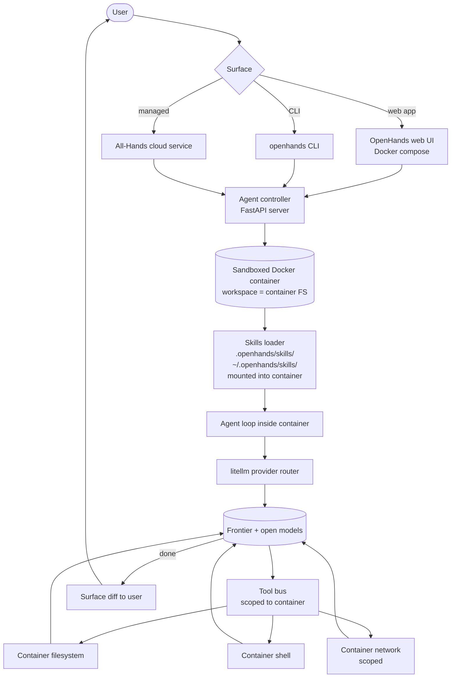

# OpenHands

> **Slug**: `openhands` · **Surface**: Web + CLI · **Vendor**: All-Hands AI · **License**: MIT

The agent platform formerly known as OpenDevin. One of the most-mature open-source agent harnesses.

## Overview

OpenHands (renamed from OpenDevin) is the flagship open-source agentic platform from All-Hands AI. It runs as a web app (Docker), CLI, or cloud service. It's been the de-facto reference implementation for "fully autonomous coding agent" academic benchmarks.

## Skills support

| Item | Value |
| --- | --- |
| Project path | `.openhands/skills/` |
| Global path | `~/.openhands/skills/` |
| `--agent` slug | `openhands` |
| `allowed-tools` | Yes |
| `context: fork` | No |
| Hooks | No |

## Installation

```bash
npx skills add vercel-labs/agent-skills -a openhands
```

## Notable behavior

- Runtime is sandboxed Docker by default — skills can confidently invoke shell commands without polluting the host.
- Multi-provider via litellm under the hood.
- Strong fit with academic/benchmark workflows.
- Rapid release cadence; major version bumps every few weeks historically.
- Available as both a self-hosted Docker app and the All-Hands managed cloud service.

## Internals & Architecture

OpenHands runs the agent inside a **sandboxed Docker container** by default — the container is the workspace, the agent's tool calls happen inside it, and the host only sees what the agent chooses to surface. That sandboxing is the architectural choice that distinguishes OpenHands: skills can confidently `rm -rf` because the blast radius is the container, not your laptop. Multi-provider routing happens through litellm under the hood, so the same container works against any frontier model.



The sandboxing pays off in a way that matters more than it looks: **the agent can experiment without consequence**. Long autonomous runs that would scare a developer running on the host are routine inside an OpenHands container, which is why OpenHands has been the de-facto reference for academic SWE-bench-style benchmarks. The trade-off is cold-start latency — spinning a container takes longer than starting an in-process loop.

## Harness Deep Dive

### Agent loop

- **Shape**: ReAct, but optimized for **long autonomous runs** — minimal user interruption is the default, because the sandbox makes that safe.
- **Tool-call style**: Native function calling for modern providers; XML/JSON parsers in fallback paths via litellm-supported providers.
- **Halting**: Standard end-turn + budget caps. Cloud workers also have wall-clock budgets.
- **Streaming**: Event stream surfaces in the web UI; CLI mode streams token-by-token.

### Context & memory

- **Context strategy**: Workspace = container filesystem. Agent reads files via tools inside the container, so context is whatever the container holds (which can be a freshly cloned repo).
- **Persistent files**: `.openhands/skills/` per-repo and `~/.openhands/skills/` per-user, mounted into the container.
- **Compaction**: Standard summarization for long autonomous runs.
- **Sub-context**: No `context: fork`; sub-context happens at the container level (multiple containers).
- **Cross-session memory**: Skill files only; container is ephemeral by default.

### Tool runtime

- **Built-ins**: Filesystem, shell, browser (inside the container), plus MCP — all scoped to the sandbox.
- **Parallelism**: Sequential within an agent; multiple containers can run in parallel.
- **Approval / safety**: Container *is* the safety boundary — destructive actions are tolerated because their blast radius is the container.
- **Sandbox**: **Docker container by default** — the architectural signature of the project.
- **MCP**: Supported, mounted into the container.

### Model integration

- **Provider model**: **litellm** wrapper — works with any provider litellm supports (Anthropic, OpenAI, Google, OpenRouter, Bedrock, Azure, local).
- **Caching**: Provider-level where available; less aggressive than provider-native harnesses.
- **Multi-model**: Pick at startup; can be swapped via config.

### Innovation summary

**The Docker sandbox as the default execution boundary.** OpenHands made "long autonomous runs are tolerable" the default by removing the host as a risk surface. It also pioneered the open-source-academic-benchmark workflow that the rest of the field now competes on.

## Documentation

- [OpenHands Skills](https://docs.openhands.ai/modules/usage/how-to/using-skills)
- [OpenHands GitHub](https://github.com/All-Hands-AI/OpenHands)
