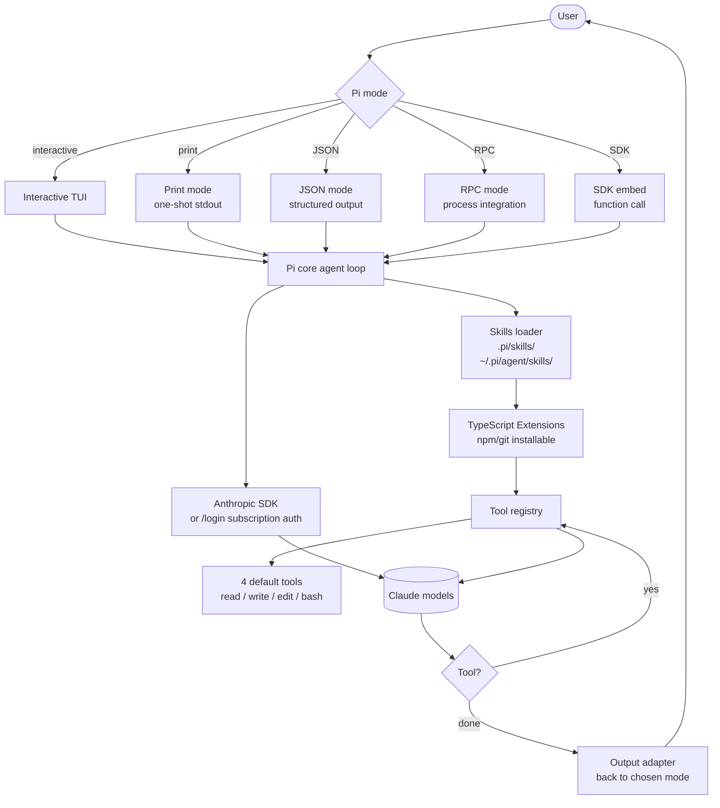

# Pi

> **Slug**: `pi` · **Surface**: CLI · **Vendor**: badlogic · **License**: MIT

A minimal terminal coding agent — deliberately lightweight, with strong defaults and an SDK for embedding.

## Overview

Pi is part of the [`pi-mono`](https://github.com/badlogic/pi-mono) repo by badlogic (Mario Zechner). It's a **minimal coding-agent harness** that ships with a small, opinionated tool set (`read`, `write`, `edit`, `bash`) and avoids forcing complex features like sub-agents or plan mode. The result: easy to understand, easy to embed, easy to extend.

The pi-mono repo is one of the most-starred OSS agent toolkits (34k+ stars on GitHub) and contains several related packages: a unified LLM API (`@mariozechner/pi-ai`), a Slack bot, a TUI library, a web-UI library, and a CLI for vLLM deployments.

## Skills support

| Item | Value |
| --- | --- |
| Project path | `.pi/skills/` |
| Global path | `~/.pi/agent/skills/` (note the extra `agent/` segment) |
| `--agent` slug | `pi` |
| `allowed-tools` | Yes |
| `context: fork` | No |
| Hooks | No |

## Installation

```bash
npm install -g @mariozechner/pi-coding-agent
export ANTHROPIC_API_KEY=sk-ant-...
pi

npx skills add vercel-labs/agent-skills -a pi
```

## Notable behavior

- Minimal by design: just 4 default tools.
- TypeScript Extensions, Skills, Prompt Templates, and Themes are all packaged-and-shareable via npm/git.
- Multiple modes: interactive, print/JSON output, RPC for process integration, and an SDK for embedding in your own apps.
- Subscription auth via `/login` is supported (instead of API key).
- The `~/.pi/agent/skills/` global path is unusual — most agents would skip the `agent/` segment.

## Internals & Architecture

Pi is **deliberately minimal** — only 4 default tools (read, write, edit, bash), no plan mode, no built-in subagents. Everything else is shipped as a TypeScript Extension that the host loads at startup. This makes Pi the easiest harness in the dataset to embed: the SDK exposes the agent loop as a function, and you bring your own UI / RPC / orchestration on top.



The architectural philosophy is *"skills + extensions in user space, not core"* — Pi ships almost nothing by default, but every part you might want (subagents, MCP, plan mode, themes) is a TypeScript Extension you can drop in. That makes Pi great as **a base for building your own agent product**: it's the harness equivalent of a kit car.

## Harness Deep Dive

### Agent loop

- **Shape**: ReAct, deliberately minimal — no plan mode, no subagents in core. Anything more complex is an Extension.
- **Tool-call style**: Native function calling on the Anthropic SDK.
- **Halting**: Standard end-turn.
- **Streaming**: Token streaming in interactive mode; one-shot in print/JSON modes.

### Context & memory

- **Context strategy**: System prompt + skill descriptions + workspace; bodies on demand. Minimal compaction logic — the Anthropic prompt cache does heavy lifting.
- **Persistent files**: `.pi/skills/`, `~/.pi/agent/skills/` (note the extra `agent/` segment).
- **Compaction**: Standard.
- **Sub-context**: None in core; Extensions can add it.
- **Cross-session memory**: Skill files; everything else is in user space.

### Tool runtime

- **Built-ins**: **Just 4 tools** — `read`, `write`, `edit`, `bash`. The smallest core registry in the dataset.
- **Parallelism**: Sequential.
- **Approval / safety**: Configurable.
- **Sandbox**: None.
- **MCP**: Via Extension.
- **Extensions**: TypeScript packages distributed via npm/git; everything beyond the 4 built-ins.

### Model integration

- **Provider model**: Anthropic-first via the Anthropic SDK; **`/login` subscription auth** is supported as an alternative to API key. Other providers via Extension or via `@mariozechner/pi-ai` (sibling SDK in `pi-mono`).
- **Caching**: Heavy use of Anthropic prompt caching.
- **Multi-model**: Pick at startup.

### Innovation summary

**Minimal-by-design SDK harness — almost everything is a TypeScript Extension.** Pi is the dataset's "kit car" agent: 4 tools in core, everything else (subagents, MCP, plan mode, themes) is an Extension you drop in. The SDK makes it the easiest harness to embed in your own product. The pi-mono repo's `@mariozechner/pi-ai` provider SDK is one of the cleanest provider-abstraction layers in the OSS world.

## Documentation

- [Pi coding-agent README](https://github.com/badlogic/pi-mono/tree/main/packages/coding-agent)
- [pi-mono repo](https://github.com/badlogic/pi-mono)
- [Skills doc](https://github.com/badlogic/pi-mono/blob/main/packages/coding-agent/docs/skills.md)
