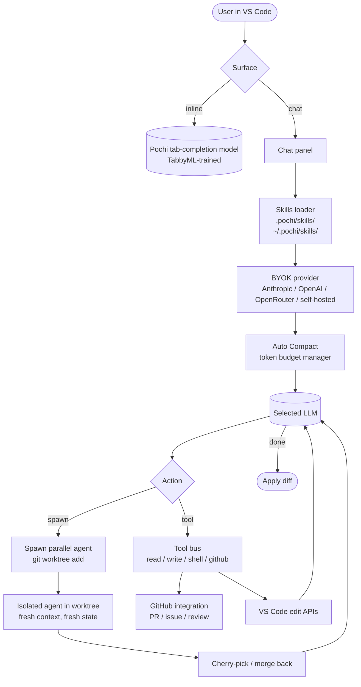

# Pochi

> **Slug**: `pochi` · **Surface**: VS Code extension · **Vendor**: TabbyML · **License**: Open source

An open-source AI coding agent built as a VS Code extension by the TabbyML team.

## Overview

Pochi is TabbyML's AI coding extension. TabbyML is best known for the Tabby self-hosted code-completion server; Pochi extends that work into a full agent surface inside VS Code, with strong BYOK and self-hosted-model support.

## Skills support

| Item | Value |
| --- | --- |
| Project path | `.pochi/skills/` |
| Global path | `~/.pochi/skills/` |
| `--agent` slug | `pochi` |
| `allowed-tools` | Yes (assumed) |
| `context: fork` | No (Pochi has Parallel Agents via Git worktrees) |
| Hooks | No |

## Installation

```bash
npx skills add vercel-labs/agent-skills -a pochi
```

Install Pochi from the VS Code Marketplace or OpenVSX Registry.

## Notable behavior

- **Tab Completion** powered by Pochi's internally-trained model (separate from the agent loop).
- **BYOK**: bring your own LLM provider; full control over data and compute costs.
- **Parallel Agents**: run multiple isolated tasks simultaneously using Git worktrees — Pochi's equivalent of `context: fork`.
- **Auto Compact**: efficient token management for long conversations.
- **Deep GitHub integration**: native PR creation, issue handling, and code review.
- 30 contributors, latest VS Code release `vscode@0.40.1` as of April 2026.

## Internals & Architecture

Pochi splits responsibilities cleanly: tab-completion runs through a Pochi-trained small model owned by TabbyML, while the agent loop is BYOK — your choice of provider. Its standout primitive is **Parallel Agents via Git worktrees**: when you want a forked context, Pochi spins a real worktree off the current branch, runs an isolated agent inside it, and lets you cherry-pick or merge the result. That's the closest thing in the dataset to Claude Code's `context: fork`, but at the filesystem layer.



The architecturally-interesting line is **Worktree → ParallelAgent → CherryPick**: a fork at the git layer is more durable than a fork at the context layer because the user can review, modify, abandon, or merge the result without trusting the agent's summary. That makes Pochi a strong fit for users who want long autonomous runs but want a true safety net.

## Harness Deep Dive

### Agent loop

- **Shape**: ReAct, with **Parallel Agents via real `git worktree`** as the sub-context primitive.
- **Tool-call style**: Native function calling for modern providers; XML/JSON parsers in fallback paths.
- **Halting**: Standard end-turn / **Auto Compact** when budget gets tight.
- **Streaming**: Token streaming in the chat panel.

### Context & memory

- **Context strategy**: **Auto Compact** — efficient token management for long conversations (a named primitive, not just background summarization).
- **Persistent files**: `.pochi/skills/`, `~/.pochi/skills/`.
- **Compaction**: **Auto Compact** is first-class.
- **Sub-context**: **Parallel Agents via `git worktree add`** — most durable sub-context primitive in the dataset because the user can review, modify, abandon, or merge the result without trusting the agent's summary.
- **Cross-session memory**: Skill files + git state.

### Tool runtime

- **Built-ins**: Read / write / shell, plus **deep GitHub integration** (PR, issue, code review).
- **Parallelism**: **Parallel Agents** in worktrees run truly concurrently.
- **Approval / safety**: Configurable; worktree isolation is the safety story.
- **Sandbox**: **Git worktree** is the durability boundary.
- **MCP**: Supported.
- **Tab completion**: Pochi-trained small model (separate from the agent loop).

### Model integration

- **Provider model**: BYOK across many providers (including self-hosted via the TabbyML lineage).
- **Caching**: Provider-level + Auto Compact.
- **Multi-model**: Per-conversation.

### Innovation summary

**Parallel Agents via real `git worktree` + Auto Compact + deep GitHub integration.** Pochi is the dataset's most durable sub-context implementation — a fork at the git layer is reviewable, mergeable, and abandonable in a way no in-memory fork is. The TabbyML lineage gives Pochi the strongest self-hosted-model story among VS Code extensions.

## Documentation

- [Pochi docs](https://docs.getpochi.com/)
- [Pochi GitHub](https://github.com/TabbyML/pochi)
