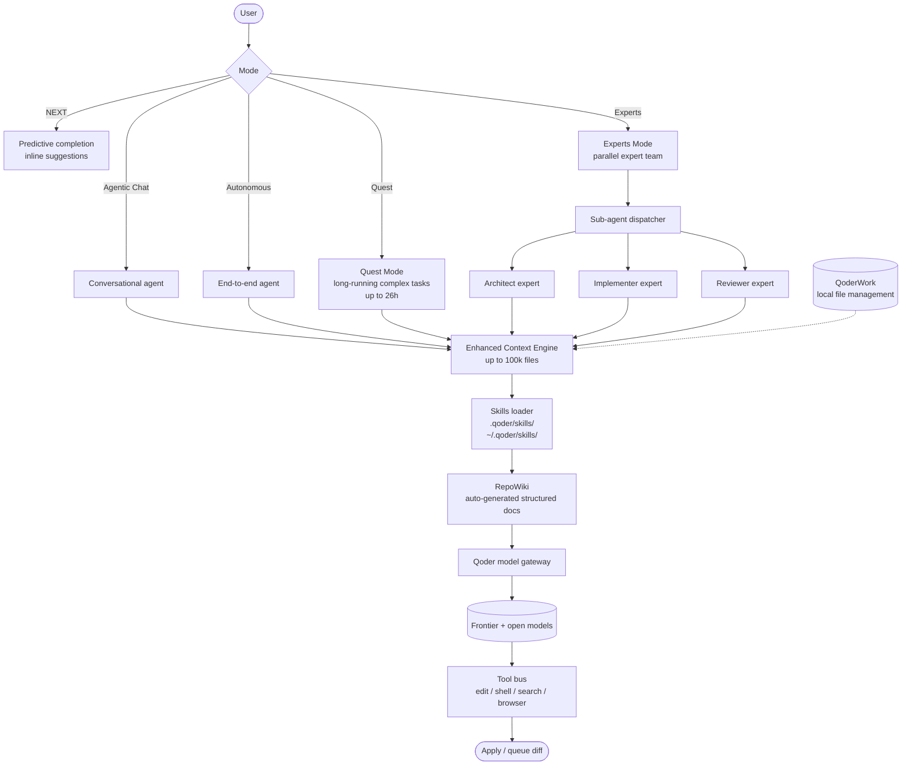

# Qoder

> **Slug**: `qoder` · **Surface**: Native AI IDE + JetBrains plugin + CLI · **Vendor**: Qoder · **License**: Proprietary

An agentic coding platform with a native AI IDE, JetBrains plugin, and CLI. The recommended migration target for sunsetting iFlow CLI users.

## Overview

Qoder is an AI-native IDE built around very-large-context engineering: the platform supports analysis of up to 100,000 files and can run for up to 26 hours per task. It was designed as a direct competitor to Cursor and the China-market competitors (Trae, CodeBuddy).

## Skills support

| Item | Value |
| --- | --- |
| Project path | `.qoder/skills/` |
| Global path | `~/.qoder/skills/` |
| `--agent` slug | `qoder` |
| `allowed-tools` | Yes |
| `context: fork` | No (Qoder has Quest Mode + Experts Mode) |
| Hooks | No |

## Installation

```bash
npx skills add vercel-labs/agent-skills -a qoder
```

## Notable behavior

- **Experts Mode**: assembles a parallel "expert team" of agents.
- **Editor Mode**: side-by-side agent collaboration with code prediction.
- **Agentic Coding Modes**: NEXT (code prediction), Agentic Chat (conversational), Autonomous Agent (end-to-end), Quest Mode (long-running complex tasks).
- **RepoWiki**: auto-generates structured docs from your code.
- **Enhanced Context Engine**: up to 100,000 files, 26 hours of runtime per task.
- Multi-platform: macOS / Windows / Linux desktop, JetBrains plugin, CLI, plus QoderWork for local file management.

## Internals & Architecture

Qoder is a multi-mode IDE built around an unusually large context engine (100k files, 26-hour task budget). The runtime exposes four explicit modes — NEXT (predictive completion), Agentic Chat, Autonomous Agent, and Quest Mode — plus an Experts Mode that orchestrates parallel sub-agents. Skills layer in as portable instruction bundles that any mode can consume.



The two architectural bets that distinguish Qoder: (1) **mode is a first-class concept** — the same agent harness presents itself as four very different products, with Quest Mode tuned for long-horizon tasks where most agents would have run out of context; (2) **Experts Mode is the closest thing to native multi-agent orchestration** in the dataset, with explicit roles (architect/implementer/reviewer) running in parallel and reconciling at hand-off boundaries.

## Harness Deep Dive

### Agent loop

- **Shape**: **Mode machine + fleet** — five modes (NEXT, Agentic Chat, Autonomous, **Quest**, **Experts**). Quest is tuned for long-horizon work; Experts spawns a parallel team.
- **Tool-call style**: Native function calling per chosen model.
- **Halting**: **Quest Mode allows up to 26 hours per task** — the dataset's outlier wall-clock budget. Other modes use standard halting.
- **Streaming**: Per-mode streaming; Experts surfaces per-expert progress.

### Context & memory

- **Context strategy**: **Enhanced Context Engine — up to 100,000 files** in scope. **RepoWiki** auto-generates structured docs from the code as additional context.
- **Persistent files**: `.qoder/skills/`, `~/.qoder/skills/`. RepoWiki artifacts are auto-maintained.
- **Compaction**: Engineered for the 100k file ceiling — heavy retrieval rather than aggressive in-context compaction.
- **Sub-context**: **Experts Mode** dispatches sub-agents (architect / implementer / reviewer) that run in parallel.
- **Cross-session memory**: Skills + RepoWiki + project state.

### Tool runtime

- **Built-ins**: Edit / shell / search / browser, plus QoderWork for local file management.
- **Parallelism**: Experts Mode is first-class parallel.
- **Approval / safety**: Configurable per mode; Autonomous and Quest are designed to run unattended.
- **Sandbox**: None first-party.
- **MCP**: Supported.

### Model integration

- **Provider model**: Qoder model gateway — frontier + open models.
- **Caching**: Gateway-managed.
- **Multi-model**: Per-mode and per-expert model selection.

### Innovation summary

**Quest Mode 26h budget + Experts Mode parallel team + 100k-file context engine.** Qoder is the dataset's most ambitious "long-horizon plus large-scope" agent. Quest Mode's 26-hour wall-clock budget is an outlier; Experts Mode is the cleanest native multi-agent orchestration with explicit roles. The 100k-file context ceiling is the highest in the dataset.

## Documentation

- [Qoder Skills](https://docs.qoder.com/cli/Skills)
- [Qoder homepage](https://www.qoder.com/)
