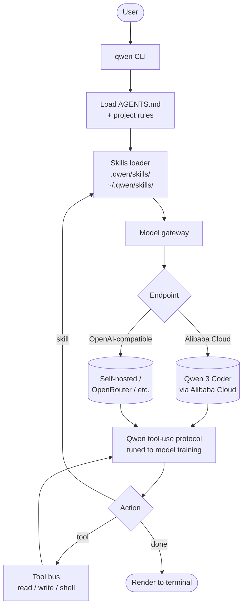

# Qwen Code

> **Slug**: `qwen-code` · **Surface**: CLI · **Vendor**: Alibaba (Qwen team) · **License**: Open source

Alibaba's terminal coding agent, optimized for the Qwen 3 Coder family of models.

## Overview

Qwen Code is the official CLI from the Qwen team (Alibaba Cloud). It's tuned to work well with Qwen 3 Coder — a strong open-weight coding model — but supports other providers as well. Like several other CLI agents in this list, it follows the AGENTS.md and skills conventions natively.

## Skills support

| Item | Value |
| --- | --- |
| Project path | `.qwen/skills/` |
| Global path | `~/.qwen/skills/` |
| `--agent` slug | `qwen-code` |
| `allowed-tools` | Yes (assumed) |
| `context: fork` | No |
| Hooks | No |

## Installation

```bash
npx skills add vercel-labs/agent-skills -a qwen-code
```

## Notable behavior

- Best paired with Qwen 3 Coder, which has stronger tool-use behavior than the base Qwen model.
- Inherits AGENTS.md as the project-wide rules surface.
- Skills layer on top of the base instructions.
- Documentation is in both English and Chinese.

## Internals & Architecture

Qwen Code is the Alibaba team's CLI specifically tuned for **Qwen 3 Coder**. The agent loop is conventional, but the model integration is tighter than most: tool-use prompting follows the patterns Qwen 3 Coder was trained on, and the CLI ships sensible defaults for Alibaba Cloud routing alongside generic OpenAI-compatible endpoints.



The architectural takeaway: when a CLI is built around a specific model family, the **tool-use protocol can match what the model was trained on** rather than what some neutral standard expects. That's why Qwen Code feels noticeably more reliable with Qwen 3 Coder than running the same model through a generic harness.

## Harness Deep Dive

### Agent loop

- **Shape**: ReAct, with **tool-use protocol matched to Qwen 3 Coder's training** — meaningfully more reliable on Qwen than running the same model through a generic harness.
- **Tool-call style**: Qwen-tuned tool-use protocol; OpenAI-compatible endpoints supported.
- **Halting**: Standard.
- **Streaming**: Token streaming.

### Context & memory

- **Context strategy**: System prompt + `AGENTS.md` + skills.
- **Persistent files**: `AGENTS.md`, `.qwen/skills/`, `~/.qwen/skills/`.
- **Compaction**: Standard.
- **Sub-context**: None first-party.
- **Cross-session memory**: `AGENTS.md` + skill files.

### Tool runtime

- **Built-ins**: Read / write / shell.
- **Parallelism**: Sequential.
- **Approval / safety**: Configurable.
- **Sandbox**: None.
- **MCP**: Supported.

### Model integration

- **Provider model**: Qwen 3 Coder via Alibaba Cloud (default), or any **OpenAI-compatible endpoint** (self-hosted, OpenRouter, etc.).
- **Caching**: Provider-level.
- **Multi-model**: Per-session.

### Innovation summary

**Tool-use protocol matched to Qwen 3 Coder's training.** Qwen Code is the cleanest example of "specialize the harness's tool-use protocol to match what the model was trained on." Running Qwen 3 Coder through a generic harness works; running it through Qwen Code is noticeably more reliable.

## Documentation

- [Qwen Code Skills](https://qwenlm.github.io/qwen-code-docs/en/users/features/skills/)
- [Qwen Code docs index](https://qwenlm.github.io/qwen-code-docs/)
