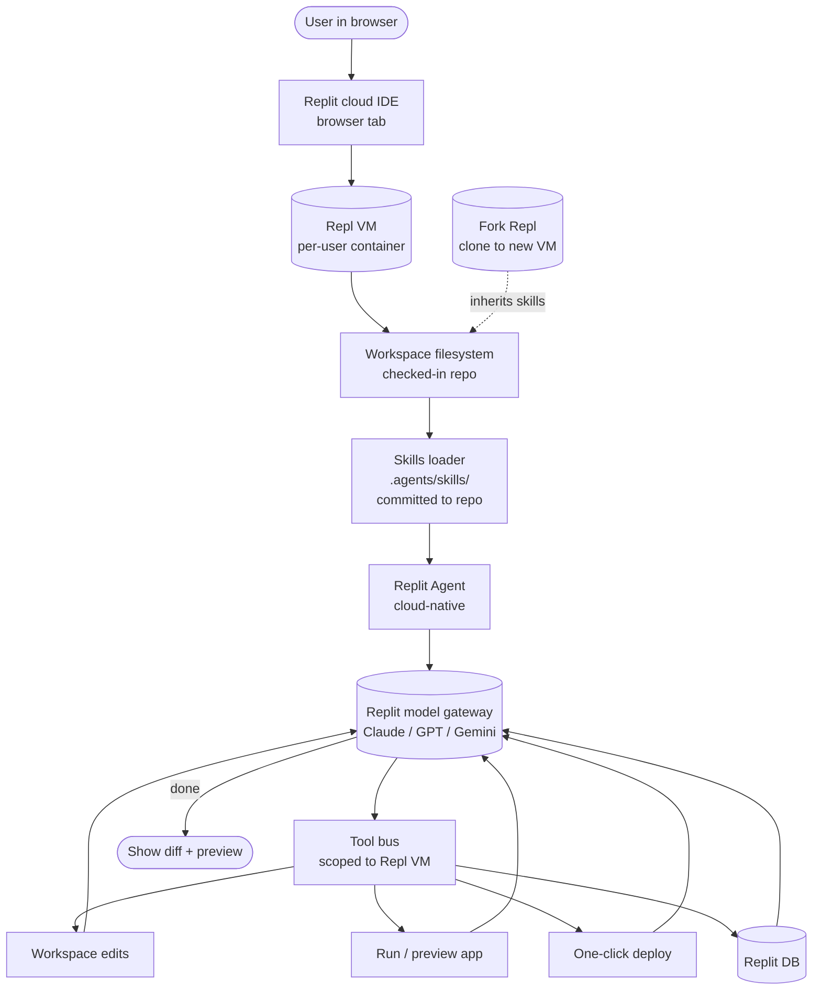

# Replit

> **Slug**: `replit` · **Surface**: Cloud IDE · **Vendor**: Replit · **License**: Proprietary

Replit's cloud development environment with the Replit Agent.

## Overview

Replit is a cloud IDE with built-in AI ("Replit Agent") that can spin up applications, deploy them, and iterate on them in the browser. Skills support means team conventions can ride along into the cloud sandbox.

## Skills support

| Item | Value |
| --- | --- |
| Project path | `.agents/skills/` (shared bucket) |
| Global path | `~/.config/agents/skills/` (XDG, shared) |
| `--agent` slug | `replit` |
| `allowed-tools` | Yes |
| `context: fork` | No |
| Hooks | No |

## Installation

```bash
npx skills add vercel-labs/agent-skills -a replit
```

For Replit specifically, the skills end up inside the Repl's filesystem, so they ship with the project clone.

## Notable behavior

- Replit Agent is a cloud-native agent, but skills install via the same CLI flow as a local agent.
- Because Replit reads from `.agents/skills/`, any skill committed to your repo is automatically picked up by Repl-cloned environments.
- Replit's documentation focuses on skills as project-level conventions; global skills are less relevant in the cloud-IDE model.

## Internals & Architecture

Replit's agent runs **inside the cloud Repl** — the same VM that hosts your code, the deployed app, and the database. Skills committed to the repo become part of the Repl filesystem and load automatically when the agent starts. There's no real "global" skills story because the workstation isn't yours: each Repl is its own ephemeral environment, and every install is implicitly project-scoped.



The architectural detail that matters is **fork-as-distribution**: when another user forks your Repl, your skills come with the workspace. That makes Replit the most natural place in the dataset to *publish a working environment* — instructions plus runtime plus app — as a single artifact. The cost is that "global skills" don't really apply: there's no persistent home directory across sessions, just whatever you commit to the repo.

## Harness Deep Dive

### Agent loop

- **Shape**: ReAct, cloud-native — agent runs **inside the cloud Repl** alongside the deployed app.
- **Tool-call style**: Native function calling on the Replit model gateway.
- **Halting**: Standard.
- **Streaming**: Token + tool-call event streaming into the browser IDE.

### Context & memory

- **Context strategy**: Workspace filesystem = Repl VM filesystem. Skills committed to repo come with every fork.
- **Persistent files**: `.agents/skills/` (shared bucket). No real "global" path because the workstation isn't yours; **`~/.config/agents/skills/`** is XDG-shared but matters less for a cloud IDE.
- **Compaction**: Standard.
- **Sub-context**: Forking a Repl is the sub-context primitive — clone to a new VM with its own state.
- **Cross-session memory**: Whatever's committed to the repo (which travels via fork).

### Tool runtime

- **Built-ins**: Workspace edits, **run-app / preview**, **one-click deploy**, Replit DB.
- **Parallelism**: One agent per Repl by default; multiple Repls in parallel.
- **Approval / safety**: Configurable; cloud VM is the safety boundary.
- **Sandbox**: **Per-Repl VM** — full container isolation, no host blast radius.
- **MCP**: Supported.

### Model integration

- **Provider model**: Replit model gateway (Claude / GPT / Gemini).
- **Caching**: Gateway-managed.
- **Multi-model**: Pick per Repl.

### Innovation summary

**Fork-as-distribution — the agent ships with the workspace.** Replit is the dataset's most natural place to *publish a working environment* (instructions + runtime + app + agent) as a single artifact. Per-Repl VMs make destructive actions tolerable; forking another user's Repl inherits their skills automatically.

## Documentation

- [Replit Skills](https://docs.replit.com/replitai/skills)
- [Replit Agent overview](https://replit.com/site/agent)
