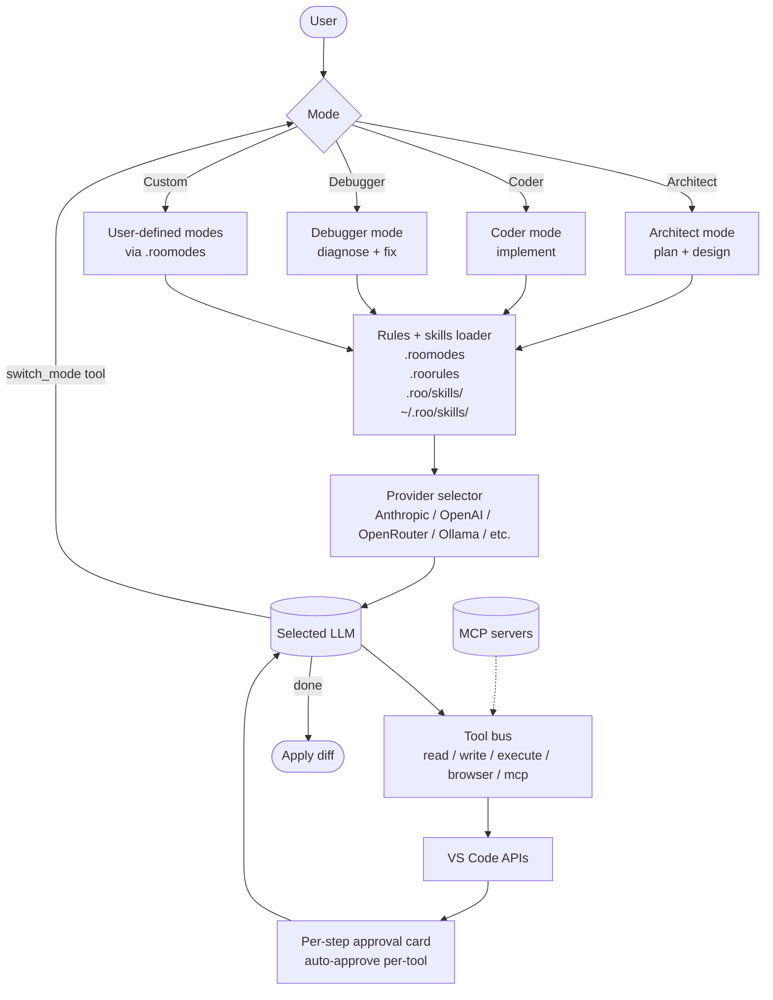

# Roo Code

> **Slug**: `roo` · **Surface**: VS Code extension · **Vendor**: Roo Code (community fork of Cline) · **License**: Apache 2.0

A community fork of Cline with extended modes and additional features.

## Overview

Roo Code (formerly "Roo Cline") forked Cline early in its development to add custom modes, more aggressive UI features, and a more configurable rules system. Today the two have diverged enough to be distinct products, though they share a common ancestor.

## Skills support

| Item | Value |
| --- | --- |
| Project path | `.roo/skills/` |
| Global path | `~/.roo/skills/` |
| `--agent` slug | `roo` |
| `allowed-tools` | Yes |
| `context: fork` | No |
| Hooks | No (unlike Cline, Roo does not currently expose hooks) |

Note: Roo's path is namespaced (`.roo/`), unlike Cline which uses the shared `.agents/` bucket.

## Installation

```bash
npx skills add vercel-labs/agent-skills -a roo
```

## Notable behavior

- Custom modes: define your own agent personas (`Architect`, `Debugger`, etc.) and skills can hint at which mode they expect.
- `.roomodes` and `.roorules` files are Roo's native rules surface.
- Multi-provider support, including local models.
- Active community with frequent releases.

## Internals & Architecture

Roo Code shares Cline's bones but evolves them in three directions: explicit **custom modes** (Architect, Debugger, custom user-defined), a **`.roomodes` / `.roorules`** rule layer that's tighter than Cline's, and aggressive UI surfacing of every step. There are no hooks (Cline's headline feature is dropped here) but mode dispatch fills the same role: a skill can hint at which mode it wants to run in, and Roo will switch.



The architecturally-interesting bit is that **mode is itself a tool**: the agent can call `switch_mode` to change persona mid-task, which lets a single skill orchestrate "plan with Architect, then hand off to Coder, then verify with Debugger" without the user having to manually flip switches.

## Harness Deep Dive

### Agent loop

- **Shape**: **Mode machine** with `switch_mode` as a callable tool — Architect / Coder / Debugger / Custom (via `.roomodes`).
- **Tool-call style**: Native function calling for modern providers; Cline-era XML/JSON parsers as fallback.
- **Halting**: Standard end-turn; per-action approval also halts.
- **Streaming**: Token + per-action approval card surfacing.

### Context & memory

- **Context strategy**: `.roorules` + `.roomodes` + skills feed every mode; the active mode adds its own system-prompt overlay.
- **Persistent files**: `.roorules`, `.roomodes`, `.roo/skills/`, `~/.roo/skills/`.
- **Compaction**: Standard summarization; per-action approval keeps loops short.
- **Sub-context**: Mode switch keeps the same context but changes the persona — closest thing to a fork without forking.
- **Cross-session memory**: Rules + modes + skill files.

### Tool runtime

- **Built-ins**: Read / write / execute / browser / MCP — Cline-derived tool set.
- **Parallelism**: Sequential.
- **Approval / safety**: Per-step approval card; auto-approve per-tool category.
- **Sandbox**: None — runs in the VS Code extension host.
- **MCP**: Mature, inherited from the Cline lineage.
- **Hooks**: No (this is the headline feature dropped relative to Cline).

### Model integration

- **Provider model**: BYOK across many providers, including local (Ollama, LM Studio).
- **Caching**: Provider-level.
- **Multi-model**: Per-conversation selection.

### Innovation summary

**Mode-as-tool — `switch_mode` lets the agent flip personas mid-task.** Roo Code is the cleanest implementation of "the same skill orchestrates Architect → Coder → Debugger handoffs without manual user intervention." The trade-off vs. Cline is that hooks are gone in favor of mode primitives.

## Documentation

- [Roo Code Skills](https://docs.roocode.com/features/skills)
- [Roo Code GitHub](https://github.com/RooVetGit/Roo-Code)
