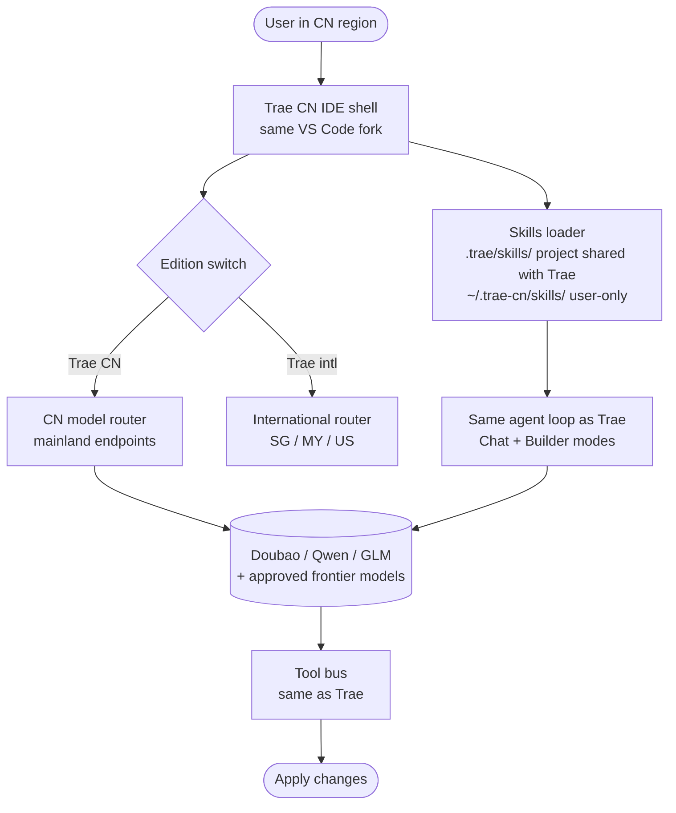

# Trae CN

> **Slug**: `trae-cn` · **Surface**: Native AI IDE · **Vendor**: ByteDance (CN edition) · **License**: Proprietary

The mainland-China edition of Trae, with a separate global path to keep installations isolated.

## Overview

Trae CN is the version of Trae optimised for the China market. Same codebase, different default models and infrastructure region. The CLI exposes it as a separate slug so users with both editions installed don't accidentally cross-pollute their global skill folder.

## Skills support

| Item | Value |
| --- | --- |
| Project path | `.trae/skills/` (shared with Trae) |
| Global path | `~/.trae-cn/skills/` |
| `--agent` slug | `trae-cn` |
| `allowed-tools` | Yes (assumed) |
| `context: fork` | No |
| Hooks | No |

The interesting bit: the **project path is shared** with Trae (`.trae/skills/`) — so a single committed skills folder serves both editions on the same checkout — while the **global path differs** so each edition's user-level skills stay separate.

## Installation

```bash
npx skills add vercel-labs/agent-skills -a trae-cn
```

## Notable behavior

- Same agent runtime as Trae; differences are mostly model selection and regional infrastructure.
- The CLI auto-detects which edition you have installed.
- If you have both Trae and Trae CN, you generally want to install skills with `-a trae -a trae-cn` to cover both.

## Internals & Architecture

Trae CN reuses the international Trae binary verbatim but flips two configuration switches at startup: (1) the model router defaults to ByteDance's mainland endpoints (Doubao family, Qwen, etc.) and (2) the global skills directory becomes `~/.trae-cn/skills/` to keep the user-level state pool isolated from the international edition. The runtime, agent loop, Builder mode, and project skills layout are otherwise identical to Trae.



The sharing of the project path with Trae is the smart design choice: a team's committed skills work for both the international and CN editions on the same checkout, so cross-region collaboration doesn't require duplicate skill folders.

## Harness Deep Dive

### Agent loop

- **Shape**: Same as Trae — Chat / Builder Agent.
- **Tool-call style**: Same as Trae.
- **Halting**: Same as Trae.
- **Streaming**: Same as Trae.

### Context & memory

- **Context strategy**: Same agent loop, **CN-routed model context**.
- **Persistent files**: `.trae/skills/` (project, **shared with Trae**), `~/.trae-cn/skills/` (user, **isolated** from Trae intl).
- **Compaction**: Same as Trae.
- **Sub-context**: None first-party.
- **Cross-session memory**: Skills + IDE state, with the user-level pool isolated.

### Tool runtime

- **Built-ins**: Same as Trae.
- **Parallelism**: Same as Trae.
- **Approval / safety**: Same as Trae.
- **Sandbox**: Same as Trae.
- **MCP**: Supported.

### Model integration

- **Provider model**: **CN model router** — Doubao, Qwen, GLM, plus approved frontier models routed to mainland endpoints.
- **Caching**: Provider-level.
- **Multi-model**: Per-conversation within the CN catalog.

### Innovation summary

**Same binary, mainland endpoints, isolated user-state pool.** Trae CN is the dataset's clearest example of "two regional editions of one product that share project state but isolate user state." A single committed `.trae/skills/` folder works for both editions; `~/.trae-cn/skills/` keeps personal preferences out of the international edition's pool.

## Documentation

- [Trae IDE docs](https://docs.trae.ai/) (covers both editions)
