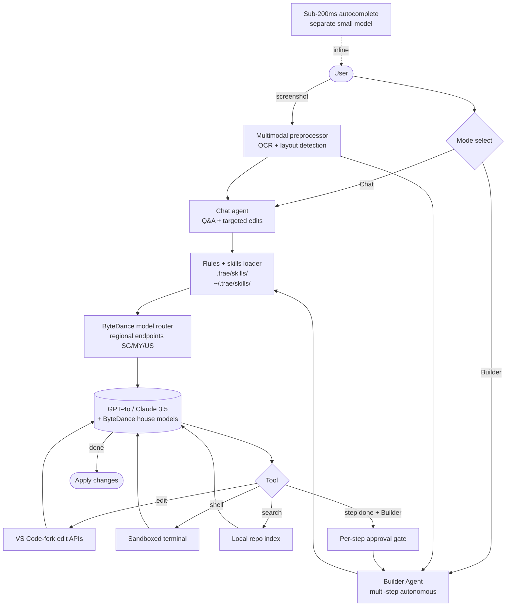

# Trae

> **Slug**: `trae` · **Surface**: Native AI IDE · **Vendor**: ByteDance · **License**: Proprietary (free tier)

ByteDance's AI-powered IDE, often described as a free competitor to Cursor and Windsurf.

## Overview

Trae launched in January 2025 as ByteDance's entrant into the AI IDE space. Built on the VS Code framework with a hybrid VSCode/Fleet UI aesthetic, it offers unlimited free access to GPT-4o and Claude 3.5 Sonnet (which significantly accelerated its adoption — 1.6M MAU by end of 2025).

## Skills support

| Item | Value |
| --- | --- |
| Project path | `.trae/skills/` (shared with Trae CN) |
| Global path | `~/.trae/skills/` |
| `--agent` slug | `trae` |
| `allowed-tools` | Yes (assumed) |
| `context: fork` | No |
| Hooks | No |

## Installation

```bash
npx skills add vercel-labs/agent-skills -a trae
```

## Notable behavior

- **Builder Agent mode**: autonomous multi-file planning + execution + terminal commands, with per-step approval.
- Sub-200ms autocomplete latency on Apple Silicon.
- Multimodal: can read screenshots and generate code from them.
- Initially Mac-only, Windows version added February 2025; no Linux yet.
- VSCode plugin compatibility for migration from VS Code.
- Privacy: regional data isolation in Singapore, Malaysia, and the US (a partial answer to ByteDance-related concerns).

## Internals & Architecture

Trae is a VS Code-derived IDE with a custom Fleet-inspired UI shell. The agent runs in two distinct modes — **Chat** (Q&A + small edits) and **Builder Agent** (multi-step autonomous work) — both routing to ByteDance-managed model endpoints. The interesting architectural piece is its multimodal pipeline: a screenshot dropped into chat is OCR'd and shape-detected before being sent to the model, which is why Trae produces unusually-good UI implementation from designs.



Two choices set Trae apart from Cursor and Windsurf: (1) the **per-step approval gate in Builder mode** is on by default, which makes the agent feel slower but safer on long autonomous runs; (2) the **regional routing** layer means a single skill folder works whether the user's traffic terminates in Singapore, Malaysia, or the US — Trae CN reuses the same project path but a different global path because the regional model pools differ.

## Harness Deep Dive

### Agent loop

- **Shape**: **Mode machine** — Chat (Q&A + small edits) vs **Builder Agent** (multi-step autonomous). Builder uses a per-step approval card.
- **Tool-call style**: Native function calling on routed models.
- **Halting**: Standard end-turn; Builder halts at each per-step approval.
- **Streaming**: Token + per-step approval card.

### Context & memory

- **Context strategy**: Code + skills + **multimodal screenshot pipeline** (OCR + layout detection before model call) — unique in the dataset for first-class screenshot input.
- **Persistent files**: `.trae/skills/` (shared with Trae CN), `~/.trae/skills/`.
- **Compaction**: Standard.
- **Sub-context**: None first-party.
- **Cross-session memory**: Skills + IDE state.

### Tool runtime

- **Built-ins**: VS-Code-fork edit APIs, sandboxed terminal, local repo index, separate sub-200ms autocomplete model.
- **Parallelism**: Sequential per Builder step.
- **Approval / safety**: **Per-step approval gate in Builder mode is on by default** — slower but safer on long autonomous runs.
- **Sandbox**: None first-party for the editor; terminal is sandboxed.
- **MCP**: Supported.

### Model integration

- **Provider model**: **ByteDance regional routing** (SG / MY / US) — GPT-4o, Claude 3.5 Sonnet, plus ByteDance house models. Free tier with unlimited access drove rapid adoption.
- **Caching**: Provider-level.
- **Multi-model**: Per-conversation.

### Innovation summary

**Multimodal screenshot pipeline + Builder mode with per-step approval + regional routing.** Trae is the dataset's clearest "screenshot to UI implementation" pipeline (OCR + layout detection upstream of the model call). Builder mode's per-step approval is more conservative than Cursor's auto-execute. Regional routing makes the same project skill folder work across SG / MY / US (and CN via the Trae CN edition).

## Documentation

- [Trae Skills](https://docs.trae.ai/ide/skills)
- [Trae IDE](https://traeide.com/)
