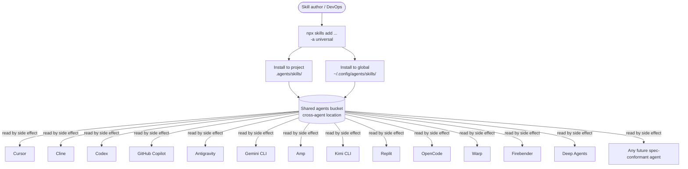

# Universal

> **Slug**: `universal` · **Surface**: any · **Vendor**: (generic) · **License**: n/a

A generic catch-all slug for any tool that reads `.agents/skills/` without identifying itself as a specific agent.

## Overview

`universal` isn't a product — it's a convention. The CLI uses this slug when you want to install skills into the shared `.agents/skills/` bucket without targeting any specific agent. Useful when:

- You're authoring an agent that conforms to the spec but isn't yet in the supported list.
- You want a guaranteed install location that any spec-conformant tool will pick up via recursive fallback discovery.
- You're committing skills to a repo for tooling that doesn't have a dedicated slug.

## Skills support

| Item | Value |
| --- | --- |
| Project path | `.agents/skills/` |
| Global path | `~/.config/agents/skills/` (XDG, shared with Amp / Kimi CLI / Replit) |
| `--agent` slug | `universal` |
| `allowed-tools` | n/a (depends on host agent) |
| `context: fork` | n/a |
| Hooks | n/a |

## Installation

```bash
npx skills add vercel-labs/agent-skills -a universal
```

## Notable behavior

- Always available as a target. The CLI never auto-detects "Universal" since it isn't an actual agent — you must pass `-a universal` explicitly.
- Hosts that read `.agents/skills/` directly (Cursor, Cline, Codex, etc.) will pick these up by side effect.
- This is the right slug to pick when scripting an environment provisioner that should drop skills "somewhere usable" without per-agent logic.

## Internals & Architecture

Universal isn't a runtime — it's a **convention**. The slug exists so the `npx skills` CLI has a target for "drop the skill in the agnostic bucket and trust that any spec-conformant agent will find it." There's no agent process, no model call, no tool bus; just a guaranteed install location that 14+ other agents already read by side effect.



Universal exists because **the spec is more durable than any one runtime**. By installing for `universal`, you're betting on the file format and discovery convention — not on a specific agent being installed today. That's the right bet when you're shipping skills as part of a dev-environment provisioning script (devcontainer, Brewfile, Ansible playbook) and don't want to enumerate every agent the dev might use.

## Harness Deep Dive

### Agent loop

- **N/A** — Universal isn't a runtime. It's a file-layout convention. There's no agent loop, no model call, no tool bus. Whatever runtime ends up reading the bucket runs its own loop.

### Context & memory

- **Context strategy**: Whatever the host agent does — Universal just guarantees the install location.
- **Persistent files**: `.agents/skills/` (project) and `~/.config/agents/skills/` (XDG, **shared with Amp / Kimi CLI / Replit**).
- **Compaction**: N/A.
- **Sub-context**: N/A.
- **Cross-session memory**: The skill files themselves; portability across runtimes is the win.

### Tool runtime

- **N/A** — Universal does not run tools. The host agent's tool runtime applies.

### Model integration

- **N/A** — no model is invoked.

### Innovation summary

**The convention itself — installation target, not a runtime.** Universal is the dataset's clearest bet that the spec is more durable than any one harness. Install for `universal` when you're provisioning a dev environment (devcontainer, Brewfile, Ansible) and don't want to enumerate every agent a future dev might use — any spec-conformant agent will pick the skill up by side effect.
