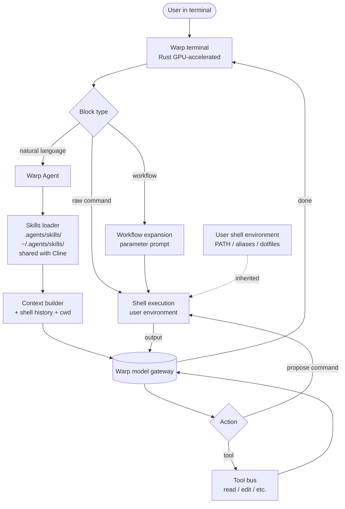

# Warp

> **Slug**: `warp` · **Surface**: Terminal · **Vendor**: Warp · **License**: Proprietary

A modern terminal app with a built-in coding agent.

## Overview

Warp is a Rust-based terminal app that re-imagined the terminal UX (block-based output, AI-native commands, IDE-style features). The Warp Agent is the agentic layer — it can plan, run commands, edit files, and now load skills.

## Skills support

| Item | Value |
| --- | --- |
| Project path | `.agents/skills/` (shared bucket) |
| Global path | `~/.agents/skills/` (shared with Cline) |
| `--agent` slug | `warp` |
| `allowed-tools` | Yes (assumed; not explicitly documented in the matrix) |
| `context: fork` | No |
| Hooks | No |

Warp shares its global path with Cline — `~/.agents/skills/` — so a skill installed globally for either is available to both.

## Installation

```bash
npx skills add vercel-labs/agent-skills -a warp
```

## Notable behavior

- Warp is the only "terminal as the surface" entry in the matrix. Skills live alongside Warp's own Workflows feature.
- The agent inherits your shell environment, so skills can rely on installed CLIs.
- Sharing `~/.agents/skills/` with Cline means a single global install reaches both — handy if you use Cline inside VS Code while doing terminal work in Warp.

## Internals & Architecture

Warp is a Rust-based GPU-accelerated terminal emulator with the agent baked into the shell experience itself — there's no separate "agent panel," because every command block is potentially an agent prompt. The agent inherits the user's full shell environment (PATH, aliases, dotfiles), so skills can confidently invoke any CLI the user already has installed. Skills coexist with Warp's pre-existing Workflows feature (parameterized command templates).



The architectural insight unique to Warp: **the agent's tool surface is your shell**. There's no need for a "shell tool" abstraction — the agent literally runs commands in your terminal, with your aliases and PATH, and reads the output directly. That's both powerful (everything you can do, the agent can do) and risky (no sandboxing). The shared `~/.agents/skills/` with Cline means a single global install covers both your IDE-side and terminal-side agentic work.

## Harness Deep Dive

### Agent loop

- **Shape**: ReAct embedded in the terminal — every command block is potentially an agent prompt; there's no separate chat panel.
- **Tool-call style**: Native function calling on Warp's gateway-routed model.
- **Halting**: Standard end-turn; user can interrupt at any block.
- **Streaming**: Tokens stream into the terminal block UI.

### Context & memory

- **Context strategy**: Shell history, current working directory, recent command output, and skills feed the model. Workflow templates (Warp's pre-existing feature) coexist with skills.
- **Persistent files**: `.agents/skills/` (project) and `~/.agents/skills/` (global, **shared with Cline**).
- **Compaction**: Standard summarization.
- **Sub-context**: None first-party.
- **Cross-session memory**: Skill files + Warp's history.

### Tool runtime

- **Built-ins**: Read / edit / etc., plus the **shell itself** as the dominant "tool" — the agent's primary action is to propose commands the user can execute.
- **Parallelism**: Sequential.
- **Approval / safety**: Commands surface as proposed blocks the user can run / edit / reject.
- **Sandbox**: None — runs in your terminal with your environment.
- **MCP**: Supported.

### Model integration

- **Provider model**: Warp model gateway (vendor-routed).
- **Caching**: Gateway-managed.
- **Multi-model**: Pick model in Warp settings.

### Innovation summary

**The agent's tool surface is your shell.** No abstraction layer between "the model proposed a command" and "your shell ran it with your environment." The shared `~/.agents/skills/` path with Cline turns a single global install into a cross-surface agent kit (IDE + terminal).

## Documentation

- [Warp homepage](https://www.warp.dev/)
- [Warp Agent docs](https://docs.warp.dev/agents/)
