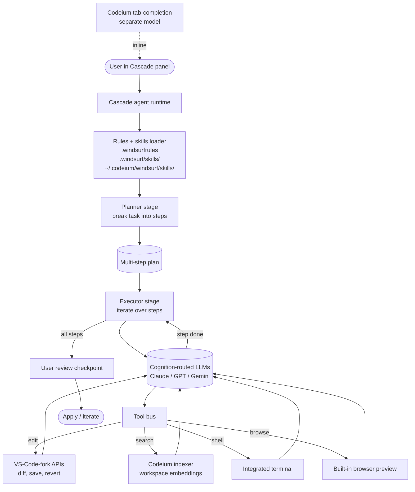

# Windsurf

> **Slug**: `windsurf` · **Surface**: Native AI IDE · **Vendor**: Cognition (originally Codeium) · **License**: Proprietary

The IDE formerly known as Codeium's Windsurf, now under Cognition. A VS Code fork with the Cascade agent.

## Overview

Windsurf is a fork of VS Code with deep AI integration via the Cascade agent. It was originally Codeium's flagship; after Codeium was acquired by (and became part of) Cognition, the product retained the Windsurf name. The skills global path still reflects its origins: `~/.codeium/windsurf/skills/`.

## Skills support

| Item | Value |
| --- | --- |
| Project path | `.windsurf/skills/` |
| Global path | `~/.codeium/windsurf/skills/` |
| `--agent` slug | `windsurf` |
| `allowed-tools` | Yes (assumed) |
| `context: fork` | No |
| Hooks | No |

The vendor-nested global path is a historical artifact — Codeium used `~/.codeium/` as the parent for all its tooling, and Windsurf inherited that.

## Installation

```bash
npx skills add vercel-labs/agent-skills -a windsurf
```

## Notable behavior

- Cascade is the agent name; skills feed Cascade's instruction context.
- Windsurf supports its own rules system (`.windsurfrules`) which coexists with skills.
- Cognition (the parent company) also makes Devin — the two are separate products.
- Strong fit with multi-step refactors thanks to Cascade's planning surface.

## Internals & Architecture

Windsurf's headline feature is **Cascade**, a planning agent that operates in the side panel of the VS Code fork. The architecture differs from Cursor in one important respect: Cascade is biased toward *planning first, then executing the whole plan*, rather than reacting tool-call by tool-call. Skills feed Cascade's instruction context alongside `.windsurfrules`, with the IDE shell handling diff application and a Codeium-era code-completion engine running tab-completion separately.



The plan-then-execute split is the architectural signature: Cascade tries to fit a whole multi-file change into one plan, ask for approval, then run the plan with tools — so skills tend to read more like *standards* than like *recipes*. The legacy `~/.codeium/windsurf/skills/` global path is the only Codeium-era surface still visible in 2026's Cognition product.

## Harness Deep Dive

### Agent loop

- **Shape**: **Plan-then-execute** (Cascade) — bias is toward producing a multi-step plan, then running it. Less "step-by-step ReAct," more "plan once, execute through."
- **Tool-call style**: Native function calling on the Cognition gateway-routed model.
- **Halting**: All-steps-complete → user review checkpoint → apply.
- **Streaming**: Plan streams first, then per-step token + diff streaming.

### Context & memory

- **Context strategy**: `.windsurfrules` + skills + Codeium-era workspace embeddings. The planner stage uses these to scope the plan; the executor stage uses them to drive each step.
- **Persistent files**: `.windsurfrules`, `.windsurf/skills/`, `~/.codeium/windsurf/skills/` (legacy).
- **Compaction**: Long sessions compact older plan/execution traces.
- **Sub-context**: No `context: fork`. The plan itself is the sub-context boundary — each step is small enough not to blow the window.
- **Cross-session memory**: Rules + skills + workspace embeddings index.

### Tool runtime

- **Built-ins**: VS-Code-fork APIs (diff, save, revert), Codeium indexer, integrated terminal, **built-in browser preview** (rare in the dataset).
- **Parallelism**: Sequential per-step within a plan.
- **Approval / safety**: Plan approval before execution; per-step diffs after. Auto-execute is configurable.
- **Sandbox**: None — runs in the IDE process.
- **MCP**: Supported.

### Model integration

- **Provider model**: **Cognition gateway** — vendor-routed across major providers.
- **Caching**: Provider-level where supported.
- **Multi-model**: Per-conversation selection.

### Innovation summary

**Plan-then-execute as the default loop shape, with workspace embeddings + a built-in browser.** Cascade's planner makes Windsurf good at multi-file changes that wander when ReAct'd one tool at a time. Windsurf is also one of the few IDE agents to ship a browser preview as a first-class tool surface.

## Documentation

- [Windsurf homepage](https://windsurf.com/)
- [Windsurf docs](https://docs.windsurf.com/)
