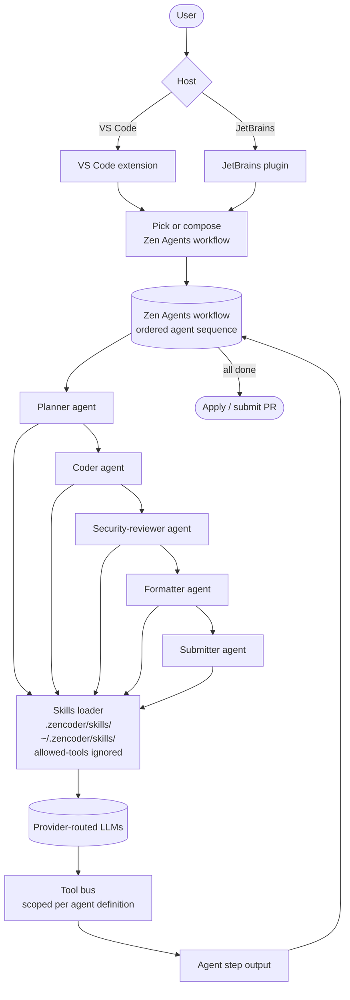

# Zencoder

> **Slug**: `zencoder` · **Surface**: IDE extensions (VS Code, JetBrains) · **Vendor**: Zencoder · **License**: Proprietary

A multi-IDE AI coding agent with a "Zen Agents" framework for orchestrating multiple specialized agents.

## Overview

Zencoder is a Series-A startup focused on agentic AI for the enterprise. The product runs as an extension inside VS Code and JetBrains IDEs. Its differentiator is the Zen Agents framework — a way to compose multiple specialized agents (planner, coder, reviewer, etc.) into a workflow.

## Skills support

| Item | Value |
| --- | --- |
| Project path | `.zencoder/skills/` |
| Global path | `~/.zencoder/skills/` |
| `--agent` slug | `zencoder` |
| `allowed-tools` | **No** (one of two agents that don't enforce it; the other is Kiro CLI) |
| `context: fork` | No |
| Hooks | No |

Zencoder is one of two agents that doesn't enforce `allowed-tools`. Skills with `allowed-tools` set will still install and work, but the field is ignored.

## Installation

```bash
npx skills add vercel-labs/agent-skills -a zencoder
```

## Notable behavior

- The Zen Agents framework lets you compose specialized agents into a multi-step workflow.
- Strong fit for enterprise teams that want to enforce a multi-step review gate (e.g., generate → security-check → format → submit).
- IDE-side, the Zencoder panel lets you switch agents per task.

## Internals & Architecture

Zencoder's headline architecture is **Zen Agents** — a composable workflow system where each step is a specialized agent (planner, coder, security-reviewer, formatter, submitter). Skills feed each agent's instruction context. Unlike most harnesses, Zencoder doesn't enforce `allowed-tools` from the skill; tool restrictions live in the agent definition rather than per-skill.



The interesting consequence: because every step is its own agent with its own tool scope, **the workflow itself enforces what `allowed-tools` would** — the security-reviewer agent simply doesn't have file-write tools, so a malicious skill running there can't mutate the workspace. That's why Zencoder feels safe to drop `allowed-tools` enforcement: the gate is at the workflow level, not the skill level.

## Harness Deep Dive

### Agent loop

- **Shape**: **Zen Agents workflow** — ordered chain of specialized agents (planner → coder → security-reviewer → formatter → submitter). Each step is a separate agent with its own tool scope.
- **Tool-call style**: Native function calling per agent.
- **Halting**: Workflow ends when the chain completes; per-agent halts at each handoff.
- **Streaming**: Per-agent step streaming; workflow progress visible.

### Context & memory

- **Context strategy**: Per-agent context — each step has its own scope and instruction set. Skills feed every agent's instruction context.
- **Persistent files**: `.zencoder/skills/`, `~/.zencoder/skills/`.
- **Compaction**: Per-agent.
- **Sub-context**: The workflow itself is sub-context — each agent is independent.
- **Cross-session memory**: Skill files + workflow definitions.

### Tool runtime

- **Built-ins**: Standard fs/shell, but **scoped per agent definition** — security-reviewer doesn't have file-write, formatter doesn't have shell, etc.
- **Parallelism**: Sequential within a workflow; multiple workflows in parallel.
- **Approval / safety**: **Tool scope per agent is the safety story** — `allowed-tools` is intentionally not enforced because the workflow-level gate is stricter.
- **Sandbox**: None first-party.
- **MCP**: Supported.
- **`allowed-tools`**: **Not respected** (one of two agents alongside Kiro that ignore it).

### Model integration

- **Provider model**: Provider-routed; per-agent model selection possible.
- **Caching**: Provider-level.
- **Multi-model**: Per-agent (a planner can be Claude, a coder Gemini, a reviewer GPT-5).

### Innovation summary

**Zen Agents workflow — ordered chain of specialized agents with per-agent tool scope.** Zencoder is the dataset's strongest "compose specialized agents into a workflow" pattern. The per-agent tool scope makes `allowed-tools` redundant — a security-reviewer agent literally doesn't have file-write tools, so a misbehaving skill there can't mutate the workspace. Strong fit for enterprise teams that want a multi-step review gate.

## Documentation

- [Zencoder homepage](https://zencoder.ai/)
- [Zencoder docs](https://docs.zencoder.ai/)
