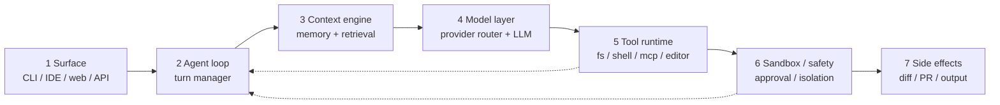
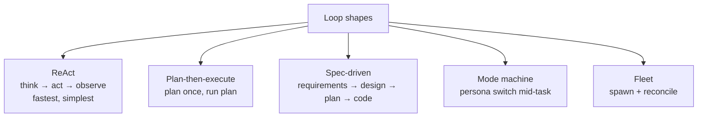
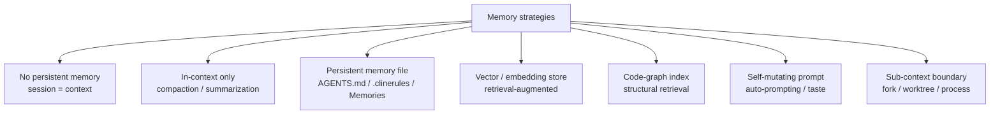
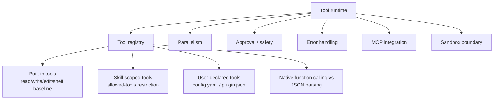
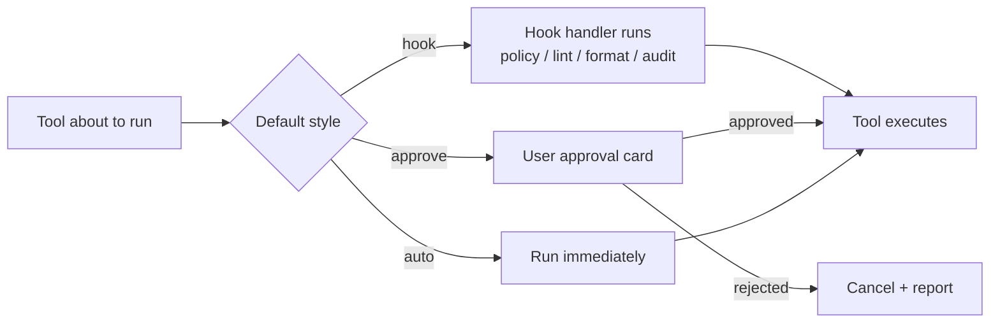
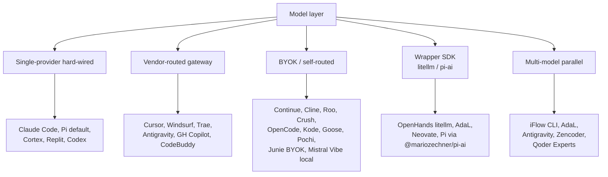
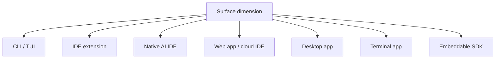
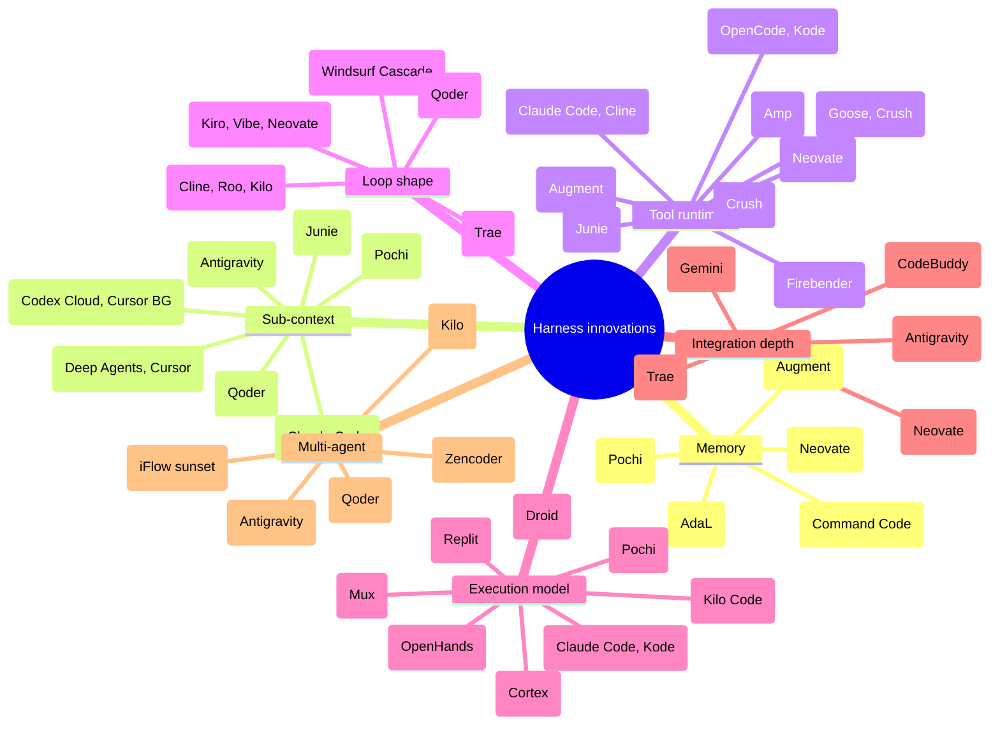

# The Harness Deep Dive — How These 45 Agents Actually Work

This page steps past the *skills* surface and looks at the **harness** underneath: the agent loop, the context/memory subsystem, the tool runtime, the model integration, and the innovations each vendor brought to the table.

Skills are the *file format these harnesses agree on*. The harness is everything else — and that's where the real engineering lives.

> If you're new here: start with [`internals-overview.md`](./internals-overview.md) for the high-level architectural patterns, then come back here for depth. Per-agent harness details live in each agent's own page (`docs/agents/<agent>.md` → "Harness Deep Dive" section).

---

## What is a "harness", exactly?

A coding-agent harness is the runtime that wraps a frontier LLM and turns it into something that can edit a repo. Every harness in this dataset, regardless of surface (CLI, IDE extension, native IDE, cloud), is some composition of these subsystems:

The seven boxes are universal. **Where the agents diverge is which box owns which responsibility, how rich each box is, and what novel primitive they put inside one of them.**

The rest of this page walks each box.

---

## 1. The agent loop — what actually happens between "user pressed enter" and "diff applied"

Every harness ultimately runs a `while not done: think → maybe call tool → observe` loop. But the loop has at least four meaningfully-different *shapes*:

### Shape A — ReAct (think-act-observe)

The default. The model emits either a tool call or a final answer; if a tool call, the harness runs it and feeds the output back; repeat. No explicit plan; the plan is whatever the model is "thinking" each turn.

| Examples | Flavor |
| --- | --- |
| Claude Code, Codex (local), Gemini CLI, Crush, OpenCode, Qwen Code, Kimi CLI, Cortex Code, Pi, Kode, Mux, Droid, Cortex Code, Warp, Continue (default), GitHub Copilot Chat, Cline (Act mode) | Pure ReAct |

**Loop discipline**: most ReAct loops cap at some number of turns (commonly 30–100) or some token budget; if hit, the agent returns a "I tried but here's what I got" summary. A few harnesses (Mux with `--budget`, Codex Cloud per-task quotas) cap at *dollars* spent rather than turns.

**Tool-call style** matters here: agents on a model that supports native function calling (Gemini, GPT, Claude) emit structured tool calls; older / open-weight model integrations sometimes have to parse XML or fenced JSON out of plain text, which is more fragile (Cline, Roo, and OpenHands all carry historical fallback parsers for this).

### Shape B — Plan-then-execute (plan once, then iterate the plan)

The agent first emits an explicit, ordered plan (a list of steps), the user (optionally) approves, and the executor walks the steps with smaller per-step ReAct loops. The plan is a first-class object — the user can usually edit it.

| Examples | Plan primitive |
| --- | --- |
| Mistral Vibe (`scan → plan → execute`) | Plan is a structured list, gated by approval |
| Windsurf (Cascade) | Plan biased; auto-executes after surfacing it |
| Junie (Planning Mode) | Plan + Live Prompting (mid-task plan revisions) |
| Kiro CLI (Spec-driven) | Plan after EARS requirements + design |
| Neovate (`brainstorm → plan → execute`) | `todo` is a built-in tool the model uses |
| Trae Builder Agent | Plan with per-step approval card |
| Deep Agents | `write_todos` is a graph node, plan is editable state |
| Replit Agent | App-scaffold plan |

**Why plan-first?** Two reasons. (1) Long autonomous runs reviewable up-front rather than after the fact. (2) Token efficiency: the plan compresses a lot of intent into a small structure that the executor can re-read each step.

### Shape C — Spec-driven (plan-first, but also requirements-first)

Spec-driven harnesses go a level above plan-then-execute: before there's even a plan, there's a *requirements* artifact (sometimes EARS notation, sometimes free-form), then an *architectural design*, then an *implementation plan*, then code. Each step is reviewable.

| Examples | Spec layers |
| --- | --- |
| Kiro CLI | EARS requirements → design → plan → code |
| Mistral Vibe | Scan inventory → plan → execute |
| Neovate | Brainstorm → plan → execute |

Spec-driven flows feel slow and over-engineered for a 5-minute fix, but produce cleaner outputs on green-field work where the model can otherwise wander.

### Shape D — Mode machine (persona switch mid-task)

The agent has explicit personas (Architect, Coder, Debugger, Reviewer, …) and either the user or a `switch_mode` tool flips between them. Each mode has its own system prompt, its own toolset, sometimes its own model.

| Examples | Modes |
| --- | --- |
| Cline | Plan / Act |
| Roo Code | Architect / Coder / Debugger / Custom (via `switch_mode` tool) |
| Kilo Code | Architect / Coder / Debugger / Custom (Agent Manager runs them in parallel) |
| Qoder | NEXT / Agentic Chat / Autonomous / Quest / Experts |
| Junie | Direct / Planning + Custom Subagents |
| OpenClaw | Per-persona allowlists in `agents.list[]` |

Mode machines partially overlap with subagents (the next shape), but the key distinction is **the same context survives a mode switch** — the persona changes, the conversation doesn't.

### Shape E — Fleet (spawn + reconcile)

Multiple agents run in parallel, each with its own scope, sometimes its own model. The orchestrator merges or surfaces their results. This is the newest shape in the dataset and the one with the most architectural variance.

| Examples | Fleet primitive |
| --- | --- |
| Antigravity | Mission Control dispatches per-scope (editor / terminal / browser) |
| Qoder | Experts Mode (architect / implementer / reviewer in parallel) |
| Pochi | Parallel Agents via real `git worktree` |
| Kilo Code | Agent Manager (session tabs in parallel) |
| Zencoder | Zen Agents workflow (ordered chain of specialized agents) |
| iFlow CLI (sunset) | Multi-model task decomposition |
| Codex Cloud | Fan-out workers per task |

**Reconciliation is the hard part.** Most harnesses currently hand reconciliation back to the user (Pochi shows you the worktree to merge; Antigravity surfaces task-level verification results; Zencoder requires the chain to succeed end-to-end). No one has a great automatic merge story for conflicting agent outputs.

### Halting and turn budgets

Worth calling out separately because it's where harnesses quietly differ:

| Halt mechanism | Examples |
| --- | --- |
| Model emits "done" / final-answer marker | Claude Code, Codex, Gemini CLI, most ReAct loops |
| Hit max turns | Almost every harness has a fallback cap (often 30–100) |
| Hit token budget | Anthropic-based agents commonly track cumulative usage |
| Hit dollar budget | **Mux `--budget`** is the only first-class dollar cap in the dataset |
| Hit wall-clock budget | **Qoder Quest Mode** allows up to **26 hours** per task — outlier |
| User interrupts | Universal (Ctrl-C in CLI, Stop button in IDE) |
| Hook returns "stop" | Claude Code, Cline (hooks can veto continuation) |

---

## 2. Context & memory — where the harness *really* differentiates

Almost every interesting harness innovation lives in this box. The model has a finite context window; memory is what the harness does to keep the conversation useful past that limit.

### Strategy 1 — No persistent memory (session is the memory)

Each session starts with a fresh window. Anything from the prior session is lost unless re-injected. The lowest-engineering option.

| Examples | Notes |
| --- | --- |
| Pi | By design — minimal harness, reach for an extension if you need persistence |
| Mux | One-shot per invocation |
| Gemini CLI (default) | Reads `GEMINI.md` per project but no cross-session state |
| Qwen Code | Same; `AGENTS.md` is the only persistence |
| Cortex Code | Stateless within Snowflake account boundary |

### Strategy 2 — In-context with compaction / summarization

The harness runs as long as it can on raw context, then compresses older turns into a summary when the budget gets tight. Almost every "long-running" agent does this; the question is *how aggressively* and *what gets preserved*.

| Examples | Notes |
| --- | --- |
| Claude Code | Aggressive prompt-cache use + summarization when context fills; `context: fork` is the escape hatch |
| Codex | Conversation summarization; long sessions drift unless reset |
| Cursor | Context engine prunes older turns; relies on workspace re-reads |
| Pochi | **Auto Compact** is a named primitive — quietly summarizes older messages so chats stay coherent |
| Deep Agents | **Context compaction + offloading** are first-class; LangGraph nodes can read/write a separate memory store |
| Goose | Built-in `truncate` action; configurable retention |
| Cline / Roo | Conversation pruning; relies on `.clinerules` for stable memory |
| Crush | SQLite-backed sessions can be resumed; no aggressive summarization in-session |

The trade-off: aggressive compaction loses detail; conservative compaction blows the context. Most harnesses choose conservatively-then-summarize, which works until it doesn't.

### Strategy 3 — Persistent memory files

A markdown file (or set of files) the agent reads at session start and may write to during the session. The format is what the cross-agent rule conventions (`AGENTS.md`, `.clinerules`, `.cursorrules`, `GEMINI.md`, `.windsurfrules`, `CLAUDE.md`) all are.

| Examples | Memory file |
| --- | --- |
| Claude Code | `CLAUDE.md` |
| Codex | `AGENTS.md` |
| Gemini CLI | `GEMINI.md` |
| Cline | `.clinerules` |
| Roo Code | `.roorules` + `.roomodes` |
| Cursor | `.cursorrules`, `.cursor/rules/*.mdc`, `AGENTS.md` |
| Windsurf | `.windsurfrules` |
| Continue | `config.yaml` blocks |
| Firebender | `.firebender/rules/*.mdc` |
| Neovate | `AGENTS.md` (with **memory mode** — `#`-prefix lines auto-append) |
| Kiro | **Project Steering** (separate longer-lived store) |

The "skill" format is *adjacent* to these — skills are scoped, named, and progressively-disclosed; memory files are always-on. Both serve memory, but in different ways.

### Strategy 4 — Vector / embedding store (RAG)

The harness keeps a continuously-updated vector index of the workspace and retrieves chunks per-query. Older but increasingly common.

| Examples | Notes |
| --- | --- |
| Augment | **Context Engine** — proprietary, cloud-hosted, continuously fresh |
| Cursor | Workspace embeddings + semantic search tool |
| Continue | `@codebase` / `@docs` context providers |
| Windsurf | Codeium-era indexer (workspace embeddings) |
| Cline / Roo | Codebase RAG via tools (less proactive than Cursor) |

The win: bounded context cost. The cost: indexing infrastructure, freshness invalidation, and a "the index lied" failure mode that's hard to debug.

### Strategy 5 — Code-graph index (structural retrieval)

Instead of (or in addition to) embeddings, the harness reads a *symbolic* index — definitions, references, call graphs — typically from an LSP or a dedicated indexer.

| Examples | Notes |
| --- | --- |
| Amp | **Sourcegraph code graph** is a first-class tool; cross-repo references work natively |
| Junie | **PSI (IntelliJ Program Structure Interface)** for semantic refactoring |
| Crush | **LSP hub** wires gopls / rust-analyzer / tsserver / pyright into the agent's context |
| Augment | Combines symbolic + vector indexing |
| Firebender | JetBrains PSI for Android/Kotlin |

Code-graph beats embeddings for "find every consumer of this struct" but is weaker for "find code that does something *like* this" — embeddings win there. The strongest harnesses use both.

### Strategy 6 — Self-mutating prompt (the system prompt itself is memory)

A few agents treat the system prompt as a learnable artifact that evolves with use, capturing implicit team or user preferences without explicit rule-writing.

| Examples | Notes |
| --- | --- |
| AdaL | **Auto-prompting** — observes commits, rewrites system prompt over time, versioned per project |
| Command Code | **Taste system** — neuro-symbolic profile of accept/reject/edit, pushable/pullable like an npm package |
| Augment | **Memories** — long-term user preferences stored separately from skills |
| GitHub Copilot | "Custom Instructions" + auto-learned style per user |

These overlap with Strategy 3 (persistent files) but the key distinction is **the agent updates them, not the user**. That's a fundamentally different memory model.

### Strategy 7 — Sub-context boundary (fork / worktree / process)

When the work would blow the context regardless of how aggressively you compact, the answer is to spawn a subordinate context that does the work and returns only a summary.

| Implementation | Examples |
| --- | --- |
| Frontmatter flag (`context: fork`) | **Claude Code only** in this dataset |
| Tool call (`task`, `new_task`, `delegate`) | Cursor (`Task`), Cline (`new_task`), Deep Agents (`task`), Neovate (`task`), Pi (via Extension) |
| Mode / persona switch | Roo (`switch_mode`), Junie (Custom Subagents) |
| Process boundary | Kilo Code (Agent Manager session tabs), Kiro (custom agents) |
| Git boundary | **Pochi (`git worktree add`)** — most durable, user can review/abandon |
| Cloud worker | Codex Cloud, Cursor Background Agents, OpenHands cloud |
| Multi-agent fleet | Antigravity, Qoder Experts, Zencoder workflow, iFlow multi-model |

This is the single biggest harness divergence in the dataset. The spec ships `context: fork` as one bit of metadata; ten different runtimes implement it ten different ways.

---

## 3. Tool runtime — what the agent can actually do

The "tools" the model can call. Almost every harness ships some baseline (read, write, edit, shell), then adds harness-specific extras. The interesting variance is *how the harness handles tool calls* — what's in the registry, whether they run in parallel, whether they're sandboxed, whether hooks fire, whether the user has to approve each one.

### The baseline toolset (the lowest common denominator)

If you author a portable skill, you can rely on roughly these tools being available:

- `read` / `read_file` — read a file
- `write` / `write_file` — overwrite a file
- `edit` / `edit_file` — apply a diff (often the preferred mutation)
- `ls` / `list` — list directory
- `glob` / `grep` — find files / search content (ripgrep nearly universal)
- `shell` / `bash` / `execute` — run a command

Beyond that baseline, things diverge.

### Tool registries that go further

| Agent | Notable extras |
| --- | --- |
| Neovate | `askUserQuestion`, `task`, `todo`, `skill` (skill is itself a tool!) — 12 built-ins |
| Deep Agents | `write_todos`, `task`, web search, fetch, MCP — heavy registry |
| Claude Code | `Task` (subagent), MCP, plus everything in the spec |
| Cline | `use_mcp_tool`, `new_task`, `browser_action` — mature MCP |
| Goose | 70+ first-party MCP extensions in the registry |
| Cursor | `Task` with `subagent_type` (explore / shell / generalPurpose), `SemanticSearch` |
| Antigravity | Browser tooling first-class (rare in dataset) |
| Trae | Multimodal (screenshot/OCR is a tool) |
| Roo Code | Browser, MCP, mode switching |
| Firebender | `adb`, Logcat read, Gradle |
| Cortex Code | Snowpark APIs, SQL, Snowsight |
| Replit | Run-app, deploy, DB |
| Kode | Slash-command-as-tool (`/pdf`, `/xlsx`) |

### Native function calling vs JSON / XML parsing

Modern frontier models (Claude 3.5+, GPT-5, Gemini 2+) support native structured tool calls. Older or open-weight models often don't, forcing the harness to parse fenced JSON or XML out of plain text. This is one of the most common sources of bugs and one of the biggest reasons agents feel "more reliable on Claude than on llama".

| Native function calling | JSON / XML parsing fallbacks |
| --- | --- |
| Claude Code, Codex, Gemini CLI, Cursor (per model), Continue (per model), most modern harnesses | Cline, Roo, OpenHands, Pochi (fallback paths for non-native models) |

Harnesses that target many providers (Continue, Cline, Roo, OpenCode) generally support both modes and pick at runtime based on which model the user selected.

### Parallelism — when the model fires multiple tools at once

Parallel tool calls are a 2024+ feature. A few harnesses lean into them; most still serialize.

| Parallel-by-default | Examples |
| --- | --- |
| Yes, with reconciliation | **Kilo Code** (parallel tool calls + Agent Manager), **Cursor** (parallel-friendly tool router) |
| Yes, in fleet mode | Antigravity, Qoder Experts, Pochi Parallel Agents |
| No, sequential by design | Most CLI agents (Pi, Crush, OpenCode, Mux, Codex local) |

### Approval gates vs hooks vs auto-approve

This is the safety / autonomy axis. Three answers in the dataset:

| Default | Examples |
| --- | --- |
| Hooks (vendor / org policy gate) | **Claude Code** (Pre/Post Skill, Pre/Post Tool, PostFile), **Cline** (skill lifecycle hooks) |
| Approval gate per action | Cline, Roo, IBM Bob (skills auto-approval off by default), Trae Builder, Kilo (Inline Code Review), Mistral Vibe (after plan), Junie |
| Auto-approve (YOLO) | **Kode default**, Crush, OpenCode, Claude Code (with `--dangerously-skip-permissions`), most ReAct CLIs in non-interactive mode, Mux (always) |

Hooks are governance; approval gates are individual safety; auto-approve is speed. Most harnesses pick one default and let the others be configured; a few (Kode default-YOLO, IBM Bob default-approval) take strong opinionated stances.

### Sandbox boundary

Where the tool calls actually run. The blast radius of a runaway agent.

| Sandbox | Examples |
| --- | --- |
| None (host filesystem, host shell) | Most CLI agents (Claude Code, Codex local, Crush, OpenCode, Pi, Kode, Warp), most IDE extensions |
| Container / Docker | **OpenHands** (Docker-by-default), Mux `--runtime docker`, Codex Cloud workers |
| Cloud VM | OpenHands cloud, Codex Cloud, Cursor Background Agents, Replit (per-Repl VM), Antigravity Mission Control |
| Git worktree | **Pochi Parallel Agents**, Mux `--runtime worktree` |
| Account boundary | **Cortex Code** (stays in Snowflake account region) |
| SSH to remote machine | Mux `--runtime ssh` |

The sandbox/no-sandbox decision drives both safety and friction. OpenHands defaults to a container because that's the only way long-autonomous-runs are tolerable; Claude Code skips the sandbox because the user is in the loop and tolerates the risk.

### MCP — the cross-harness tool standard

The Model Context Protocol is now the dominant way to add new tools to existing agents without modifying the agent itself. MCP support varies from "none" to "MCP is the primary extension mechanism":

| MCP posture | Examples |
| --- | --- |
| MCP as primary extension | **Goose** (70+ servers), **Crush** (MCP-first), **Cline** (mature MCPHub), Continue (MCP block), Kode |
| MCP as one of several | Claude Code, Cursor, Codex, Gemini CLI, OpenCode, Roo, Pochi |
| MCP testing harness | **MCPJam** (the entire product is for testing MCP) |
| No / limited MCP yet | Some IDE-vendor agents (CodeBuddy, Trae, Antigravity preview) — usually adding |

MCP's importance has grown faster than skills'. A 2026 portable skill that wants to declare new tools should prefer "describe an MCP server" over "embed code" — the former runs anywhere with MCP, the latter needs harness-specific glue.

---

## 4. Model integration — providers, routing, caching

The model is the thing every harness wraps. The shape of that wrapping is one of the most consequential design choices.

### Single-provider hard-wired

The harness is built around one provider's models. Less code, less flexibility, often best-in-class on that provider's models because the harness can lean into provider-specific features.

| Agent | Provider | Provider-specific features it leans on |
| --- | --- | --- |
| Claude Code | Anthropic | Prompt caching, `context: fork`, Messages API streaming |
| Codex (local) | OpenAI | Responses API, Responses-API-style tool calls |
| Gemini CLI | Google | Native function calling, free quota |
| Cortex Code | Snowflake-hosted | Account-boundary execution |
| Pi | Anthropic-first | Anthropic SDK, `/login` subscription auth |
| Mistral Vibe | Mistral | Devstral 2 / Devstral Small 2 (local-friendly) |
| Kimi CLI | Moonshot | Long-context MoE behavior |
| Qwen Code | Alibaba | Tool-use prompting matched to Qwen 3 Coder training |

### Vendor-routed gateway

The vendor sits between the agent and the actual model providers, handling auth, billing, fallback, and provider arbitration. The user can't swap providers but doesn't have to manage keys either.

| Agent | Gateway behavior |
| --- | --- |
| Cursor | Cursor Gateway routes to Anthropic / OpenAI / Google / xAI |
| Windsurf | Cognition gateway |
| Trae / Trae CN | ByteDance regional routing (SG / MY / US / CN) |
| Antigravity | Google Gemini 3 |
| GitHub Copilot | Copilot Service (OpenAI / Anthropic / Google / xAI) |
| CodeBuddy | Tencent router (Hunyuan + partners) |

Vendor-routed is the model for SaaS businesses; BYOK is the model for tool businesses.

### BYOK (bring your own key)

The user provides API keys; the harness routes to whichever provider has the keys. Most flexible; most user-managed.

| Agent | Notable BYOK pattern |
| --- | --- |
| Continue | `models:` block in `config.yaml` |
| Cline | Provider dropdown, API key per provider |
| Roo Code | Same as Cline |
| Crush | Mid-session model switching (state survives) |
| OpenCode | Provider-agnostic CLI |
| Kode | 20+ providers |
| Goose | 15+ providers |
| Pochi | BYOK only |
| Junie BYOK | BYOK option alongside JetBrains-hosted credits |
| Mistral Vibe local | Devstral Small 2 via Ollama / vLLM |
| Mux | Per-invocation provider selection |

### Wrapper SDK

A unified provider abstraction layer (litellm, Pi's `@mariozechner/pi-ai`) wraps everything in one adapter, then the harness uses one API.

| Agent | Wrapper |
| --- | --- |
| OpenHands | litellm |
| AdaL | Multi-provider unified layer |
| Neovate | Multi-provider unified layer |
| Pi | `@mariozechner/pi-ai` (sibling package in pi-mono) |

Wrapper SDKs make the harness lighter at the cost of being one layer further from any single provider's specialty features.

### Multi-model parallel (different models per sub-task)

A handful of harnesses can run *different models on different sub-tasks within the same session*. This is how iFlow (sunset) worked and how Antigravity, Qoder Experts, and Zencoder workflows are designed.

| Agent | Per-step model selection |
| --- | --- |
| iFlow CLI (sunset) | Per sub-agent (Kimi K2 / Qwen 3 / DeepSeek / GLM) |
| Antigravity | Per scope (editor / terminal / browser); Gemini 3 dominant |
| Qoder Experts | Per expert (architect / implementer / reviewer) |
| Zencoder | Per step in workflow |
| AdaL | Mid-session switch |
| Crush | Mid-session switch with state preserved |
| Junie | Per-task selection (Claude / GPT / Gemini / Grok) |
| Kilo | 500+ models, per-session selection |
| Continue | Per-block model assignment |

Multi-model is the bet that "different models are good at different things". Antigravity uses a fast model for editor edits and a stronger model for verification. Zencoder pairs a planner with a reviewer that's a different model.

### Prompt caching — the quiet performance win

Anthropic's prompt-cache, OpenAI's prompt cache, and Gemini's context cache let a harness cache stable prefixes (system prompt + skills + AGENTS.md) to amortize their cost across turns. Almost every Anthropic-tied harness uses this aggressively (Claude Code is the reference), and the savings on long sessions are 5–10x.

Harnesses that don't use prompt caching effectively (often older or model-agnostic ones) end up paying full cost on every turn for a system prompt that hasn't changed. This is invisible to users until they see the bill.

### Streaming and incremental rendering

Almost every harness streams model output to the user, but a few details vary:

| Pattern | Examples |
| --- | --- |
| Stream tokens to UI | Universal — every chat agent |
| Stream tool calls and execute when complete | Modern function-calling harnesses (Claude Code, Codex, Gemini CLI) |
| Render diff as it streams | Cursor, Windsurf, Trae (inline edits update live) |
| NDJSON / structured output streaming | **Mux `--json`** (CI consumers can parse incrementally) |

---

## 5. Surfaces — the same harness behind different windows

The surface is the developer-facing UI. The same harness can sit behind multiple surfaces, and a handful of vendors do this deliberately:

### Multi-surface harnesses (one core, many UIs)

| Vendor | Surfaces sharing one core |
| --- | --- |
| Augment | VS Code + JetBrains + Vim + Zed + Auggie CLI |
| GitHub Copilot | VS Code + JetBrains + Visual Studio + Xcode + Neovim + web + CLI |
| Goose | Desktop (Mac/Linux/Win) + CLI + custom UIs via API |
| Codex | Local CLI + Codex Cloud (same agent loop, different runtime) |
| CodeBuddy | Native IDE + Plugin + CLI |
| Junie | JetBrains IDE + CLI (beta) |
| Kilo Code | VS Code + JetBrains + CLI (Portable Core HTTP server) |
| Mistral Vibe | CLI + VS Code + JetBrains + programmatic |
| Continue | VS Code + JetBrains |
| Amp | CLI + VS Code + JetBrains |
| Neovate | CLI + Web + Desktop |
| MCPJam | Web + CLI + Desktop |
| Cursor | Native IDE + small CLI |
| Pi | CLI + SDK (and you can build any UI) |

The architectural enabler differs:
- **HTTP + SSE server** (Kilo Code Portable Core)
- **Stateful Rust binary with API** (Goose)
- **Cloud service consumed by thin clients** (GitHub Copilot, Augment, CodeBuddy)
- **Reusable TypeScript core with host adapters** (Continue)
- **Reusable Python core** (Mistral Vibe, Kimi CLI)
- **SDK-first** (Pi, Deep Agents)

### Single-surface specialists

Some agents bet on excelling at one surface. That's the dominant choice for most CLI agents (Crush, OpenCode, Pi, Kode, Warp, Mux), most native IDEs (Cursor, Windsurf, Trae, Antigravity, Qoder, OpenClaw, IBM Bob), and a few extension-only products (Cline, Roo, Pochi, Firebender, Zencoder).

---

## 6. Innovation taxonomy — what each agent actually pioneered

Each agent in the dataset usually has *one* design choice that's its signature contribution. Below is the dataset's "innovation map" — what each agent's team is actually known for.

### A canonical "what's the one thing?" table

| Agent | The one thing |
| --- | --- |
| AdaL | Auto-prompting — system prompt evolves with commits |
| Amp | Sourcegraph code graph as a first-class tool |
| Antigravity | Mission Control — fleet of agents per scope, task-level verification |
| Augment | Always-fresh Context Engine for million-line monorepos |
| IBM Bob | Approval-by-default + skill-folder-as-SOP |
| Claude Code | The reference implementation; `context: fork`, full hooks, plugin marketplace |
| Cline | Plan/Act modes + per-action approval card + hooks |
| CodeBuddy | One skill folder, three product surfaces (IDE / plugin / CLI) |
| Codex | Local CLI + cloud worker fan-out share an agent loop |
| Command Code | Taste system — implicit preferences as a pushable artifact |
| Continue | Lego-block composition: everything is a `config.yaml` block |
| Cortex Code | Account-boundary execution (Snowflake) |
| Crush | LSP-augmented context + persistent SQLite sessions in a TUI |
| Cursor | Editor-aware tools + Background Agents + hybrid skill paths |
| Deep Agents | LangGraph state machine; pause / inspect / replay |
| Droid | PR-as-output; first-class async / CI workflow |
| Firebender | Live Logcat as agent context; only Android-aware harness |
| Gemini CLI | Native function calling on a free Google quota |
| GitHub Copilot | Federation — seven IDE families backed by one cloud service |
| Goose | Linux-Foundation-governed runtime with 70+ MCP extensions |
| iFlow CLI (sunset) | Multi-model multi-agent task decomposition |
| Junie | PSI-level semantic refactoring + Live Prompting |
| Kilo Code | Portable Core HTTP server + Agent Manager parallel sessions + Inline Code Review |
| Kimi CLI | Hard skill/plugin split; built-in skills as defaults |
| Kiro CLI | Spec-driven flow (EARS → design → plan → code) + manual skill wiring |
| Kode | YOLO mode + slash-commands-as-skills + plugin marketplace |
| MCPJam | Inverted product — testing harness for MCP servers, with embedded agent |
| Mistral Vibe | Plan-first as a hard gate + Devstral Small 2 local |
| Mux | Headless one-shot agent with runtime / budget / output caps |
| Neovate | `skill` as a built-in tool the model can call mid-conversation |
| OpenClaw | Six-layer skill loader with explicit precedence |
| OpenCode | `/skill:name` slash override of progressive-disclosure |
| OpenHands | Sandboxed Docker container as the default execution boundary |
| Pi | Minimal-by-design SDK; almost everything is a TypeScript Extension |
| Pochi | Real `git worktree` for parallel agents — durable fork at the filesystem layer |
| Qoder | Quest Mode 26h budget + Experts Mode parallel team + 100k file context |
| Qwen Code | Tool-use protocol matched to Qwen 3 Coder training |
| Replit | Fork-as-distribution; the agent ships with the workspace |
| Roo Code | Mode-as-tool — agent calls `switch_mode` mid-task |
| Trae | Multimodal screenshot pipeline + Builder mode with per-step approval |
| Trae CN | Same binary, mainland endpoints, isolated user-state pool |
| Universal | The convention itself — installation target, not a runtime |
| Warp | Agent's tool surface *is* your shell, with full inherited environment |
| Windsurf | Cascade plan-first execution + Codeium-era completion engine |
| Zencoder | Zen Agents — ordered chain of specialized agents, tool scope per agent |

The dataset reads like a Cambrian explosion: 45 different bets on what the agent loop and harness should look like. Most of them will not survive the next five years; the ideas they pioneered probably will.

---

## 7. Cross-cutting observations

### The convergent base + divergent extensions pattern

Every harness has settled on roughly the same baseline:
- ReAct loop with native function calling for modern models
- Read / write / edit / shell / glob / grep tools
- Project + global config files (often named after the agent)
- MCP support, increasingly first-class
- Some form of context compaction
- Some form of provider routing (even single-provider harnesses still abstract the API)

The differentiation is in the *extensions*: who has hooks, who has true sub-context, who has a code graph, who has implicit-style learning, who has a sandbox, who has multi-agent orchestration.

This is good news for skill authors — the baseline is universal. It's mixed news for harness authors — the floor is high, so each new entrant has to be very clearly differentiated to get attention.

### Innovation lives at the edges, not the loop

The agent loop itself is now well-understood (ReAct + plan-then-execute + occasionally fleet). What changes is *what hangs off the loop*:

- The memory subsystem (Strategy 1–7 above)
- The sub-context primitive (none of which look alike)
- The tool runtime (especially the hook / approval / sandbox decision)
- The multi-surface story (one core, many UIs)
- The model integration (single / vendor-routed / BYOK / wrapper / multi-model)

A 2026 harness that wants to compete needs at least one of these to be genuinely better than the rest of the field. Ten or so harnesses in this dataset clearly have such an axis (Claude Code, Augment, Pochi, Qoder, OpenHands, Mistral Vibe local, Goose Foundation, AdaL Auto-prompting, Command Code Taste, Antigravity Mission Control). The rest are competent but undifferentiated, which is why most of the long tail of this dataset will consolidate.

### What this means for skill authors (revisited)

Re-reading [`internals-overview.md`](./internals-overview.md)'s recommendations through the harness lens:

1. **Don't depend on harness-specific memory.** Skills should be self-contained. If the agent's memory subsystem is doing useful work, that's a bonus.
2. **Treat the tool surface as ReAct + native function calling.** That's the lowest common denominator. Don't bake in MCP server URIs unless the skill is for an MCP-first harness.
3. **Don't depend on the loop shape.** A skill that *requires* spec-driven flow, fleet orchestration, or a specific mode will only work on a small fraction of the dataset.
4. **Treat sub-context as opportunistic.** Describe long work as long; let the harness solve it the way it knows how.
5. **`allowed-tools` is portable** — most harnesses respect it. (Two exceptions: Kiro, Zencoder.)
6. **Hooks aren't portable** — only Claude Code and Cline. Don't bake hook contracts into skills.

### What this means for harness authors

If you're building a new harness:

1. **Start with ReAct + native function calling on Claude / GPT / Gemini.** That gets you to "works at all" fast.
2. **Implement the spec's required parts** (project + global skill loading, allowed-tools). That gets you cross-agent skill compatibility for free.
3. **Pick one differentiator early** and make it visibly better than the field.
4. **Decide your sub-context story before launch** — context fork? task tool? worktree? cloud worker? — because retrofitting is painful.
5. **MCP is now table-stakes** for tool extensibility; ship it day one.
6. **Memory beyond the session** is the most under-served axis in the dataset; only a handful of agents do anything interesting here.

---

## Where to look next

- The per-agent [`Harness Deep Dive`](./agents) section in each agent doc has the agent-specific details (loop, memory, tool registry, model routing, design innovation).
- [`internals-overview.md`](./internals-overview.md) — architectural patterns at a level above this doc.
- [`analysis.md`](./analysis.md) — vendor strategy and market patterns.
- [`feature-compatibility.md`](./feature-compatibility.md) — the spec-feature matrix.
- [`pros-cons.md`](./pros-cons.md) — opinionated per-agent strengths/weaknesses.
- [`use-cases.md`](./use-cases.md) — scenario-driven recommendations.
- [`strengths-comparison.md`](./strengths-comparison.md) — quantitative scoring including the Memory and Multi-agent axes from Section 6 above.
