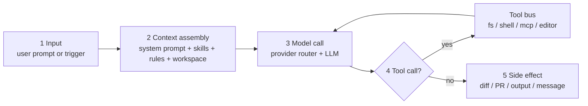
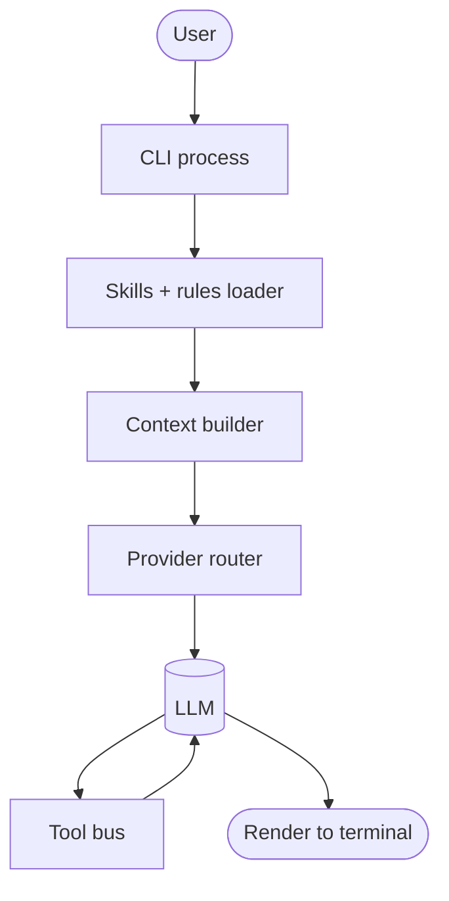
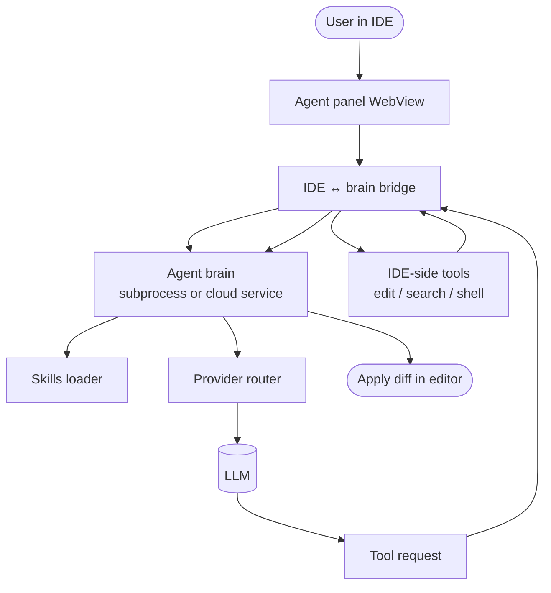
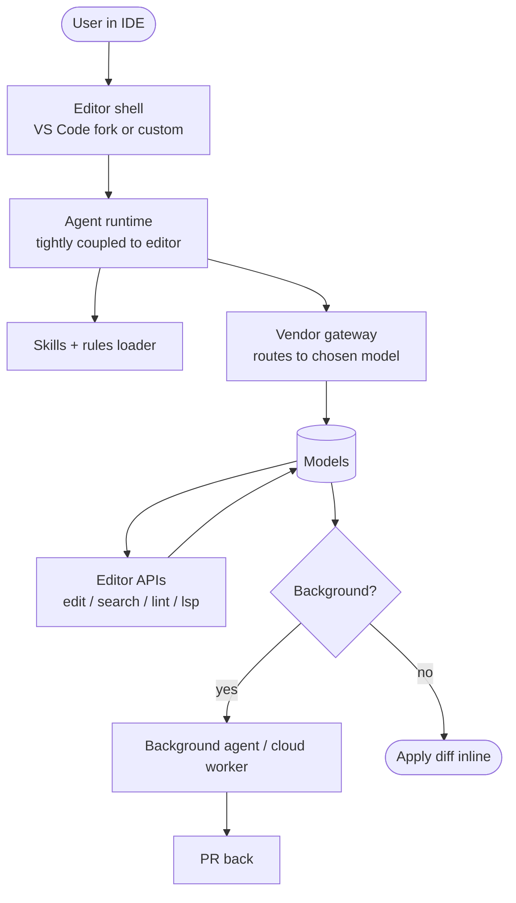
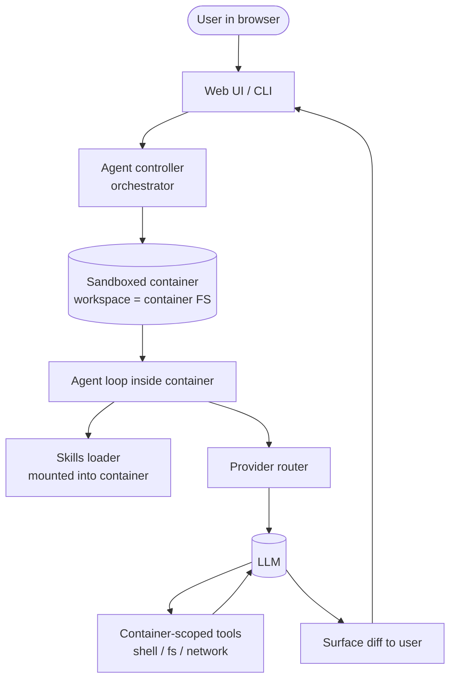
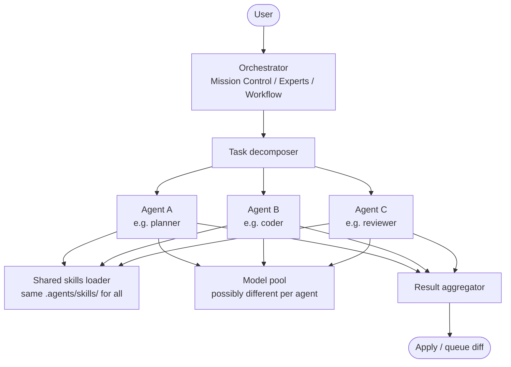
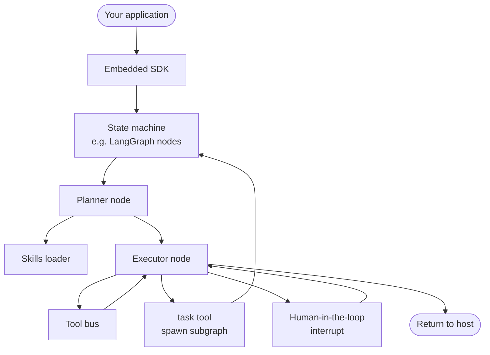
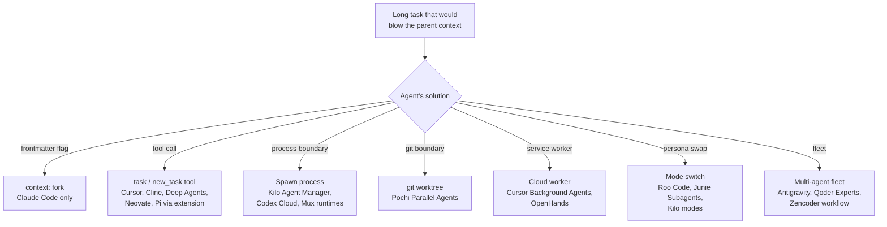
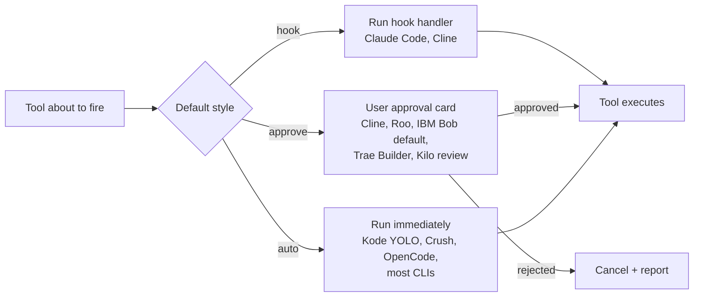

# Cross-Cutting Internals — How These 45 Agents Are Built

The per-agent pages each include an `Internals & Architecture` section with a mermaid diagram tailored to that runtime. This page steps back and asks: **what patterns do those 45 diagrams have in common, and where do they meaningfully diverge?**

The short answer: every agent in the dataset is some variation on a five-stage pipeline (input → context → model → tool → side-effect). The interesting differences live in *which stage owns which responsibility*, *where the sub-context boundary is drawn*, and *which extension point the vendor leaned on*.

> For the **harness-deep-dive companion** to this page — agent loop shapes, memory strategies, tool runtimes, model integration, sub-context primitives, and an innovation taxonomy — see [`harness-deepdive.md`](./harness-deepdive.md). This page is the high-level tour; that page is the depth.

---

## The five stages (universal)

Every agent in this dataset implements that loop. Skills attach at stage 2 (context assembly): the loader walks one or more directories, parses YAML frontmatter, and injects skill descriptions into the system prompt. The body is fetched on demand at stage 3 when the model decides the skill is relevant.

Where the agents diverge is what each stage *owns*.

---

## Pattern 1 — Single-loop CLI (most common)

The default shape. A CLI binary owns all five stages in-process.

**Examples**: Claude Code, Codex (local), Gemini CLI, Crush, OpenCode, Pi, Kode, Qwen Code, Kimi CLI, Cortex Code, Droid, Mux, iFlow CLI, Command Code, Mistral Vibe (CLI mode).

This is the simplest, fastest-to-iterate-on shape, and it's why ~25 of the 45 agents are pure CLIs. The trade-off is that long autonomous runs eat your terminal: there's no UI to inspect mid-task state.

---

## Pattern 2 — IDE extension with a remote (or in-process) brain

The IDE provides input and side-effect surfaces (chat panel, diff applier, terminal), and a "brain" — sometimes a local subprocess, sometimes a remote service — owns the agent loop. Tool calls bridge back to the IDE host.

**Examples**: Cline, Roo, Continue, Augment, Pochi, Zencoder, Firebender, GitHub Copilot, CodeBuddy (plugin variant), Kilo Code (IDE host mode), Junie.

The big architectural decision in this pattern: **where does the brain live?** Options are:
- **In the extension host** (Cline, Roo, Continue, Pochi): everything stays on the developer's machine, but the IDE's main thread is now responsible for an agent loop.
- **In a sibling subprocess** (Kilo Code's portable-core HTTP server): clean separation, survives IDE restart, can be driven from the CLI.
- **In a cloud service** (Augment, GitHub Copilot, CodeBuddy at scale): zero local CPU cost but adds a network hop and a "your code visits the vendor" question.

---

## Pattern 3 — Native AI IDE (own VS Code fork)

The IDE *is* the agent surface. There's no separate panel, just deeply-integrated chat + diff + terminal + browser inside the editor shell.

**Examples**: Cursor, Windsurf, Trae, Trae CN, Antigravity, Qoder, OpenClaw, IBM Bob, Kiro IDE.

The advantage is **deep editor integration**: the agent can read your selection, your scroll position, your LSP symbol table. The cost is **forking VS Code**: you inherit Microsoft's release cadence, marketplace dynamics, and a much larger codebase to maintain.

---

## Pattern 4 — Sandboxed cloud / containerized agent

The agent runs inside a container or VM. The user interacts via a browser (or CLI), but every tool call is scoped to the sandbox.

**Examples**: OpenHands, Replit, Codex Cloud (the cloud half of Codex).

The architectural win is **safety**: a runaway agent's blast radius is the container, not the host. The cost is cold-start latency and the distance between "the agent's filesystem" and "the developer's filesystem".

---

## Pattern 5 — Multi-agent / fleet orchestrator

The runtime spawns multiple agents in parallel — each with its own scope, model, or persona — and merges their outputs.

**Examples**: Antigravity (Mission Control), Qoder (Experts Mode), Zencoder (Zen Agents workflow), iFlow CLI (multi-model decomposition), Kilo Code (Agent Manager tabs), Pochi (Parallel Agents via worktrees).

The trade-off this pattern makes is **complexity vs scope**: you can do bigger things in parallel, but you also have to reconcile conflicting outputs, which is hard. Most fleet orchestrators in the dataset hand reconciliation back to the user (Pochi's worktree merge, Antigravity's per-task verification).

---

## Pattern 6 — Embeddable SDK / state machine

The agent runtime is exposed as a function or graph you can embed in your own application. The CLI is just one consumer of the SDK.

**Examples**: Deep Agents (LangGraph), Pi (TypeScript SDK), Neovate (multi-surface SDK), Goose (Rust runtime + custom UIs).

The win is **composability**: the agent becomes a library you can call from anywhere. The cost is that "the runtime" is now your problem to maintain — most SDK-first agents ship a reference CLI and let you go from there.

---

## Where skills attach in each pattern

| Pattern | Where skills load | Where the body fetches |
| --- | --- | --- |
| Single-loop CLI | At process start, then on each new conversation | When the model emits a "load skill" tool/intention |
| IDE extension | At extension activation + on workspace change | When the model picks a skill name |
| Native AI IDE | Same as IDE extension; usually with a layered loader (workspace + project + global) | Same |
| Sandboxed cloud | At container boot; mounted as a volume | Same |
| Multi-agent fleet | Once per orchestrator startup; shared across agents | Each sub-agent fetches independently |
| Embeddable SDK | At graph construction | When a graph node hits a "load skill" branch |

The constant: **skills always inject at context-assembly time, never at model-init time**. That's the spec's design — it's why progressive disclosure works.

---

## The sub-context primitive — the biggest divergence

`context: fork` is in the spec but only Claude Code implements it natively. Every other agent solves the same problem differently, and that's where architectures diverge most:

The reason `context: fork` hasn't standardized: **each of these solutions is genuinely a different runtime concern**. Claude Code's fork is a chat-context boundary. Pochi's worktree is a filesystem boundary. Codex Cloud's worker is a process boundary. The spec keeping the field optional is the right call.

---

## The provider-routing layer — almost universally present

Almost every agent in the dataset has a *provider router* — a layer that abstracts over Anthropic, OpenAI, Google, Bedrock, OpenRouter, Ollama, etc. The architectural variations:

| Variation | Examples | What it costs |
| --- | --- | --- |
| Single-provider, no router | Claude Code (Anthropic), Pi (Anthropic-first), Cortex Code (Snowflake-hosted), Replit (Replit gateway) | Less code, less flexibility |
| Vendor-routed | Cursor, Windsurf, Trae, Antigravity, GitHub Copilot, CodeBuddy | Vendor handles auth, billing, fallback; you can't swap |
| BYOK / self-routed | Continue, Cline, Roo, Crush, OpenCode, Kode, Goose, Pochi, Junie BYOK, Mistral Vibe local | Most flexible; you own the API keys |
| litellm or wrapper SDK | OpenHands, AdaL, Neovate | One adapter, many providers |

The XDG-shared bucket (`~/.config/agents/skills/`) is interesting partly because the agents that use it (Amp, Kimi CLI, Replit, Universal, OpenCode-adjacent) often have very different provider stories — which proves the skill format really is provider-agnostic.

---

## Hooks vs approval gates vs auto-approve

Every agent has to answer "what happens before / after a tool runs?" Three answers in the dataset:

Note the asymmetry: **hooks are for vendor / org policy** (audit log, lint, format), **approval gates are for individual safety**, and **auto-approve is for speed**. Most agents pick one default and let the other two be configured. The notable aggressive defaults: IBM Bob (approval-by-default for skills), Kode (YOLO-by-default for everything).

---

## What this means for skill authors

Looking across all six patterns and the variations within them, a portable skill that wants to work on the most agents should:

1. **Assume the single-loop CLI shape**. It's the lowest common denominator and runs literally everywhere.
2. **Treat the description as load-or-not signal**. Progressive disclosure is universal; only the most aggressive agents force-load.
3. **Don't depend on `context: fork`**. If the work is long, *describe* it as long ("consider running this via a sub-agent if your harness supports it") rather than declaring the fork.
4. **Treat `allowed-tools` as advisory**. Two agents (Kiro, Zencoder) ignore it.
5. **Don't write hook contracts in the skill**. Two agents support hooks; the rest will silently fail to run them.
6. **Assume a tool bus that has read/write/edit/shell**. Almost every agent ships these. MCP tools are increasingly available but not universal.

---

## Where to look next

- **[`harness-deepdive.md`](./harness-deepdive.md)** — The depth pass. Agent loop shapes, memory strategies, tool runtimes, model integration, sub-context primitives, and an innovation taxonomy across all 45 agents.
- The per-agent [`Internals & Architecture`](./agents) section + per-agent **Harness Deep Dive** in each agent doc.
- [`analysis.md`](./analysis.md) for cross-vendor patterns and strategy bets.
- [`feature-compatibility.md`](./feature-compatibility.md) for the spec-feature matrix.
- [`pros-cons.md`](./pros-cons.md) for opinionated per-agent strengths/weaknesses.
- [`use-cases.md`](./use-cases.md) for "which agent do I pick when…?" guidance.
- [`strengths-comparison.md`](./strengths-comparison.md) for side-by-side capability scoring.
