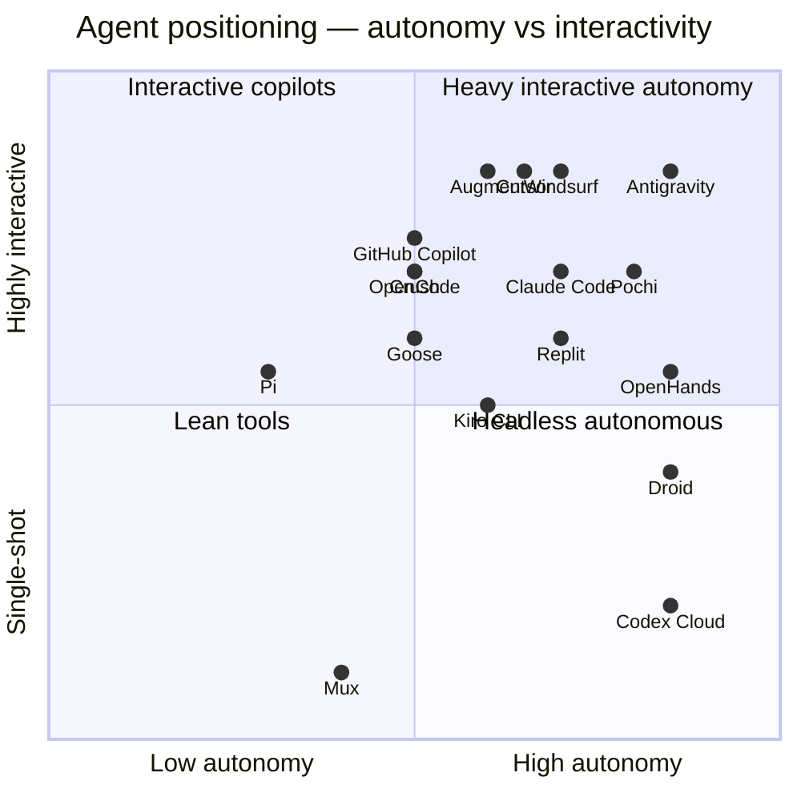

# Strengths Comparison Matrix

A quantitative complement to [`pros-cons.md`](./pros-cons.md) and [`use-cases.md`](./use-cases.md). This page scores each of the 45 agents on consistent axes so you can scan and shortlist quickly.

> **Scoring legend** (used in every table):
>
> -  **★★★** — best-in-class, defining feature for the agent
> -  **★★** — solid, on par with the best
> -  **★** — present, usable
> -  **·** — weak / not the agent's strength
> -  **—** — not applicable / not supported
>
> Scores are *relative to the rest of the dataset*, not absolute. They reflect intent + observed maturity, not a benchmark.

---

## Quick visual: where the agents cluster

---

## Capability scoring tables

The dataset is large, so capabilities are split across a few digestible matrices. Each table is sorted alphabetically inside groups.

### Table 1 — Skill ecosystem support

How well each agent participates in the Agent Skills standard, and how flexibly it loads them.

| Agent | Project skills | Global skills | Plugins | `allowed-tools` | `context: fork` | Hooks |
| --- | --- | --- | --- | --- | --- | --- |
| AdaL | ★★ | ★★ | · | · | · | · |
| Amp | ★★ | ★★ | ★ | · | · | · |
| Antigravity | ★★★ | ★★ | ★ | · | · | · |
| Augment | ★★★ | ★★ | · | · | · | · |
| IBM Bob | ★★ | ★★ | · | ★ | · | ★ |
| Claude Code | ★★★ | ★★★ | ★★★ | ★★★ | ★★★ | ★★★ |
| Cline | ★★ | ★★ | · | · | · | ★★ |
| CodeBuddy | ★★ | ★★ | · | · | · | · |
| Codex | ★★ | ★★ | ★ | · | · | · |
| Command Code | ★★ | ★★ | · | · | · | · |
| Continue | ★★ | ★★ | ★ | · | · | · |
| Cortex Code | ★★ | ★★ | · | · | · | · |
| Crush | ★★ | ★★ | · | · | · | · |
| Cursor | ★★ | ★★ | ★★ | · | · | · |
| Deep Agents | ★★ | ★★ | · | · | · | · |
| Droid | ★★ | ★★ | · | · | · | · |
| Firebender | ★★ | ★★ | · | · | · | · |
| Gemini CLI | ★★ | ★★ | · | · | · | · |
| GitHub Copilot | ★★ | ★★ | ★★ | · | · | · |
| Goose | ★★ | ★★ | ★★ | · | · | ★ |
| iFlow CLI | ★★ | ★★ | · | · | · | · |
| Junie | ★★ | ★★ | · | · | · | · |
| Kilo Code | ★★ | ★★ | · | · | · | · |
| Kimi CLI | ★★ | ★★ | · | · | · | · |
| Kiro CLI | ★★ | ★★ | · | · | · | · |
| Kode | ★★ | ★★ | · | · | · | · |
| MCPJam | ★★ | ★★ | · | · | · | · |
| Mistral Vibe | ★★ | ★★ | · | · | · | · |
| Mux | ★★ | ★★ | · | · | · | · |
| Neovate | ★★ | ★★ | · | · | · | · |
| Openclaw | ★★ | ★★ | · | · | · | · |
| OpenCode | ★★ | ★★ | ★ | · | · | · |
| OpenHands | ★★ | ★★ | · | · | · | · |
| Pi | ★★ | ★★ | · | · | · | · |
| Pochi | ★★ | ★★ | · | · | · | · |
| Qoder | ★★ | ★★ | · | · | · | · |
| Qwen Code | ★★ | ★★ | · | · | · | · |
| Replit | ★★ | ★★ | · | · | · | · |
| Roo | ★★ | ★★ | · | · | · | ★ |
| Trae | ★★ | ★★ | · | · | · | · |
| Trae CN | ★★ | ★★ | · | · | · | · |
| Universal | ★★★ | ★★★ | · | · | · | · |
| Warp | ★★ | ★★ | · | · | · | · |
| Windsurf | ★★ | ★★ | ★ | · | · | · |
| Zencoder | ★★ | ★★ | · | · | · | · |

> **Reading note**: Most agents fully implement the *core* spec (project + global skill loading), so the differentiation is in the *optional* features. Claude Code is the only agent in the dataset that supports the full spec (plugins, allowed-tools, context: fork, hooks). Universal is the spec itself, so it scores ★★★ on the core columns by definition. See [`feature-compatibility.md`](./feature-compatibility.md) for the source of truth.

---

### Table 2 — Editor & surface integration

Where you actually use the agent.

| Agent | VS Code | JetBrains | Vim/Neo | Native IDE | TUI/CLI | Web | Mobile |
| --- | --- | --- | --- | --- | --- | --- | --- |
| AdaL | · | · | · | · | ★★ | ★ | · |
| Amp | ★★ | · | · | · | ★★ | · | · |
| Antigravity | · | · | · | ★★★ | · | · | · |
| Augment | ★★★ | ★★★ | ★★ | · | · | · | · |
| IBM Bob | ★★ | ★★ | · | · | ★★ | · | · |
| Claude Code | · | · | · | · | ★★★ | · | · |
| Cline | ★★★ | ★ | · | · | · | · | · |
| CodeBuddy | ★★ | ★★ | · | ★★ | ★★ | · | · |
| Codex | · | · | · | · | ★★★ | ★★ | · |
| Command Code | ★★ | · | · | · | · | · | · |
| Continue | ★★★ | ★★★ | · | · | · | · | · |
| Cortex Code | ★ | · | · | · | ★★ | ★ | · |
| Crush | · | · | · | · | ★★★ | · | · |
| Cursor | · | · | · | ★★★ | ★ | · | · |
| Deep Agents | · | · | · | · | ★ | · | · |
| Droid | · | · | · | · | ★★ | · | · |
| Firebender | · | ★★★ | · | · | · | · | · |
| Gemini CLI | · | · | · | · | ★★★ | · | · |
| GitHub Copilot | ★★★ | ★★ | ★★ | ★★ | ★★ | ★★ | · |
| Goose | ★★ | ★ | · | · | ★★ | ★ | · |
| iFlow CLI | · | · | · | · | ★★ | · | · |
| Junie | · | ★★★ | · | · | · | · | · |
| Kilo Code | ★★★ | · | · | · | ★ | ★ | · |
| Kimi CLI | · | · | · | · | ★★★ | · | · |
| Kiro CLI | · | · | · | ★★ | ★★ | · | · |
| Kode | · | · | · | · | ★★★ | · | · |
| MCPJam | · | · | · | · | ★★ | · | · |
| Mistral Vibe | · | · | · | · | ★★★ | · | · |
| Mux | · | · | · | · | ★★★ | · | · |
| Neovate | · | · | · | · | ★★ | · | · |
| Openclaw | · | · | · | · | ★★ | · | · |
| OpenCode | · | · | · | · | ★★★ | · | · |
| OpenHands | · | · | · | · | ★★ | ★★ | · |
| Pi | · | · | · | · | ★★ | · | · |
| Pochi | ★★★ | · | · | · | · | · | · |
| Qoder | · | · | · | ★★★ | ★★ | · | · |
| Qwen Code | · | · | · | · | ★★★ | · | · |
| Replit | · | · | · | · | · | ★★★ | ★★ |
| Roo | ★★★ | · | · | · | · | · | · |
| Trae | · | · | · | ★★★ | · | · | · |
| Trae CN | · | · | · | ★★★ | · | · | · |
| Universal | · | · | · | · | · | · | · |
| Warp | · | · | · | · | ★★★ | · | · |
| Windsurf | · | · | · | ★★★ | · | · | · |
| Zencoder | ★★★ | ★★ | · | · | · | · | · |

---

### Table 3 — Autonomy & safety controls

How much can the agent do on its own, and what guardrails does it offer?

| Agent | Auto-edit | Auto-shell | Long-horizon | Approval gates | Sandbox / isolation | Audit trail |
| --- | --- | --- | --- | --- | --- | --- |
| AdaL | ★★ | ★★ | ★★ | · | · | ★ |
| Amp | ★★ | ★★ | ★★ | ★ | · | ★ |
| Antigravity | ★★★ | ★★★ | ★★★ | ★★ | · | ★★ |
| Augment | ★★★ | ★★ | ★★ | ★ | · | ★ |
| IBM Bob | ★★ | ★ | ★★ | ★★★ | · | ★★★ |
| Claude Code | ★★★ | ★★★ | ★★★ | ★★★ | · | ★★ |
| Cline | ★★ | ★★ | ★★ | ★★ | · | ★ |
| CodeBuddy | ★★ | ★★ | ★★ | ★ | · | ★ |
| Codex | ★★★ | ★★★ | ★★★ | ★ | ★★ | ★★ |
| Command Code | ★★ | ★★ | ★★ | ★★ | · | ★★ |
| Continue | ★★ | ★ | ★★ | ★★ | · | ★ |
| Cortex Code | ★★ | ★ | ★★ | ★★ | ★★★ | ★★★ |
| Crush | ★★ | ★★ | ★★ | ★★ | · | ★ |
| Cursor | ★★★ | ★★★ | ★★★ | ★★ | · | ★ |
| Deep Agents | ★★ | ★★ | ★★★ | · | · | ★ |
| Droid | ★★★ | ★★ | ★★★ | ★ | ★ | ★★ |
| Firebender | ★★ | ★★ | ★★ | ★ | · | ★ |
| Gemini CLI | ★★ | ★★ | ★★ | ★ | · | · |
| GitHub Copilot | ★★ | ★★ | ★★ | ★★ | ★ | ★★ |
| Goose | ★★ | ★★ | ★★★ | ★★ | ★ | ★★ |
| iFlow CLI | ★★ | ★★ | ★★ | ★ | · | · |
| Junie | ★★ | ★★ | ★★ | ★★ | · | ★ |
| Kilo Code | ★★ | ★★ | ★★ | ★ | · | ★ |
| Kimi CLI | ★★ | ★★ | ★★ | ★ | · | · |
| Kiro CLI | ★★ | ★★ | ★★ | ★★ | · | ★ |
| Kode | ★★★ | ★★★ | ★★ | · | · | · |
| MCPJam | ★ | ★ | ★ | ★ | · | · |
| Mistral Vibe | ★★ | ★★ | ★★ | ★★ | · | ★ |
| Mux | ★★ | ★★ | ★★ | ★★ | ★★ | ★★ |
| Neovate | ★★ | ★★ | ★★ | ★ | · | ★ |
| Openclaw | ★★ | ★★ | ★★ | ★ | · | · |
| OpenCode | ★★ | ★★ | ★★ | ★ | · | · |
| OpenHands | ★★★ | ★★★ | ★★★ | ★ | ★★★ | ★★ |
| Pi | ★★ | ★★ | ★ | ★★ | · | · |
| Pochi | ★★★ | ★★ | ★★★ | ★★ | ★★★ | ★★ |
| Qoder | ★★★ | ★★★ | ★★★ | ★ | · | ★★ |
| Qwen Code | ★★ | ★★ | ★★ | ★ | · | · |
| Replit | ★★ | ★★ | ★★ | ★ | ★★ | ★ |
| Roo | ★★ | ★★ | ★★ | ★★ | · | ★ |
| Trae | ★★ | ★★ | ★★ | ★★ | · | ★ |
| Trae CN | ★★ | ★★ | ★★ | ★★ | · | ★ |
| Universal | — | — | — | — | — | — |
| Warp | ★★ | ★★★ | ★★ | ★ | · | ★ |
| Windsurf | ★★★ | ★★★ | ★★★ | ★★ | · | ★ |
| Zencoder | ★★★ | ★★ | ★★ | ★ | · | ★ |

---

### Table 4 — Provider flexibility

Can you use the model you want?

| Agent | First-party model | BYOK cloud | Local LLM | Self-host gateway |
| --- | --- | --- | --- | --- |
| AdaL | ★★ | ★ | · | · |
| Amp | · | ★★★ | · | · |
| Antigravity | ★★★ | · | · | · |
| Augment | ★★ | ★ | · | · |
| IBM Bob | ★★★ | ★ | · | ★★ |
| Claude Code | ★★★ | · | · | · |
| Cline | · | ★★★ | ★★ | ★ |
| CodeBuddy | ★★ | · | · | · |
| Codex | ★★★ | · | · | · |
| Command Code | ★★ | ★★ | ★ | · |
| Continue | · | ★★★ | ★★★ | ★★ |
| Cortex Code | ★★★ | · | · | · |
| Crush | · | ★★★ | ★★ | · |
| Cursor | · | ★★★ | · | · |
| Deep Agents | · | ★★★ | ★★ | · |
| Droid | ★★ | ★ | · | · |
| Firebender | ★★ | ★ | · | · |
| Gemini CLI | ★★★ | · | · | · |
| GitHub Copilot | ★★ | ★★ | · | · |
| Goose | · | ★★★ | ★★★ | ★ |
| iFlow CLI | ★★★ | · | · | · |
| Junie | · | ★★★ | · | · |
| Kilo Code | · | ★★★ | ★★ | · |
| Kimi CLI | ★★★ | · | · | · |
| Kiro CLI | · | ★★ | · | · |
| Kode | · | ★★★ | ★★ | · |
| MCPJam | · | ★★ | · | · |
| Mistral Vibe | ★★★ | · | ★★★ | · |
| Mux | · | ★★★ | ★★ | · |
| Neovate | · | ★★ | ★★ | · |
| Openclaw | · | ★★ | ★★ | · |
| OpenCode | · | ★★★ | ★★ | · |
| OpenHands | · | ★★★ | ★★ | · |
| Pi | ★★★ | · | · | · |
| Pochi | · | ★★ | ★ | · |
| Qoder | ★★★ | · | · | · |
| Qwen Code | ★★★ | · | ★ | · |
| Replit | ★★★ | · | · | · |
| Roo | · | ★★★ | ★★ | · |
| Trae | ★★ | ★★ | · | · |
| Trae CN | ★★ | ★ | · | · |
| Universal | — | — | — | — |
| Warp | · | ★★★ | · | · |
| Windsurf | ★★ | ★★ | · | · |
| Zencoder | · | ★★★ | · | · |

---

### Table 5 — Distribution & licensing posture

| Agent | OSS | Free tier | Self-host | Vendor stability | Foundation governance |
| --- | --- | --- | --- | --- | --- |
| AdaL | · | ★ | · | ★ | · |
| Amp | · | · | · | ★★★ | · |
| Antigravity | · | ★ | · | ★★★ | · |
| Augment | · | ★ | · | ★★ | · |
| IBM Bob | · | · | ★★ | ★★★ | · |
| Claude Code | · | · | · | ★★★ | · |
| Cline | ★★★ | ★★★ | ★★ | ★★ | · |
| CodeBuddy | · | ★★ | · | ★★ | · |
| Codex | · | · | · | ★★★ | · |
| Command Code | · | · | · | ★ | · |
| Continue | ★★★ | ★★★ | ★★★ | ★★ | · |
| Cortex Code | · | · | · | ★★★ | · |
| Crush | ★★★ | ★★★ | ★★ | ★★ | · |
| Cursor | · | ★ | · | ★★★ | · |
| Deep Agents | ★★★ | ★★ | ★★ | ★ | · |
| Droid | · | ★ | · | ★★ | · |
| Firebender | · | ★★ | · | ★★ | · |
| Gemini CLI | ★★ | ★★★ | · | ★★★ | · |
| GitHub Copilot | · | ★★ | · | ★★★ | · |
| Goose | ★★★ | ★★★ | ★★★ | ★★★ | ★★★ |
| iFlow CLI | ★★ | ★★ | · | ★ | · |
| Junie | · | ★★ | · | ★★★ | · |
| Kilo Code | ★★★ | ★★ | ★★ | ★★ | · |
| Kimi CLI | ★★ | ★★ | · | ★★ | · |
| Kiro CLI | · | ★★ | · | ★★★ | · |
| Kode | ★★★ | ★★ | ★ | ★ | · |
| MCPJam | ★★★ | ★★ | ★ | ★ | · |
| Mistral Vibe | ★★ | ★★ | ★★★ | ★★★ | · |
| Mux | · | ★ | ★★ | ★★ | · |
| Neovate | ★★★ | ★★ | ★ | ★ | · |
| Openclaw | ★★ | ★ | ★ | ★ | · |
| OpenCode | ★★★ | ★★★ | ★★ | ★★ | · |
| OpenHands | ★★★ | ★★★ | ★★★ | ★★ | · |
| Pi | ★★★ | ★★ | ★ | ★★ | · |
| Pochi | ★★ | ★★ | ★★ | ★ | · |
| Qoder | · | ★★ | · | ★★ | · |
| Qwen Code | ★★ | ★★★ | · | ★★★ | · |
| Replit | · | ★ | · | ★★★ | · |
| Roo | ★★★ | ★★★ | ★★ | ★★ | · |
| Trae | · | ★★ | · | ★★ | · |
| Trae CN | · | ★★ | · | ★★ | · |
| Universal | ★★★ | ★★★ | ★★★ | ★★ | · |
| Warp | · | ★★ | · | ★★★ | · |
| Windsurf | · | ★ | · | ★★★ | · |
| Zencoder | · | ★★ | · | ★★ | · |

---

### Table 6 — Distinctive feature scoreboard

A wider qualitative comparison of features that don't fit the prior tables.

| Agent | Multi-agent / fleet | Spec-driven | Memory / learning | Multimodal | Code-graph |
| --- | --- | --- | --- | --- | --- |
| AdaL | · | · | ★★★ | · | · |
| Amp | · | · | · | · | ★★★ |
| Antigravity | ★★★ | · | · | · | · |
| Augment | · | · | ★★★ | · | ★★ |
| IBM Bob | · | · | · | · | · |
| Claude Code | ★ | · | ★ | · | · |
| Cline | · | · | ★ | · | · |
| CodeBuddy | · | · | · | ★★ | · |
| Codex | ★★ | · | · | · | · |
| Command Code | · | · | ★★★ | · | · |
| Continue | · | · | ★ | · | · |
| Cortex Code | · | · | · | · | · |
| Crush | · | · | · | · | · |
| Cursor | ★★ | · | ★ | ★★ | · |
| Deep Agents | ★★ | · | · | · | · |
| Droid | · | · | · | · | · |
| Firebender | · | · | · | · | · |
| Gemini CLI | · | · | · | ★★ | · |
| GitHub Copilot | ★ | · | ★ | ★ | · |
| Goose | · | · | · | · | · |
| iFlow CLI | · | · | · | · | · |
| Junie | · | · | · | · | ★★ |
| Kilo Code | ★★ | · | · | · | · |
| Kimi CLI | · | · | · | · | · |
| Kiro CLI | · | ★★★ | · | · | · |
| Kode | · | · | · | · | · |
| MCPJam | · | · | · | · | · |
| Mistral Vibe | · | ★★ | · | · | · |
| Mux | · | · | · | · | · |
| Neovate | · | ★★ | · | · | · |
| Openclaw | · | · | · | · | · |
| OpenCode | · | · | · | · | · |
| OpenHands | · | · | · | · | · |
| Pi | · | · | · | · | · |
| Pochi | ★★★ | · | · | · | · |
| Qoder | ★★★ | · | · | · | · |
| Qwen Code | · | · | · | · | · |
| Replit | · | · | · | · | · |
| Roo | · | · | · | · | · |
| Trae | · | · | · | ★★★ | · |
| Trae CN | · | · | · | ★★ | · |
| Universal | — | — | — | — | — |
| Warp | · | · | · | · | · |
| Windsurf | · | · | ★ | · | · |
| Zencoder | ★★★ | · | ★ | · | · |

---

## Cross-cutting observations

A few patterns jump out when you scan all six tables together:

### 1. Skill ecosystem support is converging — except for the optional spec features

Almost every agent now reads project + global skill folders. The differentiation is in `allowed-tools`, `context: fork`, hooks, and the plugin marketplace — and Claude Code is presently the only agent that supports all four. If those features matter to you and you can pick only one agent, Claude Code is the safe answer; otherwise treat them as nice-to-haves.

### 2. There are exactly four "native AI IDE" agents

Antigravity, Cursor, Trae (and Trae CN), Windsurf, Qoder, and Kiro CLI's Studio mode. Most other agents are extensions or CLIs. If you want the *editor itself* to be agent-aware (multi-pane diffs, auto-checkpoint, gallery views) you have a small short-list.

### 3. OSS + foundation governance is rare

Only Goose has explicit Linux Foundation governance. The other OSS projects (Cline, Continue, Crush, OpenCode, Roo, Pi, Kilo, Pochi, OpenHands, Deep Agents, Universal) carry single-vendor stewardship risk even though the code is open.

### 4. Long-horizon autonomy lives mostly outside IDEs

Codex Cloud, Droid, OpenHands, Pochi Parallel Agents, Qoder Quest, Antigravity Mission Control — the agents that actually grind for hours all assume sandboxed or worktree isolation. IDE-native agents tend to top out at "session-long". This is also where the safety story is strongest, because isolation is a precondition.

### 5. Provider flexibility correlates with OSS

The full "BYOK + local + self-host" trifecta lives in Continue, Goose, Cline, OpenCode, Crush — all OSS. Vendor-aligned agents (Claude Code, Codex, Antigravity, Kimi CLI, iFlow CLI, Cortex Code) tend to lock you into the vendor's models, by design.

### 6. Memory & learning are still rare

Only AdaL, Augment, and Command Code score 3 stars on memory/learning. Most agents still treat each session as fresh. If implicit-style learning matters, those three are the practical short-list.

### 7. Multi-agent orchestration is the newest frontier

Antigravity, Qoder Experts, Pochi Parallel Agents, Zencoder Zen Agents, Kilo Agent Manager — five agents in the dataset, all relatively recent. Expect this category to grow.

---

## How to use these tables

1. **Shortlist by surface (Table 2)** — discard anything that doesn't run where you work.
2. **Filter by autonomy (Table 3)** — pick rows whose autonomy and safety match your risk profile.
3. **Filter by provider needs (Table 4)** — if you need BYOK or local, the field shrinks fast.
4. **Filter by licensing (Table 5)** — if OSS / self-host / foundation governance matters, you have ~10 options.
5. **Use Table 6** to break a tie based on a distinctive feature you actually need.
6. **Read the corresponding `pros-cons.md` cards** for any final shortlist.
7. **Verify the `installation-paths.md` and `feature-compatibility.md`** before committing — the canonical truth lives there.

---

## Where to look next

- [`pros-cons.md`](./pros-cons.md) — per-agent strengths and weaknesses, narrative form.
- [`use-cases.md`](./use-cases.md) — scenario-driven recommendations.
- [`internals-overview.md`](./internals-overview.md) — architecture patterns common across agents.
- [`feature-compatibility.md`](./feature-compatibility.md) — canonical reference for optional Skills features.
- [`installation-paths.md`](./installation-paths.md) — where skills land for each agent.
