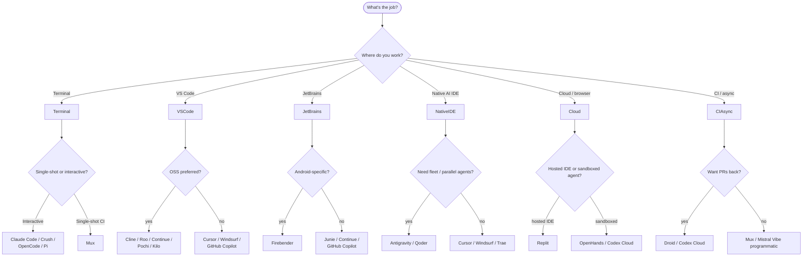
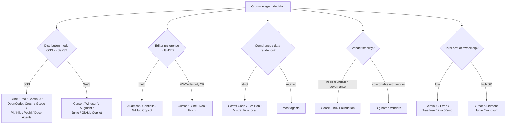

# Use-Case Guide — Which Agent for Which Job

A scenario-driven complement to [`pros-cons.md`](./pros-cons.md) and [`categories.md`](./categories.md). Read [`pros-cons.md`](./pros-cons.md) when you're shortlisting agents; read this page when you have a *job to do* and want a recommendation.

> Each use case lists a primary recommendation, two strong alternatives, and (when relevant) what *not* to use.

---

## Decision flow at a glance

This is a *starting* heuristic — every real choice depends on your team's existing tools, constraints, and tastes. The use cases below add the next layer of nuance.

---

## Use case 1 — Solo developer, side projects, on a budget

**Goal**: Capable agent with minimal cost, ideally OSS, no enterprise complexity.

| Pick | Why |
| --- | --- |
| **Primary**: [Gemini CLI](./agents/gemini-cli.md) | Free Google quota, OSS, native function-calling. |
| **Alt**: [Crush](./agents/crush.md) | Polished TUI, BYOK, OSS. |
| **Alt**: [OpenCode](./agents/opencode.md) | Provider-agnostic, slick TUI, Apache 2.0. |
| **Avoid**: Augment, Cursor, Windsurf | All paid; cost adds up for hobby work. |

---

## Use case 2 — Working developer, day-to-day coding in an IDE

**Goal**: Best general-purpose IDE agent for an individual contributor.

| Pick | Why |
| --- | --- |
| **Primary**: [Cursor](./agents/cursor.md) | Best-of-class IDE integration; works with any major model; mature skills + MCP. |
| **Alt**: [Windsurf](./agents/windsurf.md) | Cascade is good for multi-step refactors; same VS-Code-fork tradeoffs. |
| **Alt**: [GitHub Copilot](./agents/github-copilot.md) | If your shop is GitHub-centric; works in any IDE. |
| **Avoid**: Pi, Mux | Both intentionally minimal — wrong shape for an everyday IDE. |

---

## Use case 3 — Multi-IDE shop (some on VS Code, some on JetBrains, some on Vim)

**Goal**: Same skills, same conventions, across any developer's editor.

| Pick | Why |
| --- | --- |
| **Primary**: [Augment](./agents/augment.md) | VS Code + JetBrains + Vim + Zed all read the same `.augment/skills/`. |
| **Alt**: [GitHub Copilot](./agents/github-copilot.md) | Seven IDE families + CLI + web, shared `.agents/skills/`. |
| **Alt**: [Continue](./agents/continue.md) | VS Code + JetBrains, OSS, fully shared config. |
| **Avoid**: Native AI IDEs | They lock you into their fork. |

---

## Use case 4 — Android development specifically

| Pick | Why |
| --- | --- |
| **Primary**: [Firebender](./agents/firebender.md) | The only agent in the dataset that reads Logcat live. |
| **Alt**: [Junie](./agents/junie.md) | First-party JetBrains agent with PSI-level refactoring. |
| **Avoid**: Generic CLIs | They miss the runtime signals that matter on Android. |

---

## Use case 5 — Snowflake / Snowpark application development

| Pick | Why |
| --- | --- |
| **Primary**: [Cortex Code](./agents/cortex.md) | Stays inside the Snowflake account boundary. |
| **Alt**: [Cursor](./agents/cursor.md) + Snowflake CLI | If you're not bound by data-residency. |
| **Avoid**: Anything that ships your code to a third-party gateway. |

---

## Use case 6 — China-region team

| Pick | Why |
| --- | --- |
| **Primary**: [Trae CN](./agents/trae-cn.md) | Mainland-China endpoints, proven UX. |
| **Alt**: [CodeBuddy](./agents/codebuddy.md) | Tencent Cloud-native; IDE / plugin / CLI all read same skills. |
| **Alt**: [Qwen Code](./agents/qwen-code.md) | If you want a CLI tuned to Qwen 3 Coder. |
| **Avoid**: iFlow CLI | Sunsetting April 2026 — migrate to Qoder. |

---

## Use case 7 — Long autonomous refactor (rename, migrate, rewrite a layer)

**Goal**: Let the agent grind for hours, get a reviewable result, not blow context.

| Pick | Why |
| --- | --- |
| **Primary**: [Qoder](./agents/qoder.md) | Quest Mode + 100k-file context + 26h budget. |
| **Alt**: [Claude Code](./agents/claude-code.md) with `context: fork` | Native fork primitive keeps parent context clean. |
| **Alt**: [Pochi](./agents/pochi.md) | Parallel Agents in worktrees give you a true safety net. |
| **Avoid**: Pi, Mux | Both deliberately short-loop. |

---

## Use case 8 — CI/CD agentic checks (lint-style fixes, dependency bumps, scheduled refactors)

**Goal**: Headless, bounded-cost, structured output for scripts.

| Pick | Why |
| --- | --- |
| **Primary**: [Mux](./agents/mux.md) | Designed for this; runtime selection + budget caps + JSON output. |
| **Alt**: [Codex Cloud](./agents/codex.md) | Fan-out workers if you have OpenAI org-level access. |
| **Alt**: [Droid](./agents/droid.md) | If you want PRs as the output. |
| **Avoid**: Anything interactive — wrong shape entirely. |

---

## Use case 9 — Pull-request authoring from issue + repo context

**Goal**: "Read this issue, write a PR" — async, with a reviewable diff at the end.

| Pick | Why |
| --- | --- |
| **Primary**: [Droid](./agents/droid.md) | PR generation is a first-class output. |
| **Alt**: [Codex Cloud](./agents/codex.md) | Fan-out to many issues at once. |
| **Alt**: [GitHub Copilot Workspace](./agents/github-copilot.md) | Tight GitHub integration. |
| **Avoid**: Pure CLIs that just print diffs to stdout. |

---

## Use case 10 — Regulated environment (finance, healthcare, defense)

**Goal**: Audit trail, approval gates, no data egress, model attestation.

| Pick | Why |
| --- | --- |
| **Primary**: [IBM Bob](./agents/bob.md) | Approval-by-default, rich audit story, enterprise governance. |
| **Alt**: [Cortex Code](./agents/cortex.md) | Code stays in Snowflake account boundary. |
| **Alt**: [Mistral Vibe](./agents/mistral-vibe.md) with Devstral Small 2 local | Air-gapped option. |
| **Avoid**: AdaL, Augment cloud, Replit | All ship code to a vendor for processing. |

---

## Use case 11 — Air-gapped / offline development

**Goal**: No network at all; everything local.

| Pick | Why |
| --- | --- |
| **Primary**: [Mistral Vibe](./agents/mistral-vibe.md) + Devstral Small 2 local | 24B model runs on a workstation. |
| **Alt**: [Continue](./agents/continue.md) + Ollama | Strong local-LLM story, OSS. |
| **Alt**: [Crush](./agents/crush.md) + local provider | OSS, BYOK, polished TUI. |
| **Avoid**: Anything cloud-only — Replit, Augment, AdaL. |

---

## Use case 12 — Education, demos, shareable working environments

**Goal**: A teacher / instructor wants a one-click reproducible env with the agent and skills already wired up.

| Pick | Why |
| --- | --- |
| **Primary**: [Replit](./agents/replit.md) | Fork-as-distribution, agent comes with the workspace. |
| **Alt**: [Mux](./agents/mux.md) in Docker runtime | Shareable container with bounded behavior. |
| **Alt**: [OpenHands](./agents/openhands.md) | Sandboxed, cloud or self-host. |
| **Avoid**: IDE-extension agents — too many host preconditions. |

---

## Use case 13 — Building your own agent product on top

**Goal**: You want to embed a coding-agent runtime in your own application.

| Pick | Why |
| --- | --- |
| **Primary**: [Pi](./agents/pi.md) | Smallest, easiest to embed; clean SDK. |
| **Alt**: [Deep Agents](./agents/deepagents.md) | LangGraph state machine, batteries-included. |
| **Alt**: [Goose](./agents/goose.md) | Rust runtime + SDK + custom UI option. |
| **Avoid**: Anything that's primarily a UI (Cursor, Trae, Antigravity). |

---

## Use case 14 — Cross-repo refactor in a 10M-line monorepo

**Goal**: Reason about the whole codebase, not just open files.

| Pick | Why |
| --- | --- |
| **Primary**: [Augment](./agents/augment.md) | Context Engine designed for this. |
| **Alt**: [Amp](./agents/amp.md) | Sourcegraph code graph. |
| **Alt**: [Qoder](./agents/qoder.md) | 100k-file context engine. |
| **Avoid**: Pi, Crush, OpenCode | All assume a workable per-conversation context. |

---

## Use case 15 — Design-to-code from a Figma / screenshot

| Pick | Why |
| --- | --- |
| **Primary**: [Trae](./agents/trae.md) | Multimodal screenshot pipeline + Builder mode. |
| **Alt**: [CodeBuddy](./agents/codebuddy.md) | Built-in Figma integration. |
| **Alt**: Cursor + multimodal model | If you already use Cursor; less specialized but flexible. |

---

## Use case 16 — MCP server / integration development

| Pick | Why |
| --- | --- |
| **Primary**: [MCPJam](./agents/mcpjam.md) | Built for testing/debugging MCP. |
| **Alt**: [Goose](./agents/goose.md) | 70+ MCP extensions, MCP-first runtime. |
| **Alt**: [Cline](./agents/cline.md) | Mature MCP support inside VS Code. |

---

## Use case 17 — Multiple parallel agents on the same problem

**Goal**: Architect + Coder + Reviewer running in parallel, reconciling at hand-off.

| Pick | Why |
| --- | --- |
| **Primary**: [Antigravity](./agents/antigravity.md) | Mission Control fleet orchestration. |
| **Alt**: [Qoder](./agents/qoder.md) Experts Mode | Parallel expert team. |
| **Alt**: [Zencoder](./agents/zencoder.md) Zen Agents | Workflow-based composition. |
| **Alt**: [Kilo Code](./agents/kilo.md) Agent Manager | Side-by-side session tabs. |

---

## Use case 18 — Terminal-first developer who lives in `tmux` / shell

| Pick | Why |
| --- | --- |
| **Primary**: [Warp](./agents/warp.md) | Agent literally inside your terminal. |
| **Alt**: [Crush](./agents/crush.md) | Best polished TUI. |
| **Alt**: [Claude Code](./agents/claude-code.md) | Reference CLI experience. |
| **Avoid**: Native AI IDEs. |

---

## Use case 19 — Implicit-style learning ("I want my agent to write *like our team*")

| Pick | Why |
| --- | --- |
| **Primary**: [Command Code](./agents/command-code.md) | Taste system observes accept/reject and learns. |
| **Alt**: [AdaL](./agents/adal.md) | Auto-prompting evolves the system prompt with commits. |
| **Alt**: [Augment](./agents/augment.md) Memories | Long-term memory complements explicit rules. |

---

## Use case 20 — Spec-driven greenfield development

**Goal**: Requirements → Design → Plan → Code, with each step reviewable.

| Pick | Why |
| --- | --- |
| **Primary**: [Kiro CLI](./agents/kiro-cli.md) | Spec-driven workflow with EARS notation built-in. |
| **Alt**: [Mistral Vibe](./agents/mistral-vibe.md) | Plan-first scan → plan → execute. |
| **Alt**: [Neovate](./agents/neovate.md) | Brainstorm → plan → execute spec flow. |
| **Avoid**: Pi, Mux | Wrong shape — both bias toward immediate action. |

---

## Use case 21 — "I just want one set of skills that works everywhere"

**Goal**: Author skills once, install for every developer's preferred agent.

| Strategy | How |
| --- | --- |
| Use the shared bucket | Drop skills in `.agents/skills/` — covers 15 agents automatically (Cursor, Cline, Codex, GitHub Copilot, Antigravity, Gemini CLI, OpenCode, Replit, Universal, Warp, Amp, Kimi CLI, Firebender, Deep Agents, +). |
| Universal install | `npx skills add <repo> -a universal` for spec-conformant fallback. |
| Multi-target install | `npx skills add <repo> -a cursor -a claude-code -a cline -a codex -a opencode -a windsurf` — one command, all the namespaced agents. |
| Plugin marketplace pattern | Ship as a Claude Code plugin (`.claude-plugin/marketplace.json`); the CLI reads it for *every* agent. |

See [`installation-paths.md`](./installation-paths.md) for the path math.

---

## Use case 22 — "I'm choosing a primary agent for my whole engineering org"

**Goal**: A defensible long-term pick.

A few axes to weigh:

**Common defensible picks**:

| Profile | Likely pick |
| --- | --- |
| Mid-size startup, JS/TS-heavy, GitHub-native | Cursor or GitHub Copilot |
| Mid-size startup, Java/Kotlin-heavy | Junie |
| Big enterprise, audit-heavy | IBM Bob |
| AWS-native shop | Kiro |
| Snowflake-native shop | Cortex Code |
| OSS-friendly, BYOK | Continue or Cline |
| Distributed, multi-IDE | Augment or GitHub Copilot |
| Foundation-governed long-term | Goose |

---

## Anti-patterns to avoid

A few choices that look attractive but tend to disappoint:

1. **"We'll write skills only for Claude Code's `context: fork`."** Limits portability to one agent. Better: describe the work as long-running and let each harness solve sub-context locally.
2. **"We'll standardize the team on Kiro because the spec workflow is great."** Spec workflow is great for green-field; not for daily fixes. Pair Kiro with a fast interactive agent for everyday edits.
3. **"Replit is fine, our team will just live in the browser."** Cloud-only loses you offline development, local debuggers, and the comfort of a real OS. Hybrid (Replit for demos + a local agent for real work) is usually better.
4. **"Augment's Context Engine means we don't need other tools."** It's powerful, but it's still only as good as the index — keep grep / Sourcegraph as fallbacks.
5. **"We'll ship YOLO mode with Kode in production CI."** A one-character mistake can cost real money. Use `--safe` or use Mux instead.

---

## Where to look next

- [`pros-cons.md`](./pros-cons.md) — per-agent strengths and weaknesses cards.
- [`strengths-comparison.md`](./strengths-comparison.md) — side-by-side capability scoring.
- [`internals-overview.md`](./internals-overview.md) — architecture patterns the agents share.
- [`categories.md`](./categories.md) — taxonomic breakdown by surface, vendor, business model.
